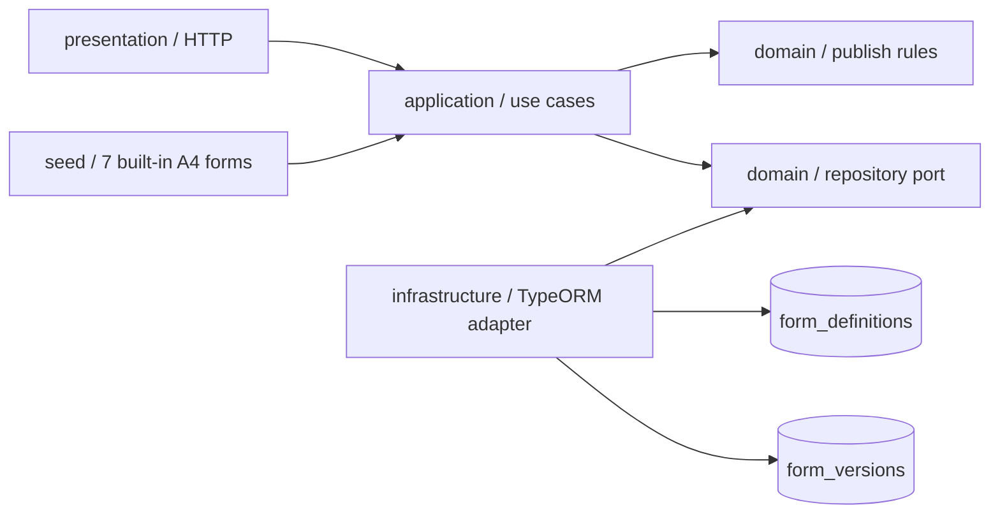

# Form Design Module

## 功能

- 管理表单定义以及 `DRAFT`、`PUBLISHED`、`RETIRED` 版本生命周期。
- 发布版不可覆盖；复制任意历史版本时自动创建下一版本草稿。
- 可用唯一 `documentType` 将真实业务单据固化到当前发布版本。
- 发布时校验字段模型以及 A4 打印版面。
- 启动时幂等预置合同、印章、物资七种业务单据的 A4 表单模板。
- 系统模板升级通过新版本发布，不覆盖历史已发布版本；用户复制后的同版本模板不会被启动过程重置。
- 简单字段网格可自动同步打印区；原始图片对应的精确分区版式在复制和保存时保持合并行、内容区、附件区和意见区。
- 通过事务保证定义和首版本同时创建，并保证新版本发布时旧版本自动退役。

## 结构

## 接口

- `GET /forms`
- `POST /forms`
- `GET /forms/:id`
- `POST /forms/:id/versions`
- `PATCH /forms/versions/:versionId`
- `POST /forms/versions/:versionId/publish`
