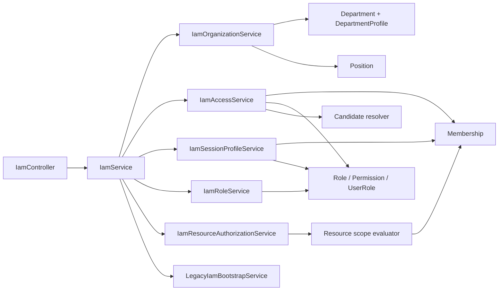

# IAM 组织与权限模块

## 功能

- 部门树和部门启停管理。
- 全局岗位或部门专属岗位管理。
- 用户多部门、多岗位、主部门和部门负责人关系。
- RBAC 角色、功能权限及角色权限配置。
- 合同、印章、物资分别使用 `*_CREATE` / `*_VIEW` 模块限定权限；通用 `DOCUMENT_CREATE` / `DOCUMENT_VIEW` 不能单独打开任一业务包。
- 自定义业务角色创建、名称/说明/启停维护；角色编码创建后不可修改，权限码目录只由代码和迁移维护。
- `SELF` / `DEPARTMENT` / `DEPARTMENT_TREE` / `ALL` 数据范围。
- 会话权限画像和工作流候选人解析：角色节点按“角色 + 目标部门”，申请部门负责人节点按组织关系解析。
- 会话权限画像按当前 `userId` 和关联 ID 定向查询任职、角色、权限、部门与岗位，不在每个 JWT 请求中扫描全体用户。
- 申请部门负责人优先使用部门配置的启用 `managerUserId`；配置缺失或用户停用时，回退到该部门启用且标记 `isDepartmentHead` 的任职，不推断固定角色。
- `filterCandidateUsersByPermissions()` 一次校验审批和业务查看权限，并要求每项权限的数据范围都覆盖目标单据；`SELF` 比较申请人，部门范围比较单据部门，角色 A 的候选资格不能与角色 B 在其他部门的权限拼接。
- `canAccessResource()` 同时校验功能权限与资源所属人/部门的数据范围，供业务读取和执行命令复用。
- 系统管理员防锁死：角色不可停用、已有权限不可移除、授权必须为 `ALL`，且不能移除最后一个启用管理员。
- 旧版 `users.departmentId` / `users.roleCodes` 数据的幂等兼容迁移；启动时尚无 IAM 任职的用户才迁移旧字段，已有任职后角色集完全由管理员维护，即使清空全部角色也不会再回放。
- 旧版角色初始范围：申请人仅本人、部门负责人仅本部门，财务/办公室/印章/采购/仓库等跨职能岗位覆盖全组织，管理员可在迁移后调整。

## 结构

`DepartmentProfileEntity` 是旧部门表的一对一扩展，用于在不改变认证边界的前提下增加上级部门、排序和状态。

## 数据范围规则

| 范围              | 含义             | 部门锚点 |
| ----------------- | ---------------- | -------- |
| `SELF`            | 仅本人数据       | 必须为空 |
| `DEPARTMENT`      | 指定部门         | 必填     |
| `DEPARTMENT_TREE` | 指定部门及其子树 | 必填     |
| `ALL`             | 全部数据         | 必须为空 |

`getSessionProfile()` 将功能权限取并集，但每个 `dataScopes` 项仍保留其角色和该角色授予的权限。不会因用户的另一个角色具有 `ALL` 而扩大其他权限的数据范围。

`canAccessResource(userId, permissionCode, ownerUserId, departmentId)` 只要存在一条同时授予该功能权限且覆盖资源的数据范围即返回 `true`：`SELF` 比较资源所有人，`DEPARTMENT` 比较部门，`DEPARTMENT_TREE` 检查部门子树，`ALL` 覆盖全部资源。

业务单据的数据范围使用模块权限码计算，例如合同读取检查 `CONTRACT_VIEW`，不会把另一个角色授予的 `DOCUMENT_VIEW + ALL` 与 `CONTRACT_VIEW + SELF` 拼接成合同全量访问。

## HTTP 接口

| 方法         | 路径                                | 权限         | 用途                 |
| ------------ | ----------------------------------- | ------------ | -------------------- |
| `GET`        | `/api/v1/iam/departments`           | `IAM_VIEW`   | 部门树               |
| `POST/PATCH` | `/api/v1/iam/departments[/:id]`     | `IAM_MANAGE` | 部门管理             |
| `GET`        | `/api/v1/iam/positions`             | `IAM_VIEW`   | 岗位列表             |
| `POST/PATCH` | `/api/v1/iam/positions[/:id]`       | `IAM_MANAGE` | 岗位管理             |
| `GET`        | `/api/v1/iam/roles`                 | `IAM_VIEW`   | 角色及已授权限       |
| `POST`       | `/api/v1/iam/roles`                 | `IAM_MANAGE` | 创建自定义业务角色   |
| `PATCH`      | `/api/v1/iam/roles/:id`             | `IAM_MANAGE` | 编辑名称、说明和状态 |
| `GET`        | `/api/v1/iam/permissions`           | `IAM_VIEW`   | 权限目录             |
| `GET`        | `/api/v1/iam/users`                 | `IAM_VIEW`   | 用户组织与授权       |
| `PUT`        | `/api/v1/iam/roles/:id/permissions` | `IAM_MANAGE` | 覆盖角色权限         |
| `PUT`        | `/api/v1/iam/users/:id/assignments` | `IAM_MANAGE` | 事务性覆盖任职与角色 |

## 集成点

1. 数据库注册 `iamEntities`、`IamOrganizationAccess1784000000000` 和幂等的 `BusinessModulePermissions1784100000000` 迁移。
2. 根模块导入 `IamModule`。
3. 旧版开发用户保存后调用 `IamService.ensureLegacyAssignments()`。
4. 认证会话合并 `getSessionProfile()` 返回的角色、权限、任职和数据范围。
5. 工作流角色节点通过 `resolveCandidateUsers(roleCode, departmentId)` 生成候选人；申请部门负责人节点通过 `resolveApplicantDepartmentManagerUsers(departmentId)` 使用组织关系生成候选人，再通过 `filterCandidateUsersByPermissions()` 排除缺少审批或目标业务包查看权限的用户。
6. 业务模块通过 `canAccessResource(userId, permissionCode, ownerUserId, departmentId)` 判断权限是否覆盖具体单据，不自行解释数据范围。

迁移会初始化稳定权限码、三个平台管理角色和现有业务角色。模块权限迁移为申请人补齐三业务包制单/查看权限，并按既有审批链为部门、财务、办公室、印章、采购和仓库角色补齐最小查看权限。系统不会猜测管理员；部署时可设置 `OA_BOOTSTRAP_ADMIN_USERNAME` 将指定的已启用用户幂等授予 `SYSTEM_ADMIN + ALL`。首次授权成功后可移除该环境变量，之后通过受权的 IAM 界面管理。
