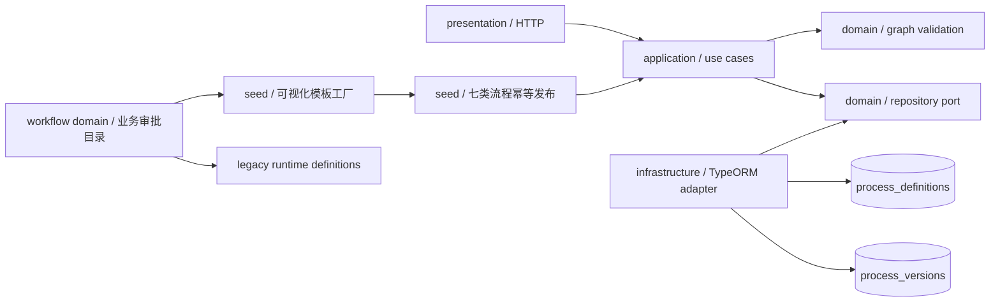
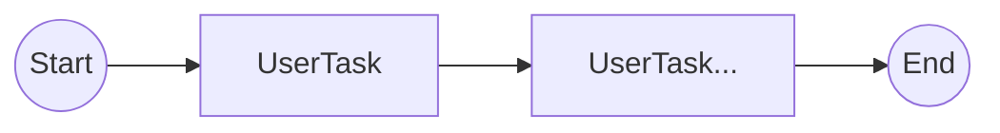

# Process Design Module

## 功能

- 管理流程定义以及 `DRAFT`、`PUBLISHED`、`RETIRED` 版本生命周期。
- 发布版不可覆盖；复制任意历史版本时自动创建下一版本草稿。
- 可用唯一 `documentType` 将运行中业务单据固化到当前发布版本。
- 设计模型预留网关、并行和会签节点，当前仅发布可执行的线性审批链。
- 办理人支持申请人部门负责人、角色和指定用户三种规则。
- `parsePublishedUserTasks` 将发布设计稳定转换为运行时有序审批节点。
- 启动时幂等预置合同、印章、物资三个业务模块共七类单据的可视化审批流程。
- 可视化模板与旧运行时定义共用审批目录，确保迁移前后的节点顺序一致。

## 结构

## 内置业务流程

| 单据类型      | 审批顺序                                   |
| ------------- | ------------------------------------------ |
| 合同/支出请示 | 申请部门负责人 -> 财务审核                 |
| 合同审批      | 申请部门负责人 -> 财务审核 -> 办公室审核   |
| 合同付款      | 申请部门负责人 -> 财务审核                 |
| 印章证照外借  | 申请部门负责人 -> 办公室审核 -> 印章管理员 |
| 印章证照使用  | 申请部门负责人 -> 办公室审核 -> 印章管理员 |
| 物资申购      | 申请部门负责人 -> 采购经办 -> 财务审核     |
| 物资领用      | 申请部门负责人 -> 仓库管理员               |

Seeder 先按流程编码查找，再按 `documentType` 兼容已有定义。已有发布版本不会重复创建；只有草稿时发布该草稿；完全不存在时创建并发布系统版本。

## 可发布流程

网关、会签、分支、回路和孤立节点可以保存在草稿中，但会在发布时被明确拒绝。

## 接口

- `GET /processes`
- `POST /processes`
- `GET /processes/:id`
- `POST /processes/:id/versions`
- `PATCH /processes/versions/:versionId`
- `POST /processes/versions/:versionId/publish`
