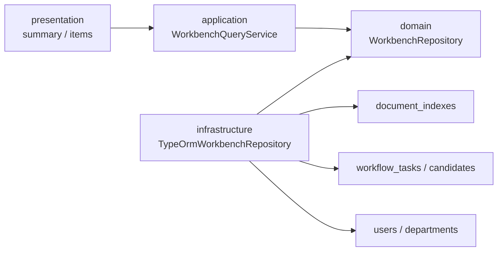

# 个人工作台聚合查询模块

## 已实现能力

- 待办、已办、我发起的和草稿四个箱体的独立汇总计数。
- 服务端分页，按 `updatedAt DESC, id DESC` 保持跨页稳定顺序。
- 支持关键词、流程类型、发起人、部门、单据状态和日期范围组合筛选。
- 列表直接联接现有用户和部门目录，返回发起人和部门显示名称。
- 待办仅使用节点创建时固化的候选人，已办仅使用当前用户实际完成的任务。
- 待办在候选人快照之外重新检查当前 `WORKFLOW_APPROVE`；撤销审批权限后立即从待办消失，但历史已办仍保留。
- 四个箱体都在计数和分页前重新校验 `DOCUMENT_VIEW + <MODULE>_VIEW` 双钥匙权限，权限撤销后不会继续出现。

## API

| 方法 | 路径                        | 用途                     |
| ---- | --------------------------- | ------------------------ |
| GET  | `/api/v1/workbench/summary` | 返回四个箱体的数量快照   |
| GET  | `/api/v1/workbench/items`   | 按箱体和组合条件分页查询 |

`items` 支持参数：`box`、`page`、`pageSize`、`keyword`、`documentType`、`applicantId`、`departmentId`、`status`、`dateFrom`、`dateTo`。日期使用 `YYYY-MM-DD` 格式。
日期边界按 `OA_TIME_ZONE` 对应的酒店本地日历换算为 UTC，默认时区为 `Asia/Shanghai`。

## 结构

## 边界

本模块是只读聚合层，不创建 `workbench_items` 或其他重复单据表，也不调用或扩大 `DocumentWorkflowService`。当前任务表只固化 `processNodeId`，没有节点名称快照，因此 `processNodeName` 保持 `null`，前端使用 `assigneeRole` 回退显示；本次不为读模型反向扩充工作流表。抄送、关注和批量审批需要独立的业务规则和事实表，本次不伪实现。
