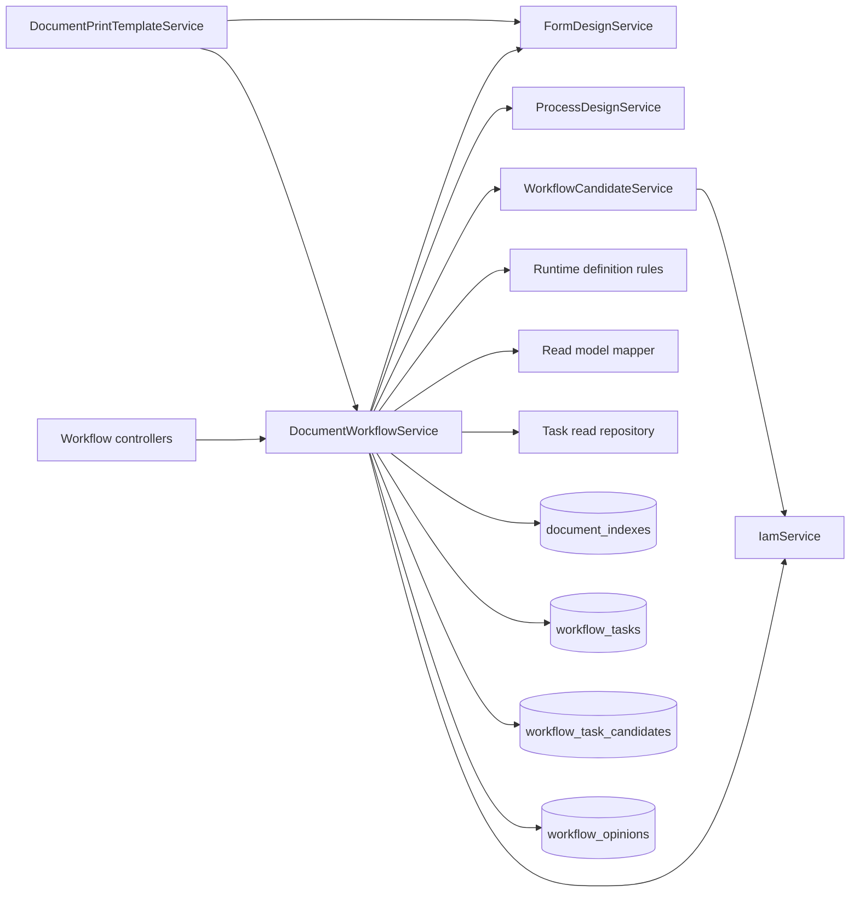
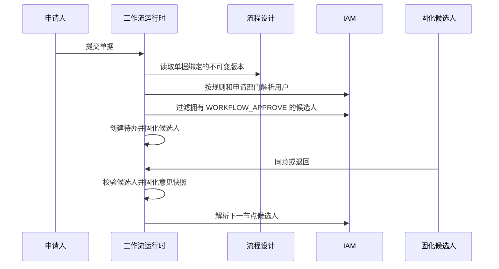

# 工作流运行时模块

## 功能

- 创建业务草稿时固化当前已发布的表单版本和流程版本。
- 通过独立打印模板查询服务按单据可见性读取绑定的不可变表单版本，供 A4 历史重放使用。
- 未迁移到可视化流程设计器的单据继续使用 `workflow_definitions` 兼容定义。
- 提交时解析线性审批节点，并按申请部门、角色或指定用户解析具体办理人。
- `APPLICANT_DEPARTMENT_MANAGER` 保留独立规则语义：优先读取申请部门 `managerUserId`，再回退启用的部门负责人任职，不转换成固定 `DEPARTMENT_MANAGER` 角色。
- 角色、指定用户和申请部门负责人规则在创建任务前统一按单据申请人和目标部门过滤 `WORKFLOW_APPROVE`、`DOCUMENT_VIEW` 和模块 `*_VIEW`，只固化能审批且能打开业务详情的候选人。
- 所有审批规则都会先排除单据申请人，禁止自审；经理本人发起单据时必须预先配置代理或上级候选，否则提交会在创建任务前失败。
- 候选人在任务创建时写入 `workflow_task_candidates`，后续角色调整不会改变历史待办归属。
- 支持同意、退回发起人、幂等命令、我的待办、我的已办和我发起的单据。
- 我的待办要求当前仍有 `WORKFLOW_APPROVE`、`DOCUMENT_VIEW` 和业务模块查看权；我的已办保留历史办理关系，但当前缺少单据或模块查看权时不返回业务信息。
- 同意和退回在候选快照校验后仍实时复核单据及业务模块查看权，撤权后的直接命令不会改变任务或单据状态。
- 单据发起人、历史办理人和当前固化候选人可直接查看；其他用户必须同时拥有 `DOCUMENT_VIEW` 且数据范围覆盖单据所有人或部门。
- 审批意见固化办理时的部门、岗位、流程节点名称，避免基础资料变更改写审计记录。
- 启动时幂等补录旧版待办候选人；无法解析的旧待办保留并记录配置告警。

## 结构

`DocumentWorkflowService` 只负责编排事务和状态迁移。候选规则解析、审批权限过滤和候选快照由 `WorkflowCandidateService` 负责；流程版本转换、读模型映射、意见快照和旧定义也分别放在独立文件中。

## 提交与审批

若节点没有有效候选人，提交或流转会以 `WORKFLOW_ASSIGNEE_EMPTY` 失败；若已解析到用户但他们都缺少 `WORKFLOW_APPROVE`，则以 `WORKFLOW_ASSIGNEE_PERMISSION_MISSING` 失败。两种情况都在任务写入前阻断并回滚整个事务，不会产生“审核中但无人可办”的单据。

## 权限边界

| 操作                 | 功能权限                                               | 数据校验                       |
| -------------------- | ------------------------------------------------------ | ------------------------------ |
| 提交                 | `DOCUMENT_CREATE`                                      | 只能提交本人草稿或退回单据     |
| 同意、退回           | `WORKFLOW_APPROVE` + `DOCUMENT_VIEW` + 模块 `*_VIEW`   | 必须是任务创建时固化的候选人   |
| 我的待办             | `WORKFLOW_APPROVE` + `DOCUMENT_VIEW` + 模块 `*_VIEW`   | 必须是任务创建时固化的候选人   |
| 我的已办             | `DOCUMENT_VIEW` + 模块 `*_VIEW`                        | `completedBy` 必须是当前用户   |
| 查看单据、概览、历史 | 参与人已登录；其他人需 `DOCUMENT_VIEW` + 模块 `*_VIEW` | 流程参与关系或权限所附数据范围 |

写命令的功能权限由全局 `PermissionGuard` 校验，工作流运行时再次校验候选快照和业务模块查看权；待办与已办读仓储也按当前权限过滤。三层职责不能互相替代。

## 版本兼容

新草稿优先绑定 `process_versions` 和 `form_versions` 的发布版 ID。没有发布流程的单据绑定旧版流程编码，执行时转换为相同的运行时节点模型。已创建单据不会自动切换到后来发布的新版本。
