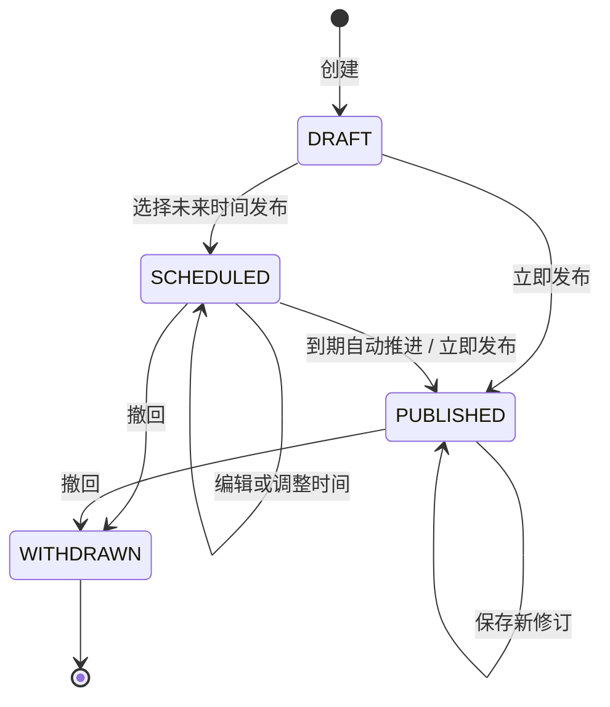
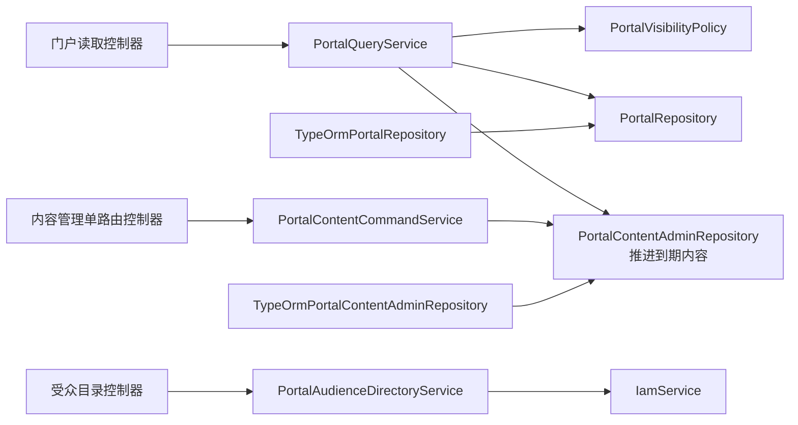

# 公司门户模块

## 已实现能力

- 门户聚合公司新闻、通知公告、会议纪要、备忘录、规章制度、党群工作、宴会会议七个栏目，并提供工作日历、常用链接和组件排序配置。
- 内容按全员、部门、角色和指定人员过滤；多部门人员使用所有启用任职判断，详情接口再次执行同一可见性策略。
- `DRAFT / SCHEDULED / PUBLISHED / WITHDRAWN` 是内容展示与运营的唯一状态源，发布时间、下线时间共同组成公开窗口。
- 定时内容到期后由门户或管理查询原子推进为已发布，并写入系统修订和审计事件。
- 创建、编辑、发布、撤回均在同一事务中保存内容、不可变完整快照和审计事件；已发布内容允许直接生成新修订，已撤回内容保持只读。
- 管理端受众目录复用 IAM 的用户、部门和角色，不复制组织主数据。
- 待阅、已阅和全部阅读列表使用幂等首次阅读回执，不能通过内容 ID 绕过受众范围。
- 非生产环境显式设置 `OA_DEMO_SEED=true` 时写入七栏目内容、四种生命周期样例、日历、链接和组件配置。

## API

### 门户读取

| 方法 | 路径                                                      | 用途                                    |
| ---- | --------------------------------------------------------- | --------------------------------------- |
| GET  | `/api/v1/portal/home`                                     | 获取门户首屏快照，不包含正文            |
| GET  | `/api/v1/portal/reading?status=UNREAD&page=1&pageSize=20` | 按 `ALL/UNREAD/READ` 分页查询需回执内容 |
| GET  | `/api/v1/portal/contents?category=NOTICE`                 | 按栏目分页查询可见内容                  |
| GET  | `/api/v1/portal/calendar?from=2026-07-01&to=2026-08-31`   | 按业务日范围读取日历                    |
| GET  | `/api/v1/portal/contents/:id`                             | 获取当前用户可见的内容详情              |
| POST | `/api/v1/portal/contents/:id/read`                        | 幂等记录首次阅读                        |

### 内容运营

| 方法  | 路径                                         | 用途                         |
| ----- | -------------------------------------------- | ---------------------------- |
| GET   | `/api/v1/portal/admin/contents`              | 按状态、栏目、关键词分页查询 |
| GET   | `/api/v1/portal/admin/contents/:id`          | 获取管理详情和当前修订       |
| POST  | `/api/v1/portal/admin/contents`              | 创建草稿                     |
| PATCH | `/api/v1/portal/admin/contents/:id`          | 保存新修订                   |
| POST  | `/api/v1/portal/admin/contents/:id/publish`  | 立即发布或设置定时发布       |
| POST  | `/api/v1/portal/admin/contents/:id/withdraw` | 撤回已发布或定时内容         |
| GET   | `/api/v1/portal/admin/contents/:id/audit`    | 获取倒序审计事件             |
| GET   | `/api/v1/portal/admin/audience-directory`    | 获取 IAM 受众目录            |

读取接口要求 `PORTAL_VIEW + CONTENT_VIEW` 或 `CONTENT_VIEW`；全部运营接口要求 `CONTENT_MANAGE`。迁移只将管理权限授予 `SYSTEM_ADMIN` 与 `OFFICE_REVIEWER`，不会扩散给全部角色。

## 生命周期



`portal_contents.status` 是单一状态源，内容表不再保留可与状态冲突的 `active` 字段。每次状态或正文变化都递增 `currentRevision`；`portal_content_revisions` 只插入不更新，`portal_content_audits` 记录动作、操作者、部门、修订号、时间和动作详情。

## 结构



```text
portal/
├── application/     查询、命令、受众目录和映射
├── domain/          仓储边界、可见性策略、快照和值类型
├── infrastructure/  TypeORM 实体、读写仓储、迁移和演示数据
└── presentation/    一个路由函数一个控制器文件、DTO 校验
```

## 明确边界

- 当前内容正文使用 Tiptap 生成 HTML，门户读取边界使用 DOMPurify 清洗；附件仍是名称数组，尚未接对象存储、下载鉴权和病毒扫描。
- 内容无需审批，符合原始需求“发起后直接发布”；若以后增加审核，应作为独立状态和权限扩展，不能复用业务单据审批任务伪造。
- 日历、常用链接和组件排序仍由服务端配置与演示数据维护，尚未提供可视化布局管理写接口。
- SQLite 的受众目标目前保存 JSON 快照并用 `json_each` 下推过滤；数据规模增长后可迁移为可索引关系表，不改变应用层契约。
