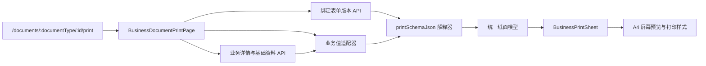

# 业务单据 A4 打印模块

## 实现功能

- 为七种已有业务单据提供独立的 A4 纵向打印视图。
- 打印页读取单据创建时绑定的不可变 `formVersionId` 与 `printSchemaJson`，新模板发布不会改变历史单据。
- 七种内置模板按原始请示、合同、印章和物资表单结构定义标题、网格、内容、明细、附件和审批意见区域。
- 真实业务打印会解释绑定版本中的页边距、表格线宽、单号开关和审批意见开关，设计器预览与历史单据重放保持一致。
- 业务适配器只负责把部门、用户、印章、金额、日期和领域计算值映射到模板字段；没有版本绑定的旧单据继续使用兼容版式。
- 用户、部门和印章证照 ID 会映射成对应名称；参考数据加载失败时不阻断单据打印。
- `@page` 固定为 `A4 portrait`，纸张内容区按模板页边距渲染，打印时隐藏系统导航和操作区。
- 打印媒体与平台表单设计器样式相互隔离，业务纸张和纸张内文字在 Chrome 打印预览及 PDF 输出中保持可见。

## 分层结构



## 文件职责

| 路径                                 | 职责                                                 |
| ------------------------------------ | ---------------------------------------------------- |
| `BusinessDocumentPrintPage.vue`      | 读取路由、加载单据与参考数据、管理加载/失败/打印状态 |
| `domain/document-print.ts`           | 业务字段、引用数据和领域计算值适配                   |
| `domain/template-print-layout.ts`    | 解释绑定版本的标题、网格、内容、明细和意见区         |
| `components/BusinessPrintSheet.vue`  | 仅负责语义化纸面渲染，不包含 API 和业务判断          |
| `styles/business-document-print.css` | 屏幕预览、稳定网格尺寸、A4 打印媒体规则              |
| `print-route.ts`                     | 集中构造打印路径                                     |

## 路由接入

主路由需在通配路由之前注册：

```ts
{
  path: '/documents/:documentType/:id/print',
  name: 'business-document-print',
  component: () => import('../modules/document-print/BusinessDocumentPrintPage.vue'),
  meta: { title: 'A4 打印' },
}
```

## 版本读取

`GET /workflow/documents/:id/print-template` 先复用工作流单据可见性校验，再返回该单据绑定的表单版本。接口不要求表单管理权限，也不能读取无权查看的单据模板。
