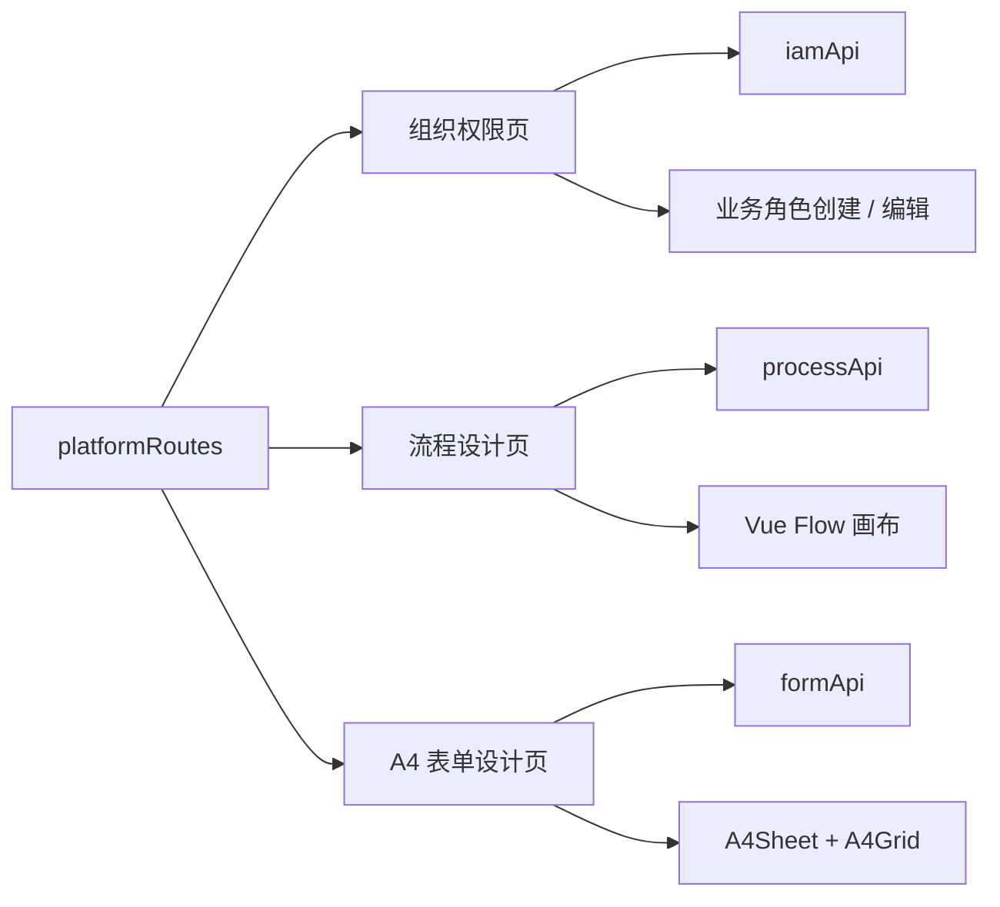

# 平台管理前端模块

本模块提供企业 OA 的三项平台能力，全部页面使用 Element Plus，并通过独立 API 适配层访问后端。

## 已实现功能

- 组织与权限：部门树、部门岗位、用户多部门任职、主部门、部门负责人、自定义业务角色、角色授权、数据范围和角色权限矩阵。
- 流程设计：版本列表、Vue Flow 画布、开始/审批/结束节点、连线、办理人规则、草稿、发布和复制版本。
- 表单设计：八类字段物料、点击或拖入、字段排序、属性编辑、草稿、发布和复制版本。
- A4 打印：设计画布固定为 `210mm × 297mm`，打印保留网格、附件清单和审批意见，并隐藏平台工具区；打印隔离样式只作用于 `.form-page`，不会隐藏合同、印章或物资业务打印页。
- 手机设计：流程设计器以“流程图 / 流程库 / 节点属性”切换，A4 设计器以“预览 / 表单库 / 字段 / 属性”切换；切换依据 `useLayoutMode()`（1024px 以下为紧凑布局，`v-if` 单面板渲染），两个页面都默认先展示核心画布，并保持 `320px` 页面无横向溢出。
- 紧凑编辑：紧凑布局下设计器左栏变成字段/节点列表（带上下移与删除），属性面板编辑选中项；IAM 授权卡片与表单字段使用 `ui-fields` 单列栅格，弹窗自动变为全屏抽屉。
- 权限化编辑：`IAM_MANAGE`、`FORM_DESIGN_MANAGE`、`PROCESS_DESIGN_MANAGE` 分别控制写操作；只有 `VIEW` 的用户使用完整只读界面，事件处理函数也不会发起写请求。

## 结构

```mermaid
flowchart LR
  Routes["platformRoutes"] --> IAM["组织权限页"]
  Routes --> Process["流程设计页"]
  Routes --> Form["A4 表单设计页"]
  IAM --> IamApi["iamApi"]
  IAM --> RoleEditor["业务角色创建 / 编辑"]
  Process --> DesignApi["processApi"]
  Form --> DesignApi2["formApi"]
  Process --> VueFlow["Vue Flow 画布"]
  Form --> A4["A4Sheet + A4Grid"]
```

## 分层约定

- `api/`：封装 HTTP 路径和 DTO，不让页面直接拼接接口。
- `types/`：IAM、定义版本、流程设计和打印结构类型。
- `utils/`：无 UI 的默认模型、复制、同步和发布前校验。
- `components/`：IAM 编辑器、流程画布、字段物料、属性面板和 A4 打印组件。
- `pages/`：只编排数据加载、选择、版本动作和页面级状态。
- 样式：模块内不再保留独立 CSS 文件，统一样式（tokens + 白/黑设计系统）以 `<style scoped>` 写在各自的 `.vue` 中；A4 纸张与打印隔离样式随 `A4Sheet` / `A4Grid` 和 `FormDesignerPage` 保存。

发布版本不可直接修改。调整已发布定义时，必须复制为新的草稿版本，避免运行中单据的结构和审批路径发生漂移。

角色编码会被流程办理人规则引用，因此仅在创建时填写，后续只能修改名称、说明和启停状态。`SYSTEM_ADMIN` 的停用、减权和非全局数据范围操作由后端领域规则拒绝，前端同时禁用对应高风险控件。
