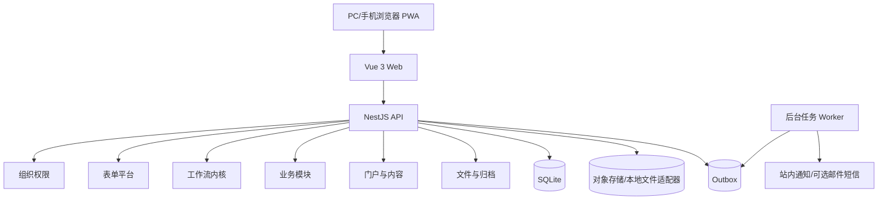
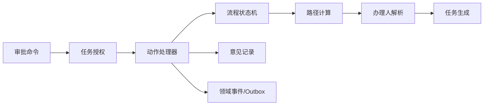

# 系统架构

## 1. 技术基线

| 层 | 推荐技术 |
| --- | --- |
| API | NestJS + TypeScript |
| 数据库 | SQLite，启用 WAL、外键和迁移 |
| 数据访问 | ORM 适配器置于 infrastructure，领域层使用仓储接口 |
| Web | Vue 3 + Vite + TypeScript |
| 状态管理 | Pinia |
| 路由 | Vue Router |
| UI | Element Plus（新平台标准）+ 存量 Ant Design Vue 渐进迁移 + 自定义设计令牌 |
| 图表 | ECharts |
| 工作流画布 | Vue Flow；发布时转换并校验为运行时定义 |
| API 契约 | OpenAPI 生成前端客户端与类型 |
| 测试 | Vitest、Nest testing、Playwright |

最终依赖版本在开发启动时锁定。新增依赖前先检查现有能力，避免同类库并存。

## 2. 总体架构



首期 API 和 Worker 可以同进程部署，但代码按独立模块设计。长耗时的归档、预览、病毒扫描和通知由后台任务处理。

## 3. 后端分层

### 3.1 Domain

- 实体、聚合、值对象、领域服务、仓储接口、领域事件。
- 不依赖 NestJS 装饰器、ORM 模型、HTTP DTO。
- 只表达业务不变量，例如金额范围、合法流程迁移和退款余额。

### 3.2 Application

- 一个命令或查询对应一个用例。
- 负责事务边界、权限编排、聚合加载和事件持久化。
- 输入 DTO 与领域对象进行显式转换。

### 3.3 Infrastructure

- SQLite/ORM 仓储实现。
- 文件存储、消息、时钟、ID、编号、加密等适配器。
- 第三方集成的防腐层。

### 3.4 Presentation

- HTTP Controller、参数解析、认证守卫和响应映射。
- 一个路由处理器文件服务一个用例；同一模块的多个路由不堆积到巨型文件。
- 不包含业务决策。

## 4. 前端分层

```text
apps/web/src/
  app/                  启动、路由、全局布局
  modules/
    workflow/
      api/
      model/
      pages/
      components/
      composables/
    contract/
    finance/
    ...
  shared/
    api/
    components/
    design-system/
    utils/
```

- Pinia 只存跨页面或共享状态；短生命周期表单状态留在组件/组合式函数。
- 页面负责组合，领域交互放在 `model` 和 `composables`。
- API 类型由契约生成，不在多处手写重复接口。
- 通用动态表单渲染器与业务专用组件分离。

## 5. 工作流内核内部结构



关键扩展点：

- `AssigneeResolver`：办理人策略。
- `ConditionEvaluator`：受限表达式或结构化条件。
- `NodeActionHandler`：节点动作。
- `BusinessHook`：业务模块提交前、任务完成前、流程完成后的验证与处理。
- `Clock`：流程时限和可测试时间。

禁止在条件表达式中执行任意 JavaScript。条件应存为结构化 JSON AST，只允许白名单字段、比较符和逻辑运算。

可视化设计器使用 Vue Flow：画布模型只负责节点位置、连线和编辑交互，发布时转换并校验为工作流内核的领域定义。运行引擎通过已发布版本解析节点，不直接依赖 Vue Flow 运行时，避免前端画布库绑定后端领域模型。

## 6. 表单平台

表单定义分为：

- `dataSchema`：字段、类型、默认值和数据校验。
- `uiSchema`：布局、组件、断点、提示和显示规则。
- `permissionSchema`：每个流程节点的字段权限。
- `printSchema`：打印顺序、分页、签字区和附件清单。

业务核心字段仍映射到明确的领域模型，不把所有业务都退化成不可查询的 JSON。可变展示字段可保存在表单数据快照中。

## 7. 文件与打印

- 文件二进制不存 SQLite，只存元数据和存储键。
- 通过 SHA-256 去重和完整性校验。
- 文件访问使用短期授权 URL 或受控下载接口。
- 归档包生成 PDF、附件清单、流程轨迹和校验码。
- 打印模板固定绑定版本，历史打印可重现。

## 8. 一致性与并发

- 审批动作使用数据库事务。
- `revision` 做乐观锁，避免两人重复处理同一任务。
- `requestId` 做接口幂等。
- Outbox 与业务数据同事务写入。
- 多人会签以独立任务记录，不把多人状态塞入一个字段。

## 9. SQLite 部署约束

- 单主实例写入，避免共享网络文件系统。
- 启用 `PRAGMA foreign_keys=ON`、`journal_mode=WAL`、合理 `busy_timeout`。
- 每日全量备份 + 持续归档策略，并定期恢复演练。
- 对附件、日志和数据库分别设置容量告警。
- 当并发写入、数据规模或高可用要求超过单机边界时迁移 PostgreSQL。

## 10. 代码质量约束

- 单函数只完成一个明确任务。
- 单文件原则上不超过 500 行；超过时按用例、组件或领域概念拆分。
- 禁止业务硬编码：部门名、角色名、金额阈值、编号和流程路径进入配置。
- 注释解释业务约束和原因，不复述代码。
- 每个业务模块必须附带模块说明、结构图、流程图和接口说明。
- 新功能开发前先检索已有领域对象、组件、用例和配置，优先扩展而非复制。

## 11. 架构决策流程

每个重大决策创建 ADR：

1. 背景与约束。
2. 候选方案。
3. 选择与理由。
4. 正反影响。
5. 迁移/回滚方式。

首批 ADR 应覆盖 ORM、UI 组件库、文件存储、流程条件模型和身份认证方式。
