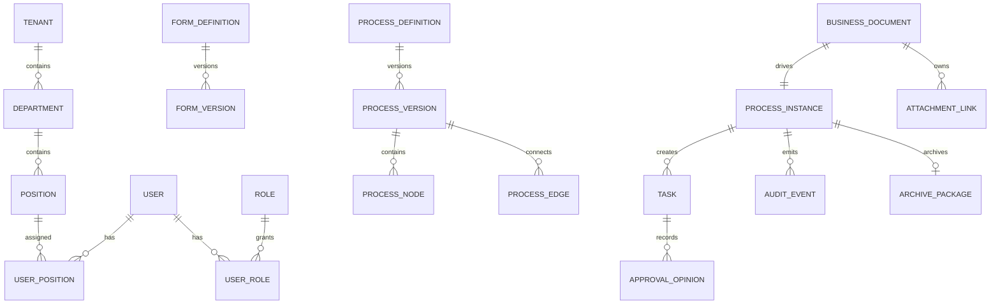

# 数据、接口与安全设计

## 1. 核心数据关系



## 2. 核心表

### 2.1 组织权限

- `tenants`
- `departments`
- `positions`
- `users`
- `user_positions`
- `roles`
- `permissions`
- `user_roles`
- `role_permissions`
- `delegations`

组织记录包含有效期和状态。流程运行时保存人员、部门、岗位名称快照，避免组织调整后历史失真。

### 2.2 表单与流程

- `form_definitions`
- `form_versions`
- `process_definitions`
- `process_versions`
- `process_nodes`
- `process_edges`
- `node_field_permissions`
- `process_instances`
- `process_tokens`
- `tasks`
- `task_candidates`
- `approval_opinions`
- `process_variables`

`process_tokens` 表示当前活动路径，支持并行分支和会签。

### 2.3 业务与归档

- `business_documents`
- 各业务模块明确表，例如 `contracts`、`expense_requests`、`leave_requests`
- `business_relations`
- `attachments`
- `attachment_links`
- `document_revisions`
- `archive_packages`
- `audit_events`
- `outbox_messages`
- `notification_receipts`

`business_documents` 保存统一索引字段；领域专属字段进入模块表。表单原始快照可存 JSON，但常用查询和强规则字段必须结构化。

## 3. 数据状态与约束

- 所有业务表包含 `tenant_id`，唯一索引也必须包含租户范围。
- 外键默认限制删除，业务数据通过状态作废。
- 金额为整数，数量为精确 Decimal 字符串或定点数。
- 敏感值使用应用层信封加密；检索需求使用单独的不可逆索引。
- 审批意见和审计事件仅追加，不允许更新正文。
- 附件删除只解除业务关联，原文件按保留策略清理。

## 4. API 风格

REST 资源用于查询，命令端点用于表达审批动作。

```text
POST   /api/v1/auth/login
GET    /api/v1/me
GET    /api/v1/workbench

GET    /api/v1/process-definitions
POST   /api/v1/process-definitions
POST   /api/v1/process-definitions/{id}/publish

POST   /api/v1/documents/{type}/drafts
PATCH  /api/v1/documents/{type}/{id}
POST   /api/v1/documents/{type}/{id}/submit
GET    /api/v1/documents/{type}/{id}

GET    /api/v1/tasks
GET    /api/v1/tasks/{id}
POST   /api/v1/tasks/{id}/approve
POST   /api/v1/tasks/{id}/return
POST   /api/v1/tasks/{id}/transfer
POST   /api/v1/tasks/{id}/countersign

POST   /api/v1/attachments
GET    /api/v1/archive-packages/{id}
```

### 4.1 命令请求

审批类请求至少包含：

- `requestId`
- `taskRevision`
- `comment`
- 动作专属数据，例如 `targetNodeId`、`assigneeIds`
- 可选意见附件

### 4.2 响应与错误

统一错误结构：

```json
{
  "code": "TASK_ALREADY_COMPLETED",
  "message": "该待办已被处理",
  "details": {},
  "traceId": "..."
}
```

业务错误使用稳定代码，不依赖中文消息进行前端判断。

## 5. 查询模型

待办、已办、我发起的和门户属于读模型：

- 按用户、候选角色和代理关系聚合。
- 预计算可展示标题、发起人、当前节点、到期时间。
- 列表不逐行加载完整聚合，避免 N+1。
- 搜索索引异步更新，但任务权限查询必须以主库为准。

## 6. 权限模型

三层鉴权：

1. 功能权限：能否访问菜单或调用动作。
2. 数据权限：本人、本部门、部门树、指定范围或全部。
3. 实例权限：是否为发起人、当前办理人、候选人、抄送人或审计人员。

流程节点再次计算字段权限。前端隐藏只改善体验，服务端必须过滤读取字段并拒绝非法写入。

## 7. 安全要求

### 7.1 身份与会话

- 密码使用 Argon2id。
- 会话使用短期访问令牌 + 可撤销刷新会话，或安全服务端 Cookie。
- Cookie 使用 HttpOnly、Secure、SameSite。
- 登录失败限流和异常登录告警。
- 管理员和审批高权限角色支持二次验证。

### 7.2 文件安全

- 文件扩展名、MIME 和魔数联合校验。
- 文件名随机化，原文件名单独存储和转义。
- 限制单文件、单单据和用户配额。
- 上传后进入扫描状态，扫描通过前不可下载。
- 富文本图片和普通附件使用同一权限系统。

### 7.3 数据保护

- 银行账号、身份证、信用卡信息加密和脱敏。
- 信用卡原则上仅保存业务必需尾号，不保存 CVV。
- 日志不得记录令牌、密码、完整账号、身份证和表单敏感正文。
- 导出、打印和下载敏感单据记入审计。

## 8. 审计

审计事件至少记录：

- 操作者和代理身份
- 租户、部门、IP、客户端
- 资源类型、资源 ID、动作
- 成功或失败、失败代码
- 变更摘要和关联请求 ID
- 时间与追踪 ID

对表单字段变更存储字段级差异，但敏感字段只记录“已变更”，不记录明文前后值。

## 9. 数据保留与备份

- 审批与归档资料按企业制度配置保留期限。
- 每日自动备份，备份文件加密并与生产主机隔离。
- 恢复演练要验证数据库、附件和归档包的一致性。
- 删除到期数据前生成清单并经过授权审批。
