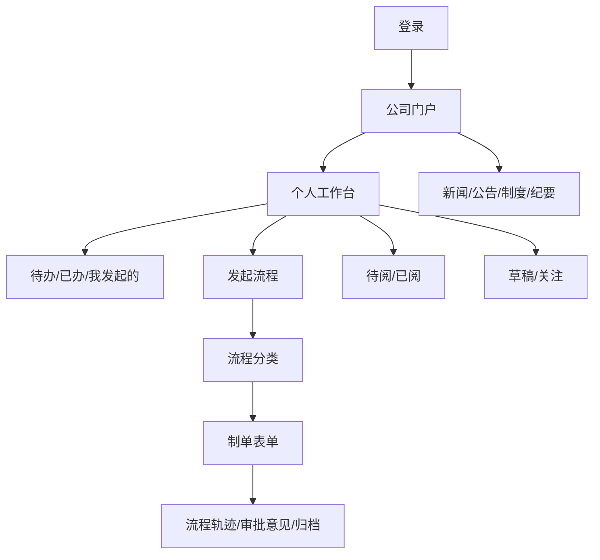

# 响应式 UI/UX 规范

## 1. 体验目标

源文档展示了登录页、公司门户、个人工作台、流程分类和内部沟通页面。新系统保留这些信息架构，但不照搬旧式密集布局。

目标：

- PC 端高信息密度但不拥挤。
- 手机端优先处理待办和快速制单。
- 表单字段完整，同时通过分组、折叠和分步减少认知负担。
- 同一业务在不同屏幕保持一致的字段、状态和权限。

## 2. 信息架构



## 3. 页面清单

### 3.1 登录页

- 企业品牌、简洁背景、账号、密码、记住登录状态。
- 密码可见切换、错误提示、锁定提示和隐私说明。
- 手机端不展示无关装饰，保证键盘弹出后仍可提交。

### 3.2 公司门户

- 公司新闻、通知公告、会议纪要、备忘录、党群工作。
- 待办摘要、日历、常用链接和快捷发起。
- 栏目卡片支持权限、置顶、更多和未读状态。
- 管理员可配置卡片顺序，不在组件中硬编码栏目。

### 3.3 个人工作台

- 待办、已办、我发起的、抄送、待阅、已阅、草稿、关注。
- 统一筛选：关键词、流程类型、发起人、部门、状态、日期。
- PC 使用表格与批量操作；手机使用卡片和底部筛选抽屉。
- 批量审批仅对允许批量且动作、节点、表单摘要一致的任务开放。

### 3.4 发起流程

- 分类、搜索、最近使用、我的收藏。
- 显示流程说明、适用范围和预计审批链。
- 同类流程名称清晰区分，避免“支出单测试用”等测试入口进入生产。

### 3.5 制单与审批

PC 布局：

```text
┌──────── 表单标题 / 编号 / 状态 ────────┐
│ 基础信息                                │
│ 业务明细                                │
│ 附件                                    │
│ 审批意见时间线                          │
├───────────────────┬────────────────────┤
│ 表单主体           │ 流程轨迹/关联单据  │
└───────────────────┴────────────────────┘
底部固定：保存草稿 / 提交 / 审批动作
```

手机布局：

- 单列字段。
- 复杂表格转为“明细卡片”，每条可展开编辑。
- 审批意见和流程轨迹使用页签/抽屉。
- 底部固定主动作，次要动作进入“更多”。
- 金额、日期、人员选择使用适合触控的专用组件。

## 4. 响应式断点

使用设计令牌集中管理，禁止在页面散落魔法数字：

| 断点 | 目标 |
| --- | --- |
| `< 768px` | 手机单列、底部导航/动作栏 |
| `768–1199px` | 平板或窄屏，双列按内容降级 |
| `>= 1200px` | PC，多栏工作台和侧边流程信息 |

布局以容器宽度和内容能力为准，不能只靠设备名称判断。

## 5. 视觉系统

- 8px 间距体系。
- 主色、成功、警告、错误、信息色均由 CSS 变量提供。
- 标题、正文、辅助文本形成稳定字号层级。
- 卡片圆角、阴影、边框保持克制。
- 支持浅色主题；深色主题可后续增加。
- 状态不只靠颜色，必须配文字或图标。

## 6. 表单体验

- 字段按“基础信息、金额/合同、收款、业务说明、附件”分组。
- 自动带出字段显示来源，用户可理解为何不可编辑。
- 条件字段只在相关选项出现时展示。
- 错误定位到具体字段，并在顶部提供错误摘要。
- 长表单自动保存，离开页面前提示未保存修改。
- 提交前展示审批路径预览、主要金额和附件数量。
- 所有截图原有字段必须进入验收清单，不因响应式改版而删除。

## 7. 审批体验

- 顶部首先显示“要决定什么”：标题、金额、申请人、当前节点。
- 关键业务字段形成摘要卡，不要求审批人先阅读整张长表。
- 审批动作弹窗显示动作影响，例如退回到哪个节点、是否重新会签。
- 意见模板可配置，但最终意见允许编辑。
- 高风险动作二次确认；普通同意避免多余确认。

## 8. 可访问性

- 键盘可完成主要操作。
- 表单控件有可读标签和错误关联。
- 焦点状态清晰。
- 文本与背景满足 WCAG AA 对比度。
- 触控目标建议不小于 44px。
- 图标按钮提供文字说明或无障碍名称。

## 9. 打印

- A4 版式独立于屏幕布局。
- 表单标题、编号、字段、审批意见和二维码验真固定进入打印。
- 长意见、明细表和附件清单支持分页。
- 打印时隐藏导航和交互按钮。
- 历史归档使用当时模板版本，避免新 UI 改动影响旧单据。
