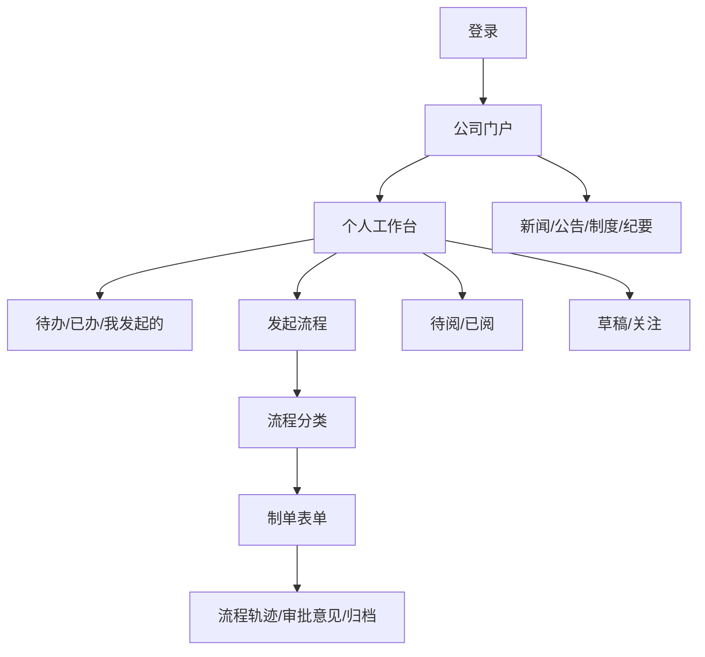

# 响应式 UI/UX 规范

## 1. 体验目标

源文档展示了登录页、公司门户、个人工作台、流程分类和内部沟通页面。新系统保留这些信息架构，但不照搬旧式密集布局。

目标：

- PC 端高信息密度但不拥挤。
- 手机端优先处理待办和快速制单。
- 表单字段完整，同时通过分组、折叠和分步减少认知负担。
- 同一业务在不同屏幕保持一致的字段、状态和权限。

## 2. 信息架构


```mermaid
flowchart TD
  Login[登录] --> Portal[公司门户]
  Portal --> Workbench[个人工作台]
  Portal --> Content[新闻/公告/制度/纪要]
  Workbench --> Todo[待办/已办/我发起的]
  Workbench --> Start[发起流程]
  Workbench --> Read[待阅/已阅]
  Workbench --> Draft[草稿/关注]
  Start --> Categories[流程分类]
  Categories --> Form[制单表单]
  Form --> Track[流程轨迹/审批意见/归档]
```

## 3. 页面清单

### 3.1 登录页

- 企业品牌、简洁背景、账号、密码、记住登录状态。
- 密码可见切换、错误提示、锁定提示和隐私说明。
- 手机端不展示无关装饰，保证键盘弹出后仍可提交。

### 3.2 公司门户

- 公司新闻、通知公告、会议纪要、备忘录、党群工作。
- 待办摘要、日历、常用链接和快捷发起。
- 栏目卡片支持权限、置顶、更多和未读状态。
- 管理员可配置卡片顺序，不在组件中硬编码栏目。

### 3.3 个人工作台

- 待办、已办、我发起的、抄送、待阅、已阅、草稿、关注。
- 统一筛选：关键词、流程类型、发起人、部门、状态、日期。
- PC 使用表格与批量操作；手机使用卡片和底部筛选抽屉。
- 批量审批仅对允许批量且动作、节点、表单摘要一致的任务开放。

### 3.4 发起流程

- 分类、搜索、最近使用、我的收藏。
- 显示流程说明、适用范围和预计审批链。
- 同类流程名称清晰区分，避免“支出单测试用”等测试入口进入生产。

### 3.5 制单与审批

PC 布局：

```text
┌──────── 表单标题 / 编号 / 状态 ────────┐
│ 基础信息                                │
│ 业务明细                                │
│ 附件                                    │
│ 审批意见时间线                          │
├───────────────────┬────────────────────┤
│ 表单主体           │ 流程轨迹/关联单据  │
└───────────────────┴────────────────────┘
底部固定：保存草稿 / 提交 / 审批动作
```

手机布局：

- 单列字段。
- 复杂表格转为“明细卡片”，每条可展开编辑。
- 审批意见和流程轨迹使用页签/抽屉。
- 底部固定主动作，次要动作进入“更多”。
- 金额、日期、人员选择使用适合触控的专用组件。

## 4. 响应式断点

使用设计令牌集中管理，禁止在页面散落魔法数字：

| 断点 | 目标 |
| --- | --- |
| `< 768px` | 手机单列、底部导航/动作栏 |
| `768–1199px` | 平板或窄屏，双列按内容降级 |
| `>= 1200px` | PC，多栏工作台和侧边流程信息 |

布局以容器宽度和内容能力为准，不能只靠设备名称判断。

## 5. 视觉系统

### 5.1 设计取向

MiniMax 式界面语言：**白画布 + 浅灰分区 + 近黑文字 + 黑色胶囊主按钮**。信息密度优先，装饰克制；产品色（珊瑚/洋红/蓝/紫）只用于确有品类含义的小面积标识，不给普通页面铺渐变。

### 5.2 令牌与样式出口

| 层 | 位置 | 说明 |
| --- | --- | --- |
| 设计令牌 | `apps/web/src/ui/tokens.css` | 颜色、字体、间距、圆角、控件尺寸档，以及 Element Plus 的 `--el-*` 映射 |
| 基础样式与外壳 | `apps/web/src/ui/system.css` | 元素级基线、组件库覆写、外壳（侧栏/顶栏/底部导航）、工具类 |
| 自适应服务 | `apps/web/src/ui/useLayoutMode.ts` | 按可用宽度给出 `desktop` / `compact`，并写 `html[data-layout]` |
| 呈现组件 | `apps/web/src/ui/{UiDataList,UiPagination,UiDialog}.vue` | 表格/卡片、分页、弹层（紧凑模式全屏） |
| 业务态渲染器 | `apps/web/src/shared/design-tokens.ts`、`shared/chart-theme.ts` | canvas 渲染器读取同一套令牌 |

页面只引用令牌与工具类，不再逐页覆写组件库。控件的具体尺寸档、筛选条写法与历史缺陷规避见 [UI 实现规范与历史缺陷规避清单](03-ui-implementation-rules.md)。

### 5.3 颜色与字体

- 画布 `--color-canvas` 纯白；分区/卡片 `--color-surface` `#f7f8fa`；描边 `--color-border` `#e5e7eb`；文字 `--color-text` `#0a0a0a`，次级 `--color-text-secondary/tertiary/quaternary`。
- 主操作 `--color-primary` 近黑（`#0a0a0a`），按下加深；聚焦 `--color-focus` 蓝（`#1d4ed8`）；状态色 `success/warning/error` 各带浅底与深字。
- 字体 `--font-body` = DM Sans（本地打包）→ 苹方/微软雅黑回退；标题与正文同族，靠字号与字重分层（正文 14px，区块标题 18–22px，页面标题 24–32px）。

### 5.4 版面骨架

- 页头：眉标（12px，业务域）→ 标题（桌面 32px / 紧凑 24px）→ 说明 → 右侧操作 → 通栏发丝线。
- 指标带：上下发丝线 + 列间竖线，数值 28px 半粗、等宽数字；2 列或 3 列时自动铺满整行。
- 表格：浅灰表头、白色表体、发丝行线、行悬停浅灰；紧凑模式自动变为卡片（标题 + 关键字段 + 操作）。
- 表单：桌面两列 `ui-fields`，紧凑模式单列；区块用发丝线分隔。
- 工具类：`.ui-page .ui-toolbar .ui-actions .ui-filter-grid .ui-fields .ui-field-full .ui-section .ui-summary .ui-text-muted`。

### 5.5 自适应约定

1. 用 `useLayoutMode()` 的 `isCompact` 选择结构（`v-if`），**同一时刻只挂载一套呈现**；不使用 `@media` 切换布局，不靠 CSS 隐藏重复表格。
2. 列表状态（筛选/排序/页码/每页条数/勾选）由页面持有，两种呈现共享，切换宽窄不丢状态、不改变记录范围。
3. 紧凑模式：单列表单、卡片列表、全屏弹层（`UiDialog`）、底部主导航 + 抽屉菜单、固定底部的操作区（含安全区内边距）。
4. 复合控件（日期区间、区间选择等）必须显式锁高，避免与单行控件出现两档高度。

### 5.6 组件约定

- **按钮**：主操作为黑色胶囊；次操作为描边胶囊；行内动作用文字按钮；图标按钮 36×36（紧凑 44×44）。
- **输入类**：白色底 + 发丝线，高 40px（紧凑 44px），聚焦蓝色 2px 描边。
- **筛选条**：单行控件等高（按钮与下拉跟随输入框高度），间距 12px；搜索框 280px、下拉与数字 168px、日期区间 280px；收尾操作贴右，换行不悬空。见 [UI 实现规范与历史缺陷规避清单 §2](03-ui-implementation-rules.md)。
- **标签**：胶囊形，语义色用「浅底 + 深字」。
- **空状态**：统一图标 + 一句说明，不用组件库插画。
- **打印**：单据打印与 A4 设计器保持白纸黑字与毫米纸面，仅屏幕外壳跟随主题。

## 6. 表单体验

- 字段按“基础信息、金额/合同、收款、业务说明、附件”分组。
- 自动带出字段显示来源，用户可理解为何不可编辑。
- 条件字段只在相关选项出现时展示。
- 错误定位到具体字段，并在顶部提供错误摘要。
- 长表单自动保存，离开页面前提示未保存修改。
- 提交前展示审批路径预览、主要金额和附件数量。
- 所有截图原有字段必须进入验收清单，不因响应式改版而删除。

会议 EO 在 PC 端使用客房、用餐、会场和部门协作四个可编辑表格；手机端转为分组明细卡片，不能通过横向压缩隐藏字段。已发布 EO 的修改页面必须显示当前修订号和字段差异。

## 7. 审批体验

- 顶部首先显示“要决定什么”：标题、金额、申请人、当前节点。
- 关键业务字段形成摘要卡，不要求审批人先阅读整张长表。
- 审批动作弹窗显示动作影响，例如退回到哪个节点、是否重新会签。
- 意见模板可配置，但最终意见允许编辑。
- 高风险动作二次确认；普通同意避免多余确认。

## 8. 可访问性

- 键盘可完成主要操作。
- 表单控件有可读标签和错误关联。
- 焦点状态清晰。
- 文本与背景满足 WCAG AA 对比度。
- 触控目标建议不小于 44px。
- 图标按钮提供文字说明或无障碍名称。

## 9. 打印

- A4 版式独立于屏幕布局。
- 表单标题、编号、字段、审批意见和二维码验真固定进入打印。
- 长意见、明细表和附件清单支持分页。
- 打印时隐藏导航和交互按钮。
- 历史归档使用当时模板版本，避免新 UI 改动影响旧单据。
