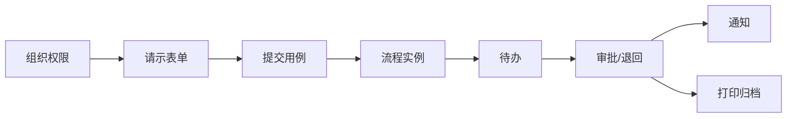

# 开发路线与验收标准

## 1. 交付策略

先搭平台内核，再用“合同/支出请示”作为首个纵向切片验证组织、表单、流程、待办、附件、打印和归档。验证成功后复用平台能力交付其他业务包。

不建议同时铺开全部表单，否则流程规则未稳定时会产生大面积返工。

## 2. 阶段规划

### 阶段 0：工程与架构基线

交付：

- NestJS、Vue 3、Pinia、SQLite 工程。
- 统一 lint、格式化、类型检查、单元测试和 CI。
- 数据库迁移、环境配置、日志和健康检查。
- ADR：ORM、UI 库、认证、文件存储、流程条件。
- 共享契约和模块模板。

验收：

- 本地一条命令启动 API 与 Web。
- CI 执行 lint、typecheck、test、build。
- 无业务硬编码和明文密钥。

### 阶段 1：组织权限与门户骨架

交付：

- 用户、部门、岗位、角色、权限、数据范围。
- 登录、个人信息、菜单权限。
- PC/手机响应式应用框架。
- 公司门户和个人工作台空状态。

验收：

- 不同角色看到不同菜单和数据范围。
- 组织变更不破坏历史人员快照。
- 手机和 PC 均可完成登录和导航。

### 阶段 2：表单与工作流 MVP

交付：

- 表单定义/版本、字段组件、校验和字段权限。
- 流程定义/版本、顺序审批、条件分支、会签、退回、转办。
- 草稿、提交、待办、已办、我发起的。
- 附件、审批意见、流程轨迹、通知。
- 打印和基础归档包。

验收：

- 发布后流程版本不可修改。
- 运行实例绑定固定表单和流程版本。
- 退回重提保留完整历史。
- 同一任务并发处理只有一次成功。

### 阶段 3：合同与支出纵向切片

交付顺序：

1. 合同/支出请示。
2. 合同审批。
3. 合同支出。
4. 支出报销。
5. 关联单据和跨流程启动。

验收：

- 原文档字段逐项对照通过。
- 请示 → 合同 → 支出关系可追溯。
- 合同累计付款与未执行金额计算正确。
- 所有审批意见和附件可打印归档。

### 阶段 4：行政、物资和财务

交付：

- 印章证照使用/外借及台账闭环。
- 物资申购、采购执行、领用和实发。
- 款待申请及后续报销关联。
- 会议宴会 EO、部门协作任务、修订确认和结算关联。
- 银行支出、现金支出、借款。
- 应收预收、微信支付宝、信用卡退款。

前置条件：补齐各财务单据流程、金额阈值和财务字段权限。

### 阶段 5：人力、公文、信息和党群

交付：

- 请假、假期余额和销假。
- 会议纪要、备忘录、通知、制度、新闻。
- 收文、发文、请示、传阅和回执。
- 党群印章、三重一大、党委收发文。

### 阶段 6：企业化增强

- 可视化流程设计器和流程模拟。
- SLA、催办、升级和代理。
- 全文检索、统计、导出和驾驶舱。
- 病毒扫描、双因素认证、安全审计。
- 备份恢复演练、容量和性能测试。
- 可选邮件、短信、企业微信/钉钉集成。

## 3. 模块完成定义

每个功能模块只有同时满足以下条件才算完成：

1. 需求说明和字段字典。
2. 模块结构图、流程图和状态图。
3. 领域模型及不变量。
4. API 契约与错误码。
5. 权限和字段权限矩阵。
6. 数据迁移。
7. 单元测试、集成测试和关键端到端测试。
8. 响应式 PC/手机页面。
9. 打印/归档方案。
10. 运维和异常处理说明。

## 4. 开发顺序

每次开发新功能必须按以下顺序：

1. 检索已有模块、用例、组件和领域能力。
2. 判断复用、扩展或新建，记录选择理由。
3. 明确业务规则、状态、不变量和权限。
4. 先更新模块文档和接口契约。
5. 实现领域和应用用例。
6. 实现基础设施与路由。
7. 实现前端交互。
8. 执行 lint、typecheck、单元/集成测试。
9. 完成 PC 与手机端关键路径验收。
10. 更新模块说明和变更记录。

## 5. 首个纵向切片拆分

建议迭代：

1. 用户可保存和提交合同/支出请示。
2. 部门总监可审批或退回。
3. 支持财务与行政完整顺序链。
4. 支持动态部门会签。
5. 支持总经理退回指定历史节点。
6. 支持通知、打印和归档。
7. 再从已完成请示启动合同审批。

## 6. 验收测试矩阵

### 6.1 通用

- 未授权用户不能查看或修改单据。
- 用户只能处理分配给自己或候选组的任务。
- 重复点击审批不会生成重复任务。
- 流程发布新版本不影响运行中的旧实例。
- 组织调整后历史意见仍显示当时部门和岗位。
- 附件权限、下载和审计正确。
- PC、手机字段数量和业务语义一致。

### 6.2 工作流

- 顺序审批正常推进。
- 条件分支只进入满足条件的路径。
- 并行会签按配置汇总。
- 退回任意允许节点并可重新提交。
- 转办、委托、加签和撤回按权限执行。
- 办理人为空时进入异常队列并告警。
- 流程结束后只生成一次归档包。

### 6.3 表单

- 字段类型、必填、格式、范围和条件规则正确。
- 金额小写与大写一致。
- 只读字段无法通过修改请求绕过。
- 明细行增删、汇总和精度正确。
- 敏感字段脱敏且不会进入日志。
- 打印包含全部字段、审批意见和附件清单。
- EO 的客房、用餐、会场、协作部门字段完整，修订后仅受影响部门重新确认。

### 6.4 性能目标

以 200 用户规模为首期基线：

- 普通列表 P95 小于 800ms。
- 单据详情 P95 小于 1s，不含大文件下载。
- 审批提交 P95 小于 1.5s。
- 50 个并发用户下无任务重复、数据库锁死或数据丢失。

性能目标需在真实部署规格上验证，不以开发机结果代替。

## 7. 上线门槛

- 关键流程 UAT 全通过。
- 数据备份和恢复演练通过。
- 权限矩阵经业务负责人确认。
- 未关闭的高风险安全问题为零。
- 流程、表单、字典、组织和编号均有生产初始化清单。
- 管理员、普通员工、财务、办公室和审计角色完成培训。
