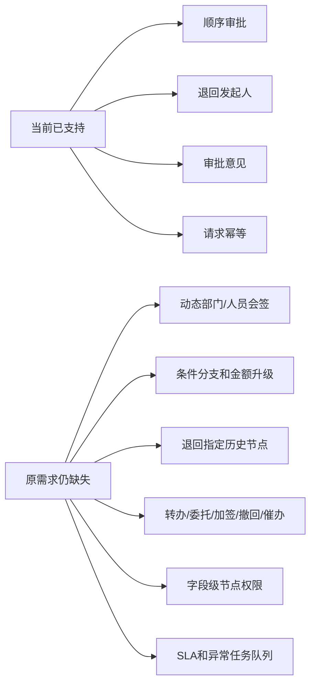

# 前三模块企业化实现差距审计

## 1. 审计范围

本次审计以三组证据交叉核对：

1. 原始 `OA说明.docx` 的流程文字、页面截图和业务表单截图。
2. `docs/requirements`、`docs/architecture` 与 `docs/delivery` 中整理后的需求。
3. 当前合同支出、行政印章、物资申购领用三个模块的接口、领域规则、页面与测试。

审计目标不是把 MVP 包装成企业版，而是确认当前可交付能力、显式缺口和需要业务确认的规则。

## 2. 结论

- 原始材料中合同、印章、物资申购和物资领用的可辨识字段已进入当前页面，并拆分为列表、制单、详情、审批和执行视图；第三类“物资类”中的款待申请尚未实现，不能计入本次完成范围。
- 当前后端已将顺序审批接入不可变流程/表单版本、组织候选人和具体用户任务，并提供独立 A4 纸面打印；尚不能满足原文中的动态会签、条件升级、指定节点退回、正式附件和不可变归档包等完整企业流程。
- 合同、印章、物资已使用“通用单据权限 + 模块权限”双钥匙控制菜单、路由、接口和数据范围；任务候选人必须同时具备审批与目标模块查看权限，且每项权限的数据范围覆盖申请部门。
- 本次 UI 只开放真实接口已经支持的操作。未支持能力作为缺口记录，不设置无效按钮或伪造成功状态。
- 因字段级节点权限、复杂流程、附件安全和归档能力尚未完成，前三模块当前定位为“具备企业平台基础的可运行纵向切片”，不能作为生产完整验收结论。

## 3. 已完成的企业化交互

| 能力 | 实现状态 |
| --- | --- |
| 正式登录 | 取消前端自动登录和内置密码，路由统一执行登录校验 |
| 企业应用框架 | 桌面侧栏、移动抽屉、统一页头、状态和用户入口 |
| 个人工作台 | 待办、已办、我发起的、关键词/流程/状态筛选 |
| 公司门户 | 七类信息栏目、受众隔离、日历、常用入口、待阅回执与响应式信息区 |
| 内容运营 | 草稿、定时发布、发布、撤回、不可变修订、审计和 IAM 受众目录 |
| 审批阅读 | 关键业务字段、流程版本、当前节点和审批意见同屏展示 |
| 单据生命周期 | 列表、创建、草稿编辑、详情、提交和审批动作分离 |
| 合同支出 | 请示、合同审批、合同付款使用独立完整表单 |
| 行政印章 | 资产台账、外借、用印和审批后执行登记分离 |
| 物资管理 | 物资目录、申购、领用和审批后实发登记分离 |
| 响应式表单 | PC 使用高密度分组与明细表，手机使用单列和明细卡片 |
| 只读详情 | 系统字段、业务字段、明细、附件清单和流程轨迹统一展示 |
| 组织权限 | 部门树、岗位、多部门任职、角色权限及四级数据范围 |
| 模块授权 | 合同、印章、物资分别使用 `*_CREATE` / `*_VIEW`，不能用通用权限跨包访问 |
| 任务授权 | 节点创建时按申请部门解析并固化具体候选用户，同时校验审批和模块查看权限 |
| 版本绑定 | 新单据绑定已发布表单和流程版本，存量单据兼容旧定义 |
| 设计平台 | Element Plus 组织权限页、Vue Flow 流程设计器和 A4 表单设计器 |
| 纸面打印 | 七类业务单据按绑定表单版本解释 A4 分区，包含明细留白、附件清单和审批意见 |

## 4. 字段覆盖核对

### 4.1 合同支出

| 单据 | 原始字段覆盖 | 当前限制 |
| --- | --- | --- |
| 合同/支出请示 | 编号、标题、部门、申请人、时间、金额、内容、附件、审批意见 | 非支出类金额可空；附件当前仅保存文件名 |
| 合同审批 | 关联请示、签约部门、日期、名称、金额、对方单位、内容理由、用印、附件、审批意见 | 关联合同类型、经办人、履约日期等扩展字段尚未进入后端契约 |
| 合同付款 | 合同快照、预算、累计执行、科目、保养估算、付款次数、进度、付款方式、原因、票据、保修期、金额大小写 | 预算和历史执行额依赖人工输入，尚无预算台账和付款流水自动汇总 |

### 4.2 行政印章

| 单据/台账 | 原始字段覆盖 | 当前限制 |
| --- | --- | --- |
| 外借申请 | 申请人、部门、日期、使用/归还日期、陪同人、地点、印章证照、内容、附件、审批意见 | 交接双方确认、签名和逾期提醒未实现 |
| 用印申请 | 申请人、部门、日期、使用日期、用途、印章证照、内容、附件、审批意见 | 待盖章文件没有真实文件存储和版本校验 |
| 执行登记 | 实际领用人、领用/归还时间、归还状态、异常；份数、执行时间、归档号、备注 | 无双人交接确认、电子签名和归档文件关联 |
| 印章证照台账 | 编码、名称、类型、保管人、状态、有效期 | 无新增/停用、盘点、变更历史和证照到期提醒 |

### 4.3 物资申购领用

| 单据/台账 | 原始字段覆盖 | 当前限制 |
| --- | --- | --- |
| 物资申购 | 申购人、部门、日期、品名、品牌、规格、单位、数量、月消耗、参考单价、备注和金额汇总 | 没有供应商、询价、订单、到货及采购执行价闭环 |
| 物资领用 | 单号、日期、部门、联系人、物资编号、品名、规格、单位、请领量、实发量、用途、附件、审批意见 | 当前只允许一次实发登记，部分发放后的再次发放尚未实现 |
| 物资目录 | 编码、品名、规格、单位、可用量和启用状态 | 缺少分类、仓库、占用量、批次、入库和盘点记录 |
| 款待申请 | 原始表单包含被款待单位、人数、事由、日期、时间和餐厅 | 当前没有领域模型、制单页面、A4 模板、正式审批链和事后账单关联，属于明确遗漏 |

## 5. 流程差距

当前开发种子中的审批链是缩短后的技术验证链，不等于原文正式流程。原文中的财务秘书、财务主管、财务总监、业主负责人、办公室秘书、办公室主任、总经理、业主代表及动态会签节点，必须在角色口径、金额阈值和会签规则确认后配置。

## 6. 平台与合规差距

| 优先级 | 缺口 | 影响 |
| --- | --- | --- |
| P0 | 空生产库尚无用户、印章资产、物资目录的管理闭环，六类业务仍依赖仅在非生产环境初始化的兼容流程 | 当前部署适合本地开发验收，正式生产前必须补管理员自举、主数据维护和全部业务流程发布方案 |
| P0 | 表单/流程设计器只能为固定七类领域单据提供版本和打印配置，不能由任意新表单自动生成制单、校验、路由和运行时 | 当前属于前三业务包的平台化配置能力，不是通用低代码 OA 运行平台 |
| P0 | 已有正式组织、RBAC、数据范围和参与人读取校验，但字段级节点权限尚未进入业务运行时 | 敏感字段仍不能按节点隐藏、只读或脱敏 |
| P0 | 附件仅记录文件名，无对象存储、下载鉴权、病毒扫描和审计 | 不能满足合同和用印材料归档 |
| P0 | 已有 A4 网格打印和版本绑定，但无 PDF 固化、二维码验真和归档包 | 可以纸面打印，尚不能完成电子档案留存 |
| P1 | 表单版式和审批意见名称已固化，但申请人、部门和印章显示名仍实时读取目录 | 基础资料改名后历史单据的纸面名称可能变化 |
| P1 | 业务记录与统一单据索引目前分两步保存，尚无共同事务 seam | 极端数据库故障可能留下孤立业务记录或索引不一致 |
| P1 | 已有部门、岗位、角色配置和空候选阻断，但无用户账号全生命周期与异常任务处理台 | 岗位空缺会被明确阻断，仍需管理员人工修复 |
| P1 | 用户可配置多部门任职，但制单和审批意见仍固定使用主任职上下文 | 副部门任职目前用于候选人和数据范围，尚不能由用户切换发起部门或办理身份 |
| P1 | 审批意见已固化部门、岗位和节点，仍缺代理人、耗时、客户端和 IP | 审计证据尚不完整 |
| P1 | 无通知、催办、超时升级和异常队列 | 业务无法持续运营和追责 |
| P1 | 无自动保存、离开保护和草稿恢复版本 | 长表单编辑存在丢失风险 |
| P2 | 无流程模板收藏、门户组件可视化布局和个人组件偏好保存 | 常用流程与门户个性化仍依赖固定配置 |
| P2 | 无导出、统计和台账报表 | 管理分析与审计抽查依赖人工 |

## 7. 原始需求冲突

以下内容继续以 `docs/delivery/01-open-questions.md` 为准，代码不得自行确定：

- 业主负责人、业主代表和业务财务负责人的角色关系。
- 金额或合同类型触发审计、总经理、业主审批的阈值。
- 部门会签和办公室会签的人员选择及通过规则。
- 总经理允许退回的节点，以及重提后是否重新会签。
- 合同用印是合同流程内节点还是独立印章子流程。
- 印章证照是否允许一单多件，以及交接确认方式。
- 物资申购是否升级行政链路，采购执行和入库由哪些岗位负责。

## 8. 后续验收顺序

1. 业务负责人确认前三模块的正式节点、条件、会签和退回矩阵。
2. 完成字段权限、附件安全和归档包三项剩余 P0 平台能力。
3. 将其余六类旧审批链逐步配置为已发布的不可变流程版本。
4. 补齐合同付款台账、印章交接台账、采购入库和多次实发闭环。
5. 执行 PC/手机字段逐项、权限越权、流程分支、打印归档和并发幂等 UAT。
