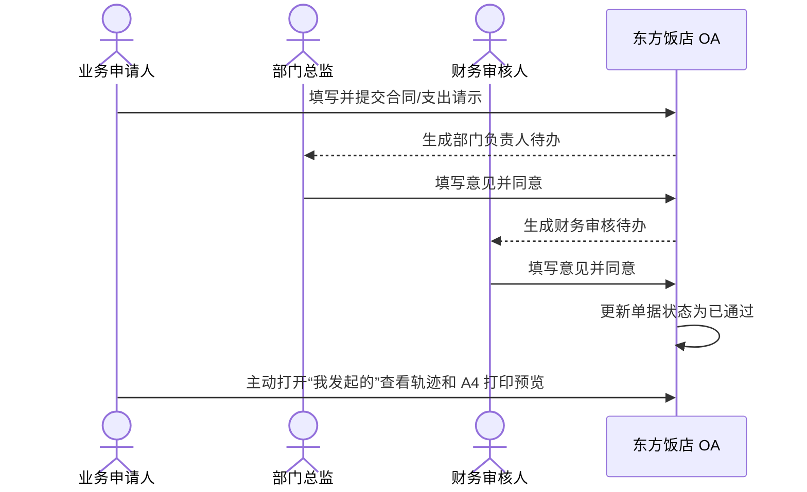

# 2026-07-21 端到端操作验证

## 1. 验证目标

使用当前本地演示环境的真实页面，验证一张新单据能否完成以下闭环：

## 2. 验证数据

| 项目 | 实测值 |
| --- | --- |
| 单据 | `CONTRACT-REQUEST-20260721-7FCA2D4B` |
| 标题 | `[操作手册演示] 客房电视维修支出请示` |
| 发起人/部门 | 业务申请人 / 业务部 |
| 请示金额 | `¥12,800.00` |
| 流程 | 合同/支出请示流程 `V1` |
| 打印表单 | 请示报告 `V2` |
| 最终状态 | `APPROVED`（页面显示“已通过”） |
| 最终修订 | `4` |
| 详情路径 | `/documents/CONTRACT_REQUEST/7fca2d4b-a87d-4955-a684-e6dad28ff142` |

上述路径和数据仅适用于 2026-07-21 当前本地演示数据库，其他环境不能使用该 UUID 查询。

## 3. 页面操作记录

| 时间 | 操作人 | 页面操作 | 实际结果 |
| --- | --- | --- | --- |
| 19:07 | `applicant` 业务申请人 | 从“发起申请”进入“合同/支出请示”，填写题目、金额和内容，点击“保存并提交” | 生成单号，状态为“审批中”，进入部门负责人待办 |
| 19:10 | `manager` 部门总监 | 从待办点击“办理”，核对详情，填写“情况属实，同意按预算安排维修，请财务审核”并同意 | 目标待办消失，流程推进到财务审核 |
| 19:12 | `finance` 财务审核人 | 从待办点击“办理”，填写“预算金额及事项说明已核对，同意该支出请示”并同意 | 目标待办消失，单据终审通过 |
| 终审后 | `applicant` 业务申请人 | 重新打开单据详情和 A4 预览 | 状态“已通过”；一条提交记录和两条人工审批意见完整显示 |

## 4. 数据库只读核对

页面操作完成后，对当前 SQLite 运行库做只读核对：

- `document_indexes.status = APPROVED`
- `document_indexes.revision = 4`
- `processVersionId` 指向已发布的“合同/支出请示流程 V1”
- `formVersionId` 指向已发布的“请示报告 V2”
- `workflow_opinions` 共有一条提交记录和两条同意意见
- `PRAGMA integrity_check = ok`

## 5. 结论

本次验证通过了制单、发布版本绑定、任务候选人、两级顺序审批、意见快照、办结状态和 A4 打印回放。本次只证明“合同/支出请示”这一条代表性流程已按当前线性流程实现跑通，不代表原始需求中的长链路、条件分支、会签、通知和不可变 PDF 归档已实现。

员工和管理员的日常使用见[东方饭店 OA 系统操作手册](../user-guide/oa-operation-manual.md)。
