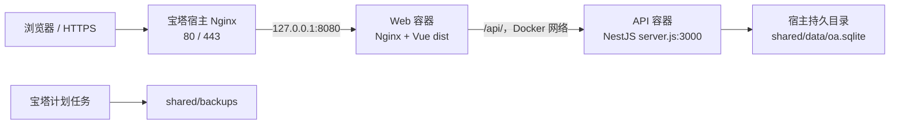

# CentOS 宝塔 Docker 部署教程

## 1. 适用范围

本文用于在 CentOS Stream 9、Rocky Linux 8/9 或 AlmaLinux 8/9 的宝塔面板中，以 Docker Compose 部署本项目。

项目已提供以下文件：

- `deploy/docker/Dockerfile`：在 Linux 容器内构建 Vue 前端、NestJS `server.js` 和受控花名册命令 `roster-import.js`。
- `deploy/docker/compose.yaml`：启动 Web 和 API 两个容器。
- `deploy/docker/nginx.conf`：提供 Vue SPA，并把 `/api/` 转发给 API 容器。
- `deploy/docker/.env.example`：部署环境变量模板。
- `deploy/docker/backup.sh`：SQLite 在线备份脚本。

非 Docker 的 PM2 部署方式仍见 `docs/deployment/centos-baota.md`，两套方案不要混用。

## 2. 部署架构



部署约束：

1. 公网只开放 `80/443`。
2. Web 容器只绑定宿主 `127.0.0.1:8080`。
3. API 的 `3000` 端口不映射到宿主和公网。
4. SQLite 只能由一个 API 容器写入，禁止扩容 API、PM2 cluster 或双实例滚动发布。
5. 数据库必须位于服务器本机 ext4/xfs 磁盘，不能放在 NFS、CIFS 或对象存储挂载中。

## 3. 上线前必须知道的限制

生产模式的全新空库会自动执行数据库迁移，但不会创建首个用户。健康接口可能返回正常，登录仍然会失败。

`OA_BOOTSTRAP_ADMIN_USERNAME` 只能给数据库中已经存在且启用的用户授予管理员权限，不能创建用户。正式上线必须先准备一份已包含正式管理员和基础组织数据、并经过审查的 SQLite 数据库。

如果只是内网演示，可按第 8 节进行一次演示数据初始化。演示账号不能直接作为正式账号体系使用。

## 4. 服务器准备

### 4.1 推荐配置

| 项目     | 建议                                               |
| -------- | -------------------------------------------------- |
| 操作系统 | Rocky/Alma 8 或 9、CentOS Stream 9，CentOS 7 不用 |
| CPU      | 2 核以上                                           |
| 内存     | 运行 2 GB；服务器直接构建镜像建议 4 GB 或配置 Swap |
| 磁盘     | 本机 SSD，预留数据库、镜像和备份空间               |
| 架构     | `x86_64` 或 `aarch64`，必须在目标服务器上构建镜像  |

### 4.2 宝塔安装组件

在宝塔软件商店安装：

1. Nginx。
2. Docker 管理器。
3. Docker Compose V2；新版 Docker 管理器通常已经包含。

进入宝塔终端，以 `root` 执行预检：

```bash
cat /etc/os-release
uname -m
docker version
docker compose version
docker compose up --help | grep -q -- '--wait'
systemctl enable --now docker
systemctl is-active docker
docker info
```

安装部署辅助工具：

```bash
dnf install -y git gzip openssl sqlite util-linux
```

如果 `docker compose version` 不存在，或 `up --help` 找不到 `--wait`，不要安装旧的 Python `docker-compose`，应在宝塔 Docker 管理器中升级 Compose V2 后再继续。

## 5. 创建目录并取得代码

本文统一使用以下目录：

```text
/www/wwwroot/oa-hotel-docker/
├── source/                 # Git 源码
└── shared/
    ├── data/               # SQLite 主库、WAL、SHM
    ├── backups/            # root 专用在线备份
    └── release-records/    # 升级与回滚记录
```

执行：

```bash
set -Eeuo pipefail
export OA_ROOT=/www/wwwroot/oa-hotel-docker

install -d -m 750 "$OA_ROOT"
install -d -o 1000 -g 1000 -m 750 "$OA_ROOT/shared/data"
install -d -o root -g root -m 700 "$OA_ROOT/shared/backups"
install -d -o root -g root -m 700 "$OA_ROOT/shared/release-records"
```

取得源码有两种方式。只有当新增的 `.dockerignore`、`deploy/docker/` 和本教程已经提交并推送到 GitHub `main` 后，才能直接克隆：

```bash
export OA_ROOT=/www/wwwroot/oa-hotel-docker

git clone --branch main \
  https://github.com/yiting001/oa-hotel-v1.git \
  "$OA_ROOT/source"
```

如果服务器要部署当前本地尚未推送的改动，应从本机项目根目录制作源码包：

```bash
COPYFILE_DISABLE=1 tar \
  --exclude='./.git' \
  --exclude='./.env' \
  --exclude='*/.env' \
  --exclude='.DS_Store' \
  --exclude='./node_modules' \
  --exclude='./dist' \
  --exclude='./apps/api/data' \
  --exclude='*/node_modules' \
  --exclude='*/dist' \
  --exclude='coverage' \
  --exclude='playwright-report' \
  --exclude='test-results' \
  --exclude='*.sqlite' \
  --exclude='*.sqlite-wal' \
  --exclude='*.sqlite-shm' \
  -czf /tmp/oa-hotel-docker-source.tar.gz .
```

通过宝塔文件管理上传到服务器后执行：

```bash
export OA_ROOT=/www/wwwroot/oa-hotel-docker
install -d -m 750 "$OA_ROOT/source"
tar -xzf /上传路径/oa-hotel-docker-source.tar.gz -C "$OA_ROOT/source"
```

如果已经通过 Git 克隆且 `source` 已存在：

```bash
git -C /www/wwwroot/oa-hotel-docker/source status --short
git -C /www/wwwroot/oa-hotel-docker/source pull --ff-only origin main
```

执行 `pull` 前，仓库必须没有服务器上的临时修改。也可以通过宝塔文件管理上传完整源码，但目录根部必须能看到 `package.json`、`package-lock.json`、`apps/`、`packages/` 和 `deploy/`。

无论使用哪种方式，都先验证 Docker 文件存在：

```bash
test -f /www/wwwroot/oa-hotel-docker/source/.dockerignore
test -f /www/wwwroot/oa-hotel-docker/source/deploy/docker/Dockerfile
test -f /www/wwwroot/oa-hotel-docker/source/deploy/docker/compose.yaml
```

不要上传本机 `node_modules`，也不要直接部署仓库中旧的 `dist/` 压缩包。`argon2` 和 `better-sqlite3` 含平台原生二进制，必须在 Linux 镜像中安装。

源码包上传方式只用于当前未推送改动的首次临时部署。第 14、15 节依赖 Git commit，正式长期运维前必须等完整 Docker 改动推送到 `main` 后切换为 Git 管理：

```bash
set -Eeuo pipefail
export OA_ROOT=/www/wwwroot/oa-hotel-docker

cp "$OA_ROOT/source/deploy/docker/.env" "$OA_ROOT/shared/docker.env"
chmod 600 "$OA_ROOT/shared/docker.env"
mv "$OA_ROOT/source" "$OA_ROOT/source-uploaded-$(date +%Y%m%d-%H%M%S)"
git clone --branch main https://github.com/yiting001/oa-hotel-v1.git "$OA_ROOT/source"
cp "$OA_ROOT/shared/docker.env" "$OA_ROOT/source/deploy/docker/.env"
chmod 600 "$OA_ROOT/source/deploy/docker/.env"

cd "$OA_ROOT/source/deploy/docker"
docker compose config --quiet
docker compose up -d --no-build --wait --wait-timeout 120
```

确认容器和业务正常后再删除 `source-uploaded-*`；不要删除 `shared/data` 和 `shared/backups`。

## 6. 配置 Docker 环境变量

执行：

```bash
cd /www/wwwroot/oa-hotel-docker/source/deploy/docker
cp .env.example .env
chmod 600 .env

JWT_SECRET_VALUE=$(openssl rand -hex 48)
sed -i "s|^JWT_SECRET=.*|JWT_SECRET=$JWT_SECRET_VALUE|" .env
sed -i "s|^OA_IMAGE_TAG=.*|OA_IMAGE_TAG=$(date +%Y%m%d-%H%M%S)|" .env
unset JWT_SECRET_VALUE
```

检查并按实际情况编辑 `.env`：

```bash
vi /www/wwwroot/oa-hotel-docker/source/deploy/docker/.env
```

正式环境的关键值应为：

```dotenv
OA_HTTP_PORT=8080
OA_DATA_DIR=/www/wwwroot/oa-hotel-docker/shared/data
OA_BACKUP_DIR=/www/wwwroot/oa-hotel-docker/shared/backups

VITE_OA_TIME_ZONE=Asia/Shanghai
VITE_OA_COMPANY_NAME=东方饭店
VITE_OA_PRODUCT_NAME=企业协同办公

NODE_ENV=production
JWT_SECRET=由openssl生成的固定随机值
OA_TIME_ZONE=Asia/Shanghai
OA_DEMO_SEED=false
OA_DEMO_PASSWORD=
OA_BOOTSTRAP_ADMIN_USERNAME=
OA_SWAGGER_ENABLED=false
OA_CORS_ORIGINS=
```

注意事项：

- `JWT_SECRET` 必须至少 32 个字符，首次生成后长期保存。更换它会让所有现有登录失效。
- `.env` 不可提交 Git、不可发到聊天或工单中，建议另做加密备份。
- `VITE_OA_*` 是前端构建参数，修改后必须重新构建 Web 镜像。
- 同域部署时 `OA_CORS_ORIGINS` 留空。
- 国内网络下载 npm 包缓慢时，可把 `OA_NPM_REGISTRY` 改为可信镜像源，然后重新构建。

验证配置，只检查退出码，不要把包含密钥的完整配置输出分享给别人：

```bash
docker compose config --quiet
```

## 7. 正式环境准备数据库

### 7.1 从已有环境制作一致性副本

在已有环境仍运行时，禁止直接复制 `oa.sqlite`，因为最新事务可能仍在 `oa.sqlite-wal`。应使用 SQLite 在线备份。

例如在当前开发机器项目根目录执行：

```bash
set -Eeuo pipefail
SOURCE_DB=apps/api/data/oa.sqlite
test -s "$SOURCE_DB"
test "$(sqlite3 "$SOURCE_DB" \
  "SELECT count(*) FROM sqlite_master WHERE type = 'table' AND name IN ('migrations', 'users');")" = 2
test "$(sqlite3 "$SOURCE_DB" 'SELECT count(*) FROM users WHERE active = 1;')" -ge 1

sqlite3 "$SOURCE_DB" \
  ".timeout 10000" \
  ".backup '/tmp/oa-production.sqlite'"

sqlite3 /tmp/oa-production.sqlite 'PRAGMA integrity_check;'
```

结果必须只有：

```text
ok
```

使用宝塔文件管理，把 `/tmp/oa-production.sqlite` 上传为：

```text
/www/wwwroot/oa-hotel-docker/shared/data/oa.sqlite
```

在服务器设置权限并再次检查：

```bash
chown 1000:1000 /www/wwwroot/oa-hotel-docker/shared/data/oa.sqlite
chmod 640 /www/wwwroot/oa-hotel-docker/shared/data/oa.sqlite
chmod 750 /www/wwwroot/oa-hotel-docker/shared/data

sqlite3 /www/wwwroot/oa-hotel-docker/shared/data/oa.sqlite \
  'PRAGMA integrity_check;'
```

必须确认该数据库中的管理员、部门、岗位、角色、密码和演示数据都适合正式环境。当前本地演示数据库不能未经处理直接作为生产账号库。

### 7.2 SELinux

Compose 的数据卷使用 `:Z` 自动创建专用 SELinux 标签，不要为了省事关闭 SELinux。

查看状态：

```bash
getenforce
```

宝塔宿主 Nginx 反代出现权限型 `502` 时允许 Nginx 建立网络连接：

```bash
setsebool -P httpd_can_network_connect 1
```

## 8. 仅演示服务器的一次性初始化

本节只适用于无正式数据的内网演示或验收服务器，必须在配置公网反向代理之前执行。正式上线跳过本节，使用第 7 节准备的数据库。

下面整段一次执行。无论初始化在哪一步失败，退出处理都会把 `.env` 恢复为生产配置并停止本次容器，防止服务遗留在 development 模式：

```bash
set -Eeuo pipefail
umask 077
export OA_ROOT=/www/wwwroot/oa-hotel-docker
cd /www/wwwroot/oa-hotel-docker/source/deploy/docker

if compgen -G "$OA_ROOT/shared/data/*.sqlite*" >/dev/null; then
  echo '数据目录已存在 SQLite 文件，拒绝执行演示初始化。' >&2
  exit 1
fi

DEMO_PASSWORD=$(openssl rand -hex 16)
LOGIN_RESPONSE="/tmp/oa-demo-login-$$.json"

restore_production_config() {
  sed -i 's/^NODE_ENV=.*/NODE_ENV=production/' .env
  sed -i 's/^OA_DEMO_SEED=.*/OA_DEMO_SEED=false/' .env
  sed -i 's/^OA_DEMO_PASSWORD=.*/OA_DEMO_PASSWORD=/' .env
  sed -i 's/^OA_BOOTSTRAP_ADMIN_USERNAME=.*/OA_BOOTSTRAP_ADMIN_USERNAME=/' .env
}

cleanup_demo_init() {
  STATUS=$?
  trap - EXIT
  rm -f "$LOGIN_RESPONSE"
  restore_production_config
  if [[ "$STATUS" -ne 0 ]]; then
    docker compose stop web api >/dev/null 2>&1 || true
  fi
  exit "$STATUS"
}
trap cleanup_demo_init EXIT

sed -i 's/^NODE_ENV=.*/NODE_ENV=development/' .env
sed -i 's/^OA_DEMO_SEED=.*/OA_DEMO_SEED=true/' .env
sed -i "s/^OA_DEMO_PASSWORD=.*/OA_DEMO_PASSWORD=$DEMO_PASSWORD/" .env
sed -i 's/^OA_BOOTSTRAP_ADMIN_USERNAME=.*/OA_BOOTSTRAP_ADMIN_USERNAME=office/' .env
echo "请暂存演示密码：$DEMO_PASSWORD"

docker compose config --quiet
docker compose build --pull
docker compose up -d --wait --wait-timeout 120
test -s "$OA_ROOT/shared/data/oa.sqlite"

LOGIN_STATUS=$(curl -sS -o "$LOGIN_RESPONSE" -w '%{http_code}' \
  -H 'Content-Type: application/json' \
  -d "{\"username\":\"office\",\"password\":\"$DEMO_PASSWORD\"}" \
  http://127.0.0.1:8080/api/v1/auth/login)
rm -f "$LOGIN_RESPONSE"
test "$LOGIN_STATUS" = 201

restore_production_config
docker compose config --quiet
docker compose up -d --force-recreate --wait --wait-timeout 120 api
curl -fsS http://127.0.0.1:8080/api/v1/health
docker compose ps
trap - EXIT
unset DEMO_PASSWORD
```

该过程会创建 `applicant`、`manager`、`finance`、`office`、`procurement` 和 `warehouse` 六个演示账号。它们共享刚生成的演示密码，不能作为正式生产账号长期使用。

如果脚本中途失败，容器会停止，但数据目录可能保留半初始化文件。先确认该目录绝不是正式数据，再人工移走这些文件后重试；空库保护会阻止直接覆盖。

## 9. 构建并启动正式服务

已经按第 7 节准备数据库后执行：

```bash
cd /www/wwwroot/oa-hotel-docker/source/deploy/docker
docker compose config --quiet
docker compose build --pull
docker compose up -d --remove-orphans --wait --wait-timeout 120
docker compose ps
```

首次构建会下载 Node、Nginx 和 npm 依赖，耗时取决于服务器网络。构建阶段会：

1. 编译共享契约包。
2. 把 NestJS 业务代码和花名册导入命令分别合并为 `server.js`、`roster-import.js`，并在镜像内执行命令烟测。
3. 在 Debian Linux 中安装 `argon2`、`better-sqlite3` 和 `swagger-ui-dist`。
4. 构建 Vue 生产静态文件。

查看启动日志：

```bash
docker compose logs --tail=200 api
docker compose logs --tail=200 web
```

本机健康检查：

```bash
curl -fsS http://127.0.0.1:8080/api/v1/health
curl -I http://127.0.0.1:8080/
```

健康接口应返回包含 `"status":"ok"` 的 JSON。它只证明进程可访问，不代表账号和所有业务流程已经验收。

在宝塔 Docker 页面中应能看到 `oa-hotel-api-*` 和 `oa-hotel-web-*` 两个镜像，以及 `api`、`web` 两个运行容器。不要在宝塔界面重复新建一套同名容器。

## 10. 宝塔站点、域名与 HTTPS

### 10.1 DNS 与防火墙

先把域名的 A 记录指向服务器公网 IPv4；使用 IPv6 时同时配置 AAAA 记录。

云安全组、宝塔安全和 firewalld 只开放 `80/443`：

```bash
firewall-cmd --permanent --add-service=http
firewall-cmd --permanent --add-service=https
firewall-cmd --reload
firewall-cmd --list-all
```

不要开放 `3000` 或 `8080`。Compose 已把 `8080` 绑定到 `127.0.0.1`，外部无法直接访问。

### 10.2 创建宝塔站点

在宝塔“网站”中新增站点：

1. 填写正式域名。
2. 不创建数据库。
3. PHP 版本选择“纯静态”。
4. 在“反向代理”中新增代理，目标 URL 填 `http://127.0.0.1:8080`。
5. 发送域名保持为 `$host`。

如果需要手工填写 Nginx 代理段，使用：

```nginx
location / {
    proxy_pass http://127.0.0.1:8080;
    proxy_http_version 1.1;
    proxy_set_header Host $host;
    proxy_set_header X-Real-IP $remote_addr;
    proxy_set_header X-Forwarded-For $proxy_add_x_forwarded_for;
    proxy_set_header X-Forwarded-Proto $scheme;
    proxy_read_timeout 60s;
    client_max_body_size 20m;
}
```

`proxy_pass` 后不要添加路径，浏览器请求的 `/api/v1/...` 必须保持不变。

修改后检查并重载宝塔 Nginx：

```bash
nginx -t
systemctl reload nginx
```

### 10.3 开启 HTTPS

在宝塔站点“SSL”中：

1. 申请 Let's Encrypt 证书。
2. 确认证书签发成功。
3. 开启“强制 HTTPS”。
4. 确认证书自动续期任务正常。

系统登录令牌保存在浏览器本地存储中，正式环境必须使用 HTTPS。

## 11. 上线验收

依次检查：

```bash
curl -fsS http://127.0.0.1:8080/api/v1/health
curl -fsS https://你的域名/api/v1/health
docker compose ps
docker compose logs --tail=100 api
```

浏览器验收：

1. HTTPS 页面无证书错误。
2. 可以使用正式管理员登录。
3. 公司门户图片、个人工作台、合同、印章和物资页面正常。
4. 新建一张测试草稿并刷新页面，确认数据仍存在。
5. 完成一条审批流程并打开 A4 打印预览。
6. 执行 `docker compose restart` 后再次确认数据存在。

## 12. 日常运维命令

所有命令先进入：

```bash
cd /www/wwwroot/oa-hotel-docker/source/deploy/docker
```

常用命令：

```bash
docker compose ps
docker compose logs -f --tail=200 api
docker compose logs -f --tail=200 web
docker compose restart api
docker compose restart web
docker compose images
docker stats
```

Compose 已限制单个容器日志为每文件 10 MB、最多 5 个文件。仍需定期检查宝塔 Nginx 的 access/error 日志和服务器磁盘空间。

不要执行：

```text
docker compose down -v
docker system prune --volumes
```

本项目使用 bind mount，但养成不删除卷的习惯可以避免未来配置变化造成数据事故。

## 13. SQLite 自动备份

首次执行：

```bash
cd /www/wwwroot/oa-hotel-docker/source/deploy/docker
chmod 750 backup.sh
BACKUP_GZ=$(./backup.sh)
test -s "$BACKUP_GZ"
echo "$BACKUP_GZ"
ls -lh /www/wwwroot/oa-hotel-docker/shared/backups
```

脚本先确认源数据库非空且包含 `migrations`、`users` 两个关键表，再通过宿主机 SQLite `.backup` 在线生成一致性副本。它使用 `flock` 防止人工备份与计划任务并发，执行 `PRAGMA integrity_check`，成功后以权限 `600` 压缩保存，并按 `.env` 中的 `OA_BACKUP_RETENTION_DAYS` 清理旧备份。备份目录不挂载给 API 容器。

在宝塔“计划任务”中新增 Shell 脚本，例如每天 `02:30` 执行：

```bash
cd /www/wwwroot/oa-hotel-docker/source/deploy/docker && \
./backup.sh >> /www/wwwroot/oa-hotel-docker/shared/backup.log 2>&1
```

至少定期把备份同步到另一台服务器或受控对象存储。仅保存在同一块磁盘不能防止磁盘损坏。`.env` 和 `JWT_SECRET` 也应单独加密备份。

运行中的数据库禁止使用 `cp oa.sqlite` 备份。

## 14. 升级发布

本节和第 15 节只适用于已经切换为 Git clone 的正式部署。每次升级都使用新的镜像标签，并先备份数据库：

```bash
set -Eeuo pipefail
umask 077
export OA_ROOT=/www/wwwroot/oa-hotel-docker
cd /www/wwwroot/oa-hotel-docker/source/deploy/docker

test "$(git -C ../.. branch --show-current)" = main
test -z "$(git -C ../.. status --porcelain --untracked-files=no)"
OLD_COMMIT=$(git -C ../.. rev-parse HEAD)
OLD_TAG=$(sed -n 's/^OA_IMAGE_TAG=//p' .env)
docker image inspect "oa-hotel-api:$OLD_TAG" >/dev/null
docker image inspect "oa-hotel-web:$OLD_TAG" >/dev/null
BACKUP_GZ=$(./backup.sh)
test -s "$BACKUP_GZ"

RECORD="$OA_ROOT/shared/release-records/upgrade-$(date +%Y%m%d-%H%M%S).env"
{
  echo "OLD_COMMIT=$OLD_COMMIT"
  echo "OLD_TAG=$OLD_TAG"
  echo "BACKUP_GZ=$BACKUP_GZ"
  echo "CREATED_AT=$(date -Is)"
} > "$RECORD"
chmod 600 "$RECORD"

restore_old_release_metadata() {
  STATUS=$?
  trap - ERR
  set +e
  sed -i "s/^OA_IMAGE_TAG=.*/OA_IMAGE_TAG=$OLD_TAG/" .env
  git -C ../.. switch --detach "$OLD_COMMIT" >/dev/null 2>&1
  git -C ../.. branch -f main "$OLD_COMMIT" >/dev/null 2>&1
  git -C ../.. switch main >/dev/null 2>&1
  echo "FAILED_AT=$(date -Is)" >> "$RECORD"
  echo '升级失败，源码和镜像标签已恢复；如果新容器曾启动，继续执行第 15 节完整回滚。' >&2
  exit "$STATUS"
}
trap restore_old_release_metadata ERR

git -C ../.. pull --ff-only origin main

NEW_TAG=$(date +%Y%m%d-%H%M%S)
sed -i "s/^OA_IMAGE_TAG=.*/OA_IMAGE_TAG=$NEW_TAG/" .env
docker compose config --quiet
docker compose build --pull
docker compose up -d --remove-orphans --wait --wait-timeout 120
docker compose ps
curl -fsS http://127.0.0.1:8080/api/v1/health

echo "NEW_COMMIT=$(git -C ../.. rev-parse HEAD)" >> "$RECORD"
echo "NEW_TAG=$NEW_TAG" >> "$RECORD"
trap - ERR
echo "升级记录：$RECORD"
```

应用启动时会自动执行 TypeORM 迁移。不要在生产容器里另外运行 TypeScript migration 命令。

升级完成后执行第 11 节业务验收。`release-records` 会持久记录旧提交、旧镜像标签和准确的升级前备份路径。保留上一个镜像标签和这些文件，直到新版本稳定。如果构建或启动失败，脚本会把部署源码和 `.env` 镜像标签恢复到旧发布组合；容器已经开始重建时仍应按下节执行完整回滚，因为数据库迁移不会随 Git 恢复。

## 15. 回滚

数据库迁移可能不向后兼容，回滚时必须同时恢复旧代码镜像和升级前数据库，不能只切换镜像。

以下命令必须先把路径和标签替换成 `release-records` 中的实际值。备份、旧提交和两个旧镜像会在停服前完成验证：

```bash
set -Eeuo pipefail
umask 077
export OA_ROOT=/www/wwwroot/oa-hotel-docker
export OLD_COMMIT=填写升级前Git提交
export OLD_TAG=填写升级前镜像标签
export BACKUP_GZ=填写升级前oa-时间.sqlite.gz绝对路径

cd "$OA_ROOT/source/deploy/docker"
DATA_DIR="$OA_ROOT/shared/data"
STAMP=$(date +%Y%m%d-%H%M%S)
RESTORE_DB=$(mktemp "$DATA_DIR/.oa-restore-$STAMP.XXXXXX.sqlite")
PREFLIGHT_DIR=''
cleanup_restore() {
  rm -f "$RESTORE_DB"
  if [[ -n "$PREFLIGHT_DIR" ]]; then
    rm -rf "$PREFLIGHT_DIR"
  fi
}
trap cleanup_restore EXIT

test -s "$BACKUP_GZ"
gzip -t "$BACKUP_GZ"
gunzip -c "$BACKUP_GZ" > "$RESTORE_DB"
test -s "$RESTORE_DB"
test "$(sqlite3 "$RESTORE_DB" 'PRAGMA integrity_check;')" = ok
git -C "$OA_ROOT/source" cat-file -e "$OLD_COMMIT^{commit}"
git -C "$OA_ROOT/source" cat-file -e "$OLD_COMMIT:deploy/docker/compose.yaml"
docker image inspect "oa-hotel-api:$OLD_TAG" >/dev/null
docker image inspect "oa-hotel-web:$OLD_TAG" >/dev/null

PREFLIGHT_DIR=$(mktemp -d /tmp/oa-rollback-preflight.XXXXXX)
git -C "$OA_ROOT/source" archive "$OLD_COMMIT" | tar -x -C "$PREFLIGHT_DIR"
cp .env "$PREFLIGHT_DIR/deploy/docker/.env"
sed -i "s/^OA_IMAGE_TAG=.*/OA_IMAGE_TAG=$OLD_TAG/" "$PREFLIGHT_DIR/deploy/docker/.env"
(
  cd "$PREFLIGHT_DIR/deploy/docker"
  docker compose config --quiet
)
rm -rf "$PREFLIGHT_DIR"
PREFLIGHT_DIR=''

docker compose stop web api

FAILED_DIR="$DATA_DIR/failed-$STAMP"
install -d -m 700 "$FAILED_DIR"
for file in oa.sqlite oa.sqlite-wal oa.sqlite-shm; do
  if [[ -e "$DATA_DIR/$file" ]]; then
    mv "$DATA_DIR/$file" "$FAILED_DIR/$file"
  fi
done
mv "$RESTORE_DB" "$DATA_DIR/oa.sqlite"
chown 1000:1000 "$DATA_DIR/oa.sqlite"
chmod 640 "$DATA_DIR/oa.sqlite"

git -C "$OA_ROOT/source" switch --detach "$OLD_COMMIT"
sed -i "s/^OA_IMAGE_TAG=.*/OA_IMAGE_TAG=$OLD_TAG/" .env
docker compose config --quiet
docker compose up -d --no-build --wait --wait-timeout 120
docker compose ps
curl -fsS http://127.0.0.1:8080/api/v1/health
trap - EXIT
```

故障时的主库、WAL 和 SHM 会整组保存在 `failed-时间/`，不要在事故处理中删除。回滚后源码有意处于 detached HEAD；下一次准备升级时，先执行 `git switch main`、`git pull --ff-only origin main`，完成评审后再按第 14 节发布。

## 16. 常见故障

### 16.1 Web 容器一直等待或显示 unhealthy

```bash
docker compose ps
docker compose logs --tail=200 api
docker compose logs --tail=200 web
```

优先检查 API 是否因 `JWT_SECRET`、数据库目录权限或迁移错误退出。

### 16.2 数据库目录不可写

错误通常包含 `Database directory is not writable`：

```bash
chown -R 1000:1000 /www/wwwroot/oa-hotel-docker/shared/data
chmod 750 /www/wwwroot/oa-hotel-docker/shared/data
docker compose up -d --force-recreate --wait --wait-timeout 120 api
```

不要只给 `oa.sqlite` 写权限，SQLite 还要在同目录创建 `-wal` 和 `-shm`。

### 16.3 宝塔访问 502

依次检查：

```bash
curl -fsS http://127.0.0.1:8080/api/v1/health
docker compose ps
nginx -t
getenforce
```

本机 curl 正常但宝塔仍 502，并且 SELinux 为 Enforcing 时，执行：

```bash
setsebool -P httpd_can_network_connect 1
systemctl reload nginx
```

### 16.4 健康正常但无法登录

最常见原因是使用了全新 production 空库。回到第 3、7 节，导入已经包含正式管理员的数据库。`OA_BOOTSTRAP_ADMIN_USERNAME` 不能创建首个用户。

### 16.5 构建原生依赖失败

确认：

```bash
uname -m
docker version
docker compose build --no-cache api
```

不要复制 macOS 或其他服务器的 `node_modules`。镜像必须在当前目标服务器或相同 Linux/CPU 平台上构建。

### 16.6 前端品牌配置修改后没有变化

`VITE_OA_*` 只在构建时生效，并且 API、Web 共用同一个发布标签。修改品牌后按第 14 节执行一次完整的带备份发布，不要只修改标签并单独重建 Web，否则 Compose 会期望一个不存在的同标签 API 镜像。发布完成后浏览器执行强制刷新；酒店固定文件名图片最长缓存一小时。

## 17. 安全检查清单

- [ ] 只开放 `80/443`，未开放 `3000/8080`。
- [ ] `JWT_SECRET` 为固定的 32 字符以上随机值。
- [ ] `.env` 权限为 `600`，且未提交 Git。
- [ ] 正式环境为 `NODE_ENV=production`、`OA_DEMO_SEED=false`。
- [ ] Swagger 为关闭状态。
- [ ] API 只有一个容器实例。
- [ ] SQLite 数据目录位于本机磁盘并已持久化。
- [ ] HTTPS 和证书自动续期正常。
- [ ] 在线备份、完整性检查和异机备份已配置。
- [ ] 已实际测试一次恢复和回滚。
