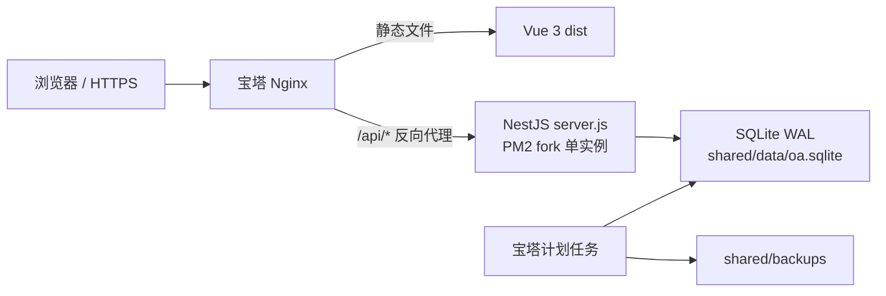

# CentOS / 宝塔生产部署指南

本文是宿主机 Nginx + PM2 部署方案。使用宝塔 Docker Compose 时，请改看 `docs/deployment/centos-baota-docker.md`，不要混用两套启动和反向代理配置。

## 1. 部署产物与边界

本项目采用以下生产拓扑：



`npm run package:production` 会把 NestJS 业务代码、迁移、实体和大部分第三方 JavaScript 合并成一个 `api/server.js`。部署包仍保留三个运行依赖：

- `better-sqlite3`：包含与 Linux、CPU 和 Node ABI 匹配的原生 `.node` 文件。
- `argon2`：包含密码哈希原生 `.node` 文件。
- `swagger-ui-dist`：Swagger 静态资源；生产默认关闭 Swagger，但依赖保留以支持显式启用。

因此不能只上传 `server.js`。正确方式是上传完整压缩包，并在 CentOS 服务器的 `api` 目录执行 `npm ci --omit=dev`。禁止把 macOS 的 `node_modules` 上传到 CentOS。

## 2. 服务器要求

### 2.1 推荐环境

| 项目     | 要求                                                    |
| -------- | ------------------------------------------------------- |
| 操作系统 | Rocky Linux / AlmaLinux 8 或 9、CentOS Stream 9，x86_64 |
| Node.js  | 推荐 Node 22 LTS；最低 `20.18`                          |
| 进程管理 | 宝塔 Node 项目管理器或 PM2，fork 单实例                 |
| Web 服务 | 宝塔 Nginx                                              |
| 数据库   | SQLite，服务器本地 ext4/xfs 磁盘                        |
| 开放端口 | 仅 `80/443`；API `3000` 不对公网开放                    |

CentOS 7 已停止维护，且系统 glibc 通常不能可靠运行官方 Node 20/22 二进制，不建议继续部署。

在服务器执行预检：

```bash
cat /etc/os-release
uname -m
ldd --version | head -1
node -v
npm -v
```

如果原生依赖没有匹配的预编译包，安装编译工具：

```bash
dnf install -y gcc gcc-c++ make python3 sqlite
```

宝塔软件商店需要安装：

1. Nginx。
2. Node 项目管理器，并安装 Node 22 LTS。
3. PM2；若使用宝塔 Node 项目管理器自带的进程管理，可不单独操作全局 PM2。

## 3. 本地构建上传包

在项目根目录执行：

```bash
nvm use 22
node --version
npm ci

VITE_OA_TIME_ZONE=Asia/Shanghai \
VITE_OA_COMPANY_NAME='东方饭店' \
VITE_OA_PRODUCT_NAME='企业协同办公' \
npm run package:production

# 可选快速检查：仅在 npm ci 与当前 Node 版本一致时复用本机原生二进制
npm run smoke:production -- --reuse-native
```

也可以一次执行：

```bash
VITE_OA_TIME_ZONE=Asia/Shanghai \
VITE_OA_COMPANY_NAME='东方饭店' \
VITE_OA_PRODUCT_NAME='企业协同办公' \
npm run verify:production
```

`verify:production` 会在隔离临时目录重新执行生产 `npm ci`，然后启动打包后的 `server.js` 并访问健康接口。这是发布前必须执行的完整校验；`--reuse-native` 只用于日常快速检查。

输出：

```text
dist/
├── oa-hotel-production.tar.gz.sha256
├── oa-hotel-production.tar.gz
└── oa-hotel-production/
    ├── api/
    │   ├── server.js
    │   ├── package.json
    │   ├── package-lock.json
    │   └── .env.example
    ├── web/
    │   ├── index.html
    │   └── assets/
    ├── config/
    │   ├── ecosystem.config.cjs
    │   └── nginx.conf.example
    ├── DEPLOYMENT.md
    └── release-manifest.json
```

`release-manifest.json` 记录每个部署文件的 SHA-256、Git commit 和构建时工作区状态。`oa-hotel-production.tar.gz.sha256` 用于服务器校验实际上传的压缩包。前端品牌变量只在构建时生效，服务器运行时修改它们不会改变已生成页面。

## 4. 创建服务器目录

以下命令默认运行用户为宝塔的 `www`。如果宝塔 Node 项目配置了其他用户，目录所有者必须同步替换。

```bash
export OA_ROOT=/www/wwwroot/oa-hotel

install -d -o www -g www -m 750 "$OA_ROOT/releases"
install -d -o www -g www -m 750 "$OA_ROOT/shared/data"
install -d -o www -g www -m 750 "$OA_ROOT/shared/backups"
install -d -o www -g www -m 750 "$OA_ROOT/shared/logs"
install -d -o www -g www -m 750 "$OA_ROOT/uploads"
```

推荐目录结构：

```text
/www/wwwroot/oa-hotel/
├── current -> releases/20260714-001
├── releases/
│   ├── 20260714-001/
│   └── 20260720-001/
├── shared/
│   ├── api.env
│   ├── data/oa.sqlite
│   ├── backups/
│   └── logs/
├── uploads/
└── ecosystem.config.cjs
```

`shared` 不随版本切换，数据库、密钥、日志和备份不会被新版本覆盖。

## 5. 上传并安装版本

以下各节命令均重新定义路径变量，宝塔终端重连后也可单独执行。通过宝塔文件管理把下列两个文件上传到 `$OA_ROOT/uploads`：

- `dist/oa-hotel-production.tar.gz`
- `dist/oa-hotel-production.tar.gz.sha256`

然后执行：

```bash
set -euo pipefail
export OA_ROOT=/www/wwwroot/oa-hotel
export VERSION=20260714-001
export RELEASE="$OA_ROOT/releases/$VERSION"

cd "$OA_ROOT/uploads"
sha256sum -c oa-hotel-production.tar.gz.sha256

test ! -e "$RELEASE"
install -d -o www -g www -m 750 "$RELEASE"
tar -xzf "$OA_ROOT/uploads/oa-hotel-production.tar.gz" -C "$RELEASE"
chown -R www:www "$RELEASE"

su -s /bin/bash www -c "cd '$RELEASE/api' && npm ci --omit=dev --no-audit --no-fund"
```

校验或安装任一步失败都会立即退出。版本目录是不可变的：不要覆盖已存在的 `$RELEASE`，修正问题后使用新 `VERSION`。如果 `better-sqlite3` 安装阶段提示没有预编译包，会自动尝试本机编译；确认第 2 节的编译工具已经安装。不要使用 `npm ci --ignore-scripts`，否则原生模块不能运行。

## 6. 配置生产环境变量

首次部署：

```bash
export OA_ROOT=/www/wwwroot/oa-hotel
export VERSION=20260714-001
export RELEASE="$OA_ROOT/releases/$VERSION"
cp "$RELEASE/api/.env.example" "$OA_ROOT/shared/api.env"
chmod 600 "$OA_ROOT/shared/api.env"
chown www:www "$OA_ROOT/shared/api.env"
openssl rand -base64 48
```

把最后一条命令输出的随机值写入 `JWT_SECRET`，并长期保存。修改 `$OA_ROOT/shared/api.env`：

```dotenv
NODE_ENV=production
HOST=127.0.0.1
PORT=3000
OA_DATABASE_PATH=/www/wwwroot/oa-hotel/shared/data/oa.sqlite
JWT_SECRET=这里填写至少 32 个字符的固定随机密钥
OA_TIME_ZONE=Asia/Shanghai
OA_DEMO_SEED=false
OA_BOOTSTRAP_ADMIN_USERNAME=
OA_SWAGGER_ENABLED=false
OA_CORS_ORIGINS=
```

| 变量                          | 说明                                              |
| ----------------------------- | ------------------------------------------------- |
| `HOST`                        | 宝塔反代部署固定为 `127.0.0.1`                    |
| `PORT`                        | API 内部端口，默认 `3000`                         |
| `OA_DATABASE_PATH`            | 必须使用 `shared/data` 下的绝对路径               |
| `JWT_SECRET`                  | 必须固定；更换会让所有现有登录失效                |
| `OA_TIME_ZONE`                | 酒店业务时区，默认 `Asia/Shanghai`                |
| `OA_DEMO_SEED`                | 正式运行必须为 `false`                            |
| `OA_BOOTSTRAP_ADMIN_USERNAME` | 只能给已经存在的用户授予系统管理员，不能创建用户  |
| `OA_SWAGGER_ENABLED`          | 生产默认 `false`；临时排障后应重新关闭            |
| `OA_CORS_ORIGINS`             | 同源部署留空；仅用于允许外部 API 客户端跨域访问       |

项目不会自动读取普通 `.env` 文件。宝塔 Node 项目管理器需要把这些变量逐项填写到项目环境变量中；使用随包提供的 PM2 配置时，`shared/api.env` 是唯一权威配置，不会被当前 shell 里的同名变量覆盖。内置 Vue 前端固定访问同源 `/api/v1`，因此宝塔站点必须按第 10 节配置同源 Nginx 反向代理；`OA_CORS_ORIGINS` 不会改变前端的 API 地址。

## 7. 首次数据库初始化

### 7.1 正式生产必须先处理的限制

当前版本在 `NODE_ENV=production` 的全新空库中只会执行结构迁移，不会创建首个用户；现有接口也没有“创建首个用户”和“重置密码”能力。`OA_BOOTSTRAP_ADMIN_USERNAME` 只能授权已经存在且启用的用户。

因此正式生产上线必须满足以下任一条件：

1. 使用经过审查、已经创建正式管理员和基础主数据的 SQLite 数据库。
2. 先开发并验收独立的一次性生产管理员初始化命令，再使用空库部署。

不能为了绕过初始化问题而让正式系统长期使用 `NODE_ENV=development` 或演示账号。

### 7.2 上传已经准备好的数据库

在原环境服务仍运行时，不能只复制主 `.sqlite` 文件，因为最新提交可能仍在 WAL。使用 SQLite 在线备份：

```bash
export OA_ROOT=/www/wwwroot/oa-hotel
sqlite3 /原数据库路径/oa.sqlite \
  ".timeout 10000" \
  ".backup '/tmp/oa-prepared.sqlite'"

sqlite3 /tmp/oa-prepared.sqlite 'PRAGMA integrity_check;'
```

结果必须为 `ok`。上传为：

```text
/www/wwwroot/oa-hotel/shared/data/oa.sqlite
```

然后设置权限：

```bash
export OA_ROOT=/www/wwwroot/oa-hotel
chown www:www "$OA_ROOT/shared/data/oa.sqlite"
chmod 640 "$OA_ROOT/shared/data/oa.sqlite"
chmod 750 "$OA_ROOT/shared/data"
```

SQLite WAL 需要在数据库同目录创建 `oa.sqlite-wal` 和 `oa.sqlite-shm`，因此运行用户必须对目录有写权限。数据库必须放本机磁盘，不能放 NFS、对象存储挂载或多服务器共享盘。

### 7.3 仅用于演示/验收服务器的初始化

如果服务器只用于当前阶段演示，可在空库上进行一次非生产初始化，然后立即切回 production。该方式会创建六个演示账号，不可作为正式生产初始化方案。

```bash
(
set -euo pipefail
export OA_ROOT=/www/wwwroot/oa-hotel
export VERSION=20260714-001
export RELEASE="$OA_ROOT/releases/$VERSION"

cd "$RELEASE/api"
set -a
. "$OA_ROOT/shared/api.env"
set +a

export NODE_ENV=development
export HOST=127.0.0.1
export PORT
PORT=$(node -e "const s=require('node:net').createServer();s.listen(0,'127.0.0.1',()=>{console.log(s.address().port);s.close()})")
export OA_DEMO_SEED=true
export OA_DEMO_PASSWORD='请填写演示环境强密码'
export OA_BOOTSTRAP_ADMIN_USERNAME=office

INIT_LOG="$OA_ROOT/shared/logs/demo-init.log"
INIT_PID=''
cleanup_demo_init() {
  if [[ -n "${INIT_PID:-}" ]] && kill -0 "$INIT_PID" 2>/dev/null; then
    kill "$INIT_PID" 2>/dev/null || true
    wait "$INIT_PID" 2>/dev/null || true
  fi
  unset OA_DEMO_PASSWORD
}
trap cleanup_demo_init EXIT

node server.js >"$INIT_LOG" 2>&1 &
INIT_PID=$!

HEALTHY=false
for i in $(seq 1 60); do
  kill -0 "$INIT_PID" 2>/dev/null || break
  if curl -fsS "http://127.0.0.1:$PORT/api/v1/health" >/dev/null &&
    kill -0 "$INIT_PID" 2>/dev/null; then
    HEALTHY=true
    break
  fi
  sleep 1
done

if [[ "$HEALTHY" != true ]]; then
  tail -n 100 "$INIT_LOG" >&2
  exit 1
fi

cleanup_demo_init
INIT_PID=''
trap - EXIT
test -s "$OA_DATABASE_PATH"
)
```

确认数据库已生成后，正式启动配置仍必须保持 `NODE_ENV=production` 和 `OA_DEMO_SEED=false`。

## 8. 切换 current 版本

先使用临时端口和生产数据库的在线备份副本验证新版本。这会在副本上真实执行新迁移，不会改动生产库：

```bash
set -euo pipefail
export OA_ROOT=/www/wwwroot/oa-hotel
export VERSION=20260714-001
export RELEASE="$OA_ROOT/releases/$VERSION"

cd "$RELEASE/api"
PRODUCTION_DB="$OA_ROOT/shared/data/oa.sqlite"
test -s "$PRODUCTION_DB"
SMOKE_DB="/tmp/oa-hotel-$VERSION.sqlite"
SMOKE_LOG="/tmp/oa-hotel-$VERSION.log"
SMOKE_PID=''
SMOKE_PORT=$(node -e "const s=require('node:net').createServer();s.listen(0,'127.0.0.1',()=>{console.log(s.address().port);s.close()})")

rm -f "$SMOKE_DB" "$SMOKE_DB-wal" "$SMOKE_DB-shm"
sqlite3 "$PRODUCTION_DB" ".timeout 10000" ".backup '$SMOKE_DB'"

cleanup_smoke() {
  if [[ -n "${SMOKE_PID:-}" ]] && kill -0 "$SMOKE_PID" 2>/dev/null; then
    kill "$SMOKE_PID" 2>/dev/null || true
    wait "$SMOKE_PID" 2>/dev/null || true
  fi
  rm -f "$SMOKE_DB" "$SMOKE_DB-wal" "$SMOKE_DB-shm"
}
trap cleanup_smoke EXIT

NODE_ENV=production \
HOST=127.0.0.1 \
PORT="$SMOKE_PORT" \
JWT_SECRET='temporary-smoke-secret-at-least-32-characters' \
OA_DATABASE_PATH="$SMOKE_DB" \
OA_TIME_ZONE=Asia/Shanghai \
OA_DEMO_SEED=false \
OA_SWAGGER_ENABLED=false \
node server.js >"$SMOKE_LOG" 2>&1 &
SMOKE_PID=$!

HEALTHY=false
for i in $(seq 1 60); do
  kill -0 "$SMOKE_PID" 2>/dev/null || break
  if curl -fsS "http://127.0.0.1:$SMOKE_PORT/api/v1/health" >/dev/null &&
    kill -0 "$SMOKE_PID" 2>/dev/null; then
    HEALTHY=true
    break
  fi
  sleep 1
done

if [[ "$HEALTHY" != true ]]; then
  tail -n 100 "$SMOKE_LOG" >&2
  exit 1
fi

kill "$SMOKE_PID" 2>/dev/null || true
wait "$SMOKE_PID" 2>/dev/null || true
SMOKE_PID=''
test "$(sqlite3 "$SMOKE_DB" 'PRAGMA integrity_check;')" = ok
rm -f "$SMOKE_LOG"
cleanup_smoke
trap - EXIT
test -s "$RELEASE/api/server.js"
```

上述脚本只在数据库副本上验证迁移，不切换 `current`。任一步失败都会以非零状态退出；成功后再执行第 9.2 节的生产激活脚本。

## 9. 宝塔 Node 项目 / PM2 启动

### 9.1 宝塔 Node 项目管理器

在宝塔中新增 Node 项目：

| 配置项    | 值                                  |
| --------- | ----------------------------------- |
| 项目目录  | `/www/wwwroot/oa-hotel/current/api` |
| 启动文件  | `server.js`                         |
| 启动命令  | `node server.js` 或 `npm start`     |
| Node 版本 | Node 22 LTS                         |
| 运行用户  | `www`                               |
| 运行方式  | fork，单实例                        |
| 项目端口  | `3000`                              |

把第 6 节的变量逐项加入宝塔项目环境变量。SQLite 不支持同一数据库上的 PM2 cluster 多实例，也不要使用 PM2 `reload` 产生短暂双进程。

### 9.2 PM2 生产激活

首次部署和后续更新都使用同一段激活脚本。它会停止旧 API、切换 `current`、重新读取 `shared/api.env`、启动新 API，并只在生产健康检查通过后保存 PM2 状态：

```bash
set -Eeuo pipefail
export OA_ROOT=/www/wwwroot/oa-hotel
export VERSION=20260714-001
export RELEASE="$OA_ROOT/releases/$VERSION"

test -s "$RELEASE/api/server.js"
test -s "$RELEASE/config/ecosystem.config.cjs"
test -s "$OA_ROOT/shared/api.env"
command -v ss >/dev/null
OLD_RELEASE=$(readlink -f "$OA_ROOT/current" 2>/dev/null || true)
API_PORT=$(node -e "const fs=require('node:fs');const {parseEnv}=require('node:util');console.log(parseEnv(fs.readFileSync(process.argv[1],'utf8')).PORT||'3000')" "$OA_ROOT/shared/api.env")

activation_failed() {
  STATUS=$?
  trap - ERR
  set +e
  su -s /bin/bash www -c "pm2 delete oa-hotel-api" >/dev/null 2>&1
  su -s /bin/bash www -c "pm2 save --force" >/dev/null 2>&1
  if [[ -n "$OLD_RELEASE" && -d "$OLD_RELEASE" ]]; then
    ln -sfn "$OLD_RELEASE" "$OA_ROOT/current"
    cp "$OLD_RELEASE/config/ecosystem.config.cjs" "$OA_ROOT/ecosystem.config.cjs"
    chown www:www "$OA_ROOT/ecosystem.config.cjs"
  else
    rm -f "$OA_ROOT/current"
  fi
  echo "新版本激活失败，API 已停止。如果是更新，必须执行第 14 节恢复数据库后才能启动旧版。" >&2
  exit "$STATUS"
}
trap activation_failed ERR

if su -s /bin/bash www -c "pm2 describe oa-hotel-api" >/dev/null 2>&1; then
  su -s /bin/bash www -c "pm2 stop oa-hotel-api"
fi
EXISTING_LISTENER=$(ss -H -ltn "sport = :$API_PORT")
if [[ -n "$EXISTING_LISTENER" ]]; then
  echo "端口 $API_PORT 仍被其他进程监听，拒绝激活新版本。" >&2
  false
fi

ln -sfn "$RELEASE" "$OA_ROOT/current"
cp "$RELEASE/config/ecosystem.config.cjs" "$OA_ROOT/ecosystem.config.cjs"
chown www:www "$OA_ROOT/ecosystem.config.cjs"
su -s /bin/bash www -c \
  "OA_DEPLOY_ROOT='$OA_ROOT' pm2 startOrRestart '$OA_ROOT/ecosystem.config.cjs' --only oa-hotel-api --update-env"

HEALTHY=false
for i in $(seq 1 60); do
  PM2_PID_BEFORE=$(su -s /bin/bash www -c "pm2 pid oa-hotel-api" 2>/dev/null || true)
  if [[ "$PM2_PID_BEFORE" =~ ^[1-9][0-9]*$ ]] &&
    curl -fsS "http://127.0.0.1:$API_PORT/api/v1/health" >/dev/null; then
    sleep 1
    PM2_PID_AFTER=$(su -s /bin/bash www -c "pm2 pid oa-hotel-api" 2>/dev/null || true)
    if [[ "$PM2_PID_AFTER" = "$PM2_PID_BEFORE" ]] &&
      curl -fsS "http://127.0.0.1:$API_PORT/api/v1/health" >/dev/null; then
      HEALTHY=true
      break
    fi
  fi
  sleep 1
done
test "$HEALTHY" = true

su -s /bin/bash www -c "pm2 save"
trap - ERR
```

必须使用与宝塔项目一致的 `www` 用户运行 PM2。如果使用 `pm2 startup`，执行它输出的系统命令。不要使用 cluster 或 `pm2 reload`。激活失败时脚本会恢复旧前端链接，但不会让旧 API 盲目打开可能已迁移的数据库；按第 14 节完成代码与数据库一致回滚。

## 10. 宝塔 Nginx 网站

1. 在宝塔“网站”中创建站点，PHP 选择“纯静态”。
2. 站点根目录设置为 `/www/wwwroot/oa-hotel/current/web`。
3. 用部署包 `config/nginx.conf.example` 的内容配置站点，修改 `server_name` 为真实域名。
4. 在宝塔中申请 Let's Encrypt 证书并开启强制 HTTPS。
5. 安全组和 firewalld 只开放 `80/443`，不要开放 `3000`。

关键配置：

```nginx
location ^~ /api/ {
    proxy_pass http://127.0.0.1:3000;
    proxy_set_header Host $host;
    proxy_set_header X-Real-IP $remote_addr;
    proxy_set_header X-Forwarded-For $proxy_add_x_forwarded_for;
    proxy_set_header X-Forwarded-Proto $scheme;
}

location / {
    try_files $uri $uri/ /index.html;
}
```

`proxy_pass` 末尾不能添加 `/`，否则 Nginx 会剥掉 `/api` 前缀。SPA 必须保留 `try_files ... /index.html`，否则刷新 `/contract` 等前端路由会返回 404。

检查并重载：

```bash
set -euo pipefail
nginx -t
systemctl reload nginx
```

SELinux 为 enforcing 且 Nginx 返回 502 时：

```bash
setsebool -P httpd_can_network_connect 1
```

## 11. 上线验收

```bash
set -euo pipefail
curl -fsS http://127.0.0.1:3000/api/v1/health
curl -fsS https://你的域名/api/v1/health
```

浏览器验收：

1. 打开登录页并完成登录。
2. 刷新 `/contract`、`/workbench` 等前端路由，确认不出现 Nginx 404。
3. 检查公司门户、审批中心、发起申请、A4 表单和流程设计权限入口。
4. 新建一张测试单据，确认数据库可写。
5. 查看 PM2 和 Nginx 错误日志。

## 12. SQLite 自动备份

服务运行时必须使用 SQLite `.backup`，不能直接 `cp oa.sqlite`：

```bash
#!/usr/bin/env bash
set -euo pipefail

DB=/www/wwwroot/oa-hotel/shared/data/oa.sqlite
BACKUP_DIR=/www/wwwroot/oa-hotel/shared/backups
STAMP=$(date +%Y%m%d-%H%M%S)
OUT="$BACKUP_DIR/oa-$STAMP.sqlite"

test -s "$DB"
sqlite3 "$DB" ".timeout 10000" ".backup '$OUT'"
test "$(sqlite3 "$OUT" 'PRAGMA integrity_check;')" = ok
gzip -9 "$OUT"
find "$BACKUP_DIR" -type f -name 'oa-*.sqlite.gz' -mtime +30 -delete
```

在宝塔“计划任务”中设置每天执行，并定期把备份同步到另一台机器或对象存储。只保存在同一块服务器磁盘不算完整备份。

## 13. 更新流程

1. 本地执行 `npm run verify:production` 生成新压缩包。
2. 上传并解压到新的 `releases/<version>`，不要覆盖旧版本。
3. 在新版本 `api` 中执行 `npm ci --omit=dev`。
4. 对生产数据库执行第 12 节的在线备份并验证完整性。
5. 执行第 8 节脚本，用生产数据库副本做迁移烟测。
6. 执行第 9.2 节生产激活脚本，切换版本并重新读取 `shared/api.env`。
7. 验证内网和域名健康检查，再完成浏览器业务验收。

应用启动时会自动执行 TypeORM 迁移，生产环境不需要执行 TypeScript 版本的 `migration:run`。

## 14. 回滚流程

数据库迁移可能不向后兼容，因此代码和数据库必须一起回滚：

```bash
set -euo pipefail
OA_ROOT=/www/wwwroot/oa-hotel
PREVIOUS_RELEASE="$OA_ROOT/releases/上一版本"
BACKUP_GZ="$OA_ROOT/shared/backups/升级前备份.sqlite.gz"
DB="$OA_ROOT/shared/data/oa.sqlite"
RESTORE_DB="$DB.restore.$$"
FAILED_DB="$DB.failed-$(date +%Y%m%d-%H%M%S)"
API_PORT=$(node -e "const fs=require('node:fs');const {parseEnv}=require('node:util');console.log(parseEnv(fs.readFileSync(process.argv[1],'utf8')).PORT||'3000')" "$OA_ROOT/shared/api.env")

test -s "$PREVIOUS_RELEASE/api/server.js"
test -s "$PREVIOUS_RELEASE/config/ecosystem.config.cjs"
test -s "$BACKUP_GZ"
test -s "$DB"
command -v ss >/dev/null

cleanup_restore() {
  rm -f "$RESTORE_DB" "$RESTORE_DB-wal" "$RESTORE_DB-shm"
}
rollback_failed() {
  STATUS=$?
  trap - ERR
  set +e
  su -s /bin/bash www -c "pm2 delete oa-hotel-api" >/dev/null 2>&1
  su -s /bin/bash www -c "pm2 save --force" >/dev/null 2>&1
  echo "回滚未完成，API 已保持删除状态，请核对数据库和 current 后重试。" >&2
  exit "$STATUS"
}
trap cleanup_restore EXIT
trap rollback_failed ERR

if su -s /bin/bash www -c "pm2 describe oa-hotel-api" >/dev/null 2>&1; then
  su -s /bin/bash www -c "pm2 stop oa-hotel-api"
fi
EXISTING_LISTENER=$(ss -H -ltn "sport = :$API_PORT")
if [[ -n "$EXISTING_LISTENER" ]]; then
  echo "端口 $API_PORT 仍被其他进程监听，拒绝启动回滚版。" >&2
  false
fi
gzip -dc "$BACKUP_GZ" >"$RESTORE_DB"
test -s "$RESTORE_DB"
test "$(sqlite3 "$RESTORE_DB" 'PRAGMA integrity_check;')" = ok
chown www:www "$RESTORE_DB"
chmod 640 "$RESTORE_DB"

rm -f "$DB-wal" "$DB-shm"
mv "$DB" "$FAILED_DB"
mv "$RESTORE_DB" "$DB"
ln -sfn "$PREVIOUS_RELEASE" "$OA_ROOT/current"
cp "$PREVIOUS_RELEASE/config/ecosystem.config.cjs" "$OA_ROOT/ecosystem.config.cjs"
chown www:www "$OA_ROOT/ecosystem.config.cjs"

su -s /bin/bash www -c \
  "OA_DEPLOY_ROOT='$OA_ROOT' pm2 startOrRestart '$OA_ROOT/ecosystem.config.cjs' --only oa-hotel-api --update-env"

HEALTHY=false
for i in $(seq 1 60); do
  PM2_PID_BEFORE=$(su -s /bin/bash www -c "pm2 pid oa-hotel-api" 2>/dev/null || true)
  if [[ "$PM2_PID_BEFORE" =~ ^[1-9][0-9]*$ ]] &&
    curl -fsS "http://127.0.0.1:$API_PORT/api/v1/health" >/dev/null; then
    sleep 1
    PM2_PID_AFTER=$(su -s /bin/bash www -c "pm2 pid oa-hotel-api" 2>/dev/null || true)
    if [[ "$PM2_PID_AFTER" = "$PM2_PID_BEFORE" ]] &&
      curl -fsS "http://127.0.0.1:$API_PORT/api/v1/health" >/dev/null; then
      HEALTHY=true
      break
    fi
  fi
  sleep 1
done

if [[ "$HEALTHY" != true ]]; then
  su -s /bin/bash www -c "pm2 delete oa-hotel-api" || true
  su -s /bin/bash www -c "pm2 save --force" || true
  echo "回滚版 API 未在 60 秒内通过健康检查，已保持停止状态。" >&2
  exit 1
fi

su -s /bin/bash www -c "pm2 save"
trap - ERR
trap - EXIT
```

不能只切回旧 `server.js` 而继续使用已经迁移的新数据库。

## 15. 常见问题

| 现象                                | 检查项                                                    |
| ----------------------------------- | --------------------------------------------------------- |
| `GLIBC_x.y not found`               | 系统过旧；升级到 Rocky/Alma 8/9 或 CentOS Stream 9        |
| `Cannot find module better-sqlite3` | 未在服务器 `api` 目录执行 `npm ci --omit=dev`             |
| `invalid ELF header` / `Mach-O`     | 错误上传了 macOS `node_modules`；删除后在 CentOS 重新安装 |
| `node-gyp` 编译失败                 | 安装 `gcc gcc-c++ make python3`，确认 Node 版本受支持     |
| `SQLITE_READONLY`                   | `www` 对 `shared/data` 或数据库无写权限                   |
| `database is locked`                | 检查是否启动了多个 API 实例，必须 fork 单实例             |
| Nginx 502                           | API 未启动、端口不一致、防火墙/SELinux 阻止反代           |
| 刷新前端路由 404                    | Nginx 缺少 `try_files $uri $uri/ /index.html`             |
| 重启后登录全部失效                  | `JWT_SECRET` 未固定或被更换                               |
| 健康检查正常但不能登录              | 全新生产库没有首个用户，按第 7 节处理                     |
