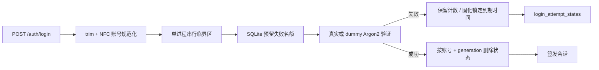

# 认证与登录安全

## 1. 模块目标

本模块负责账号密码验证、登录失败限流、自助改密、显式强制改密和会话换发。酒店花名册账号默认采用可选自助改密策略；只有账号被明确标记为 `passwordChangeRequired=true` 时，守卫才会暂时限制其他办公功能。登录限流以规范化账号为粒度，状态保存在业务 SQLite 数据库中，因此在 API 进程重启后仍然有效。

当前实现适用于项目约定的“单 API 进程 + 单 SQLite”部署。不得将多个 API 进程同时指向同一 SQLite 文件；如需水平扩容，必须先把限流状态迁移到支持跨进程原子操作的存储。

## 2. 处理流程



名额在密码验证前预留，因此同一账号的并发请求不能同时读到旧计数。预留、容量判断和状态写入由 `LoginAttemptLimiter` 串行化；SQLite 负责持久化。进程在预留后异常退出时，该次名额会保留到过期，这是有意的保守失败策略。

## 3. 持久化结构

```text
apps/api/src/common/auth/
  login-attempt-limiter.service.ts      预留、锁定、成功清理和串行化
  login-attempt-state.repository.ts     TypeORM 持久化边界
  login-attempt-state.entity.ts         账号限流状态
  login-password-verifier.service.ts    真实 / dummy Argon2 等时验证
apps/api/src/common/database/migrations/
  1784600000000-PersistentLoginAttemptLimiter.ts
```

`login_attempt_states` 一个规范化账号只有一行：

| 字段 | 用途 |
| --- | --- |
| `username` | `trim + NFC` 后的账号主键 |
| `generation` | 防止旧请求清理新一轮计数 |
| `attempts` | 当前时间窗口已预留的尝试数 |
| `expiresAt` | 计数或锁定的过期时间 |
| `updatedAt` | 最后一次状态变更时间 |

## 4. 配置与容量

| 环境变量 | 默认值 | 有效范围 | 含义 |
| --- | ---: | ---: | --- |
| `OA_LOGIN_MAX_FAILURES` | `5` | `1..100` | 同一账号进入锁定的失败阈值 |
| `OA_LOGIN_LOCK_MS` | `900000` | `1..86400000` | 失败窗口和锁定时长（毫秒） |
| `OA_LOGIN_MAX_TRACKED_ACCOUNTS` | `10000` | `1..1000000` | 同时保留的未过期账号状态上限 |

新账号进入限流器时会先删除已过期记录。如果清理后仍达到容量上限，系统对新账号返回与账号锁定一致的 `429 LOGIN_RATE_LIMITED`，等待最早状态过期。容量策略不会删除任何未过期状态，尤其不会因随机账号洪泛而解除已锁定账号。

## 5. 安全不变量

1. 已达阈值且未过期的账号在 API 重启后仍返回 429。
2. 随机账号洪泛不能删除未过期的锁定或失败计数。
3. 同一账号的并发请求在 Argon2 前占用独立名额。
4. 成功登录只清理与当前 `generation` 一致的状态。
5. 未知账号仍由 `LoginPasswordVerifier` 执行 dummy Argon2，不因持久化限流改变账号枚举防护。
6. 限流响应不包含账号是否存在，只返回统一错误码和 `retryAfterSeconds`。
7. 账号首次进入锁定时输出 `LOGIN_ACCOUNT_LOCKED` 结构化警告；日志只含进程内 HMAC 指纹和重试秒数，不记录姓名账号或密码。生产环境应由宝塔日志告警或日志平台订阅该事件。

## 6. 验证范围

- SQLite 真实仓储下的并发名额预留、Unicode 规范化、阈值和过期。
- 锁定状态和成功清理在重建 `DataSource` 后保持正确。
- 容量洪泛下锁定账号不被淘汰，过期记录可被回收。
- HTTP 登录达到阈值后返回 429，成功登录会清理账号状态。
- 锁定告警包含稳定事件名且不泄露原始账号。
