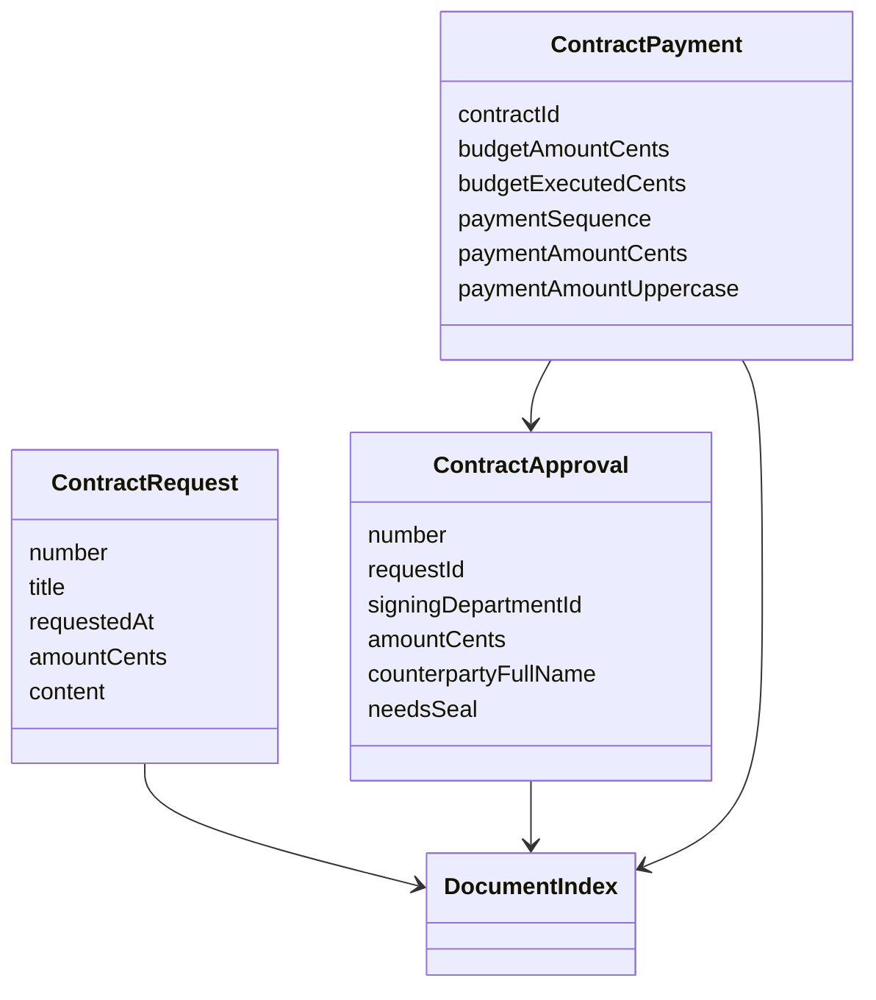
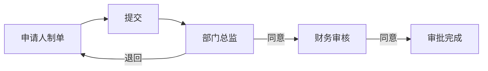
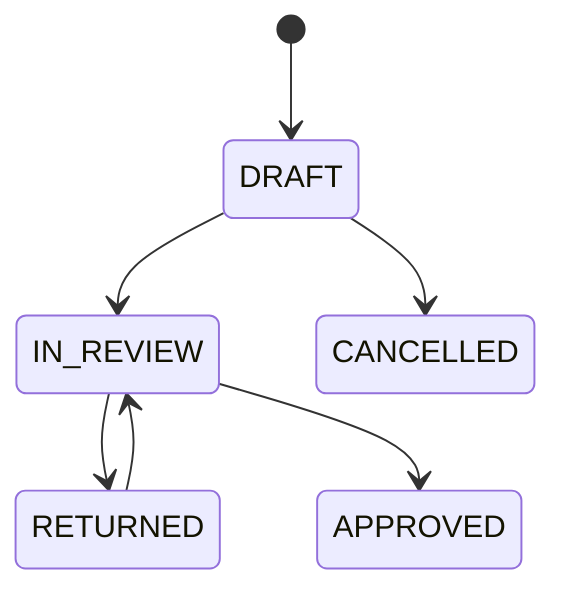

# 合同支出模块 MVP

## 功能说明

本模块实现首批合同支出纵向切片：

1. 合同/支出请示：草稿、提交、退回重提、审批意见。
2. 合同审批：可关联已通过请示，保存乙方、金额、签约部门和用印标记。
3. 合同付款申请：保存合同快照、预算和付款字段，校验付款余额、付款次数和进度。

暂不扩展现金支出、借款、退款等未确认流程。

## 领域模型



## 结构图

```text
modules/contract
├── domain：付款金额、付款次数、进度差校验
├── application：草稿保存、工作流注册、快照计算
├── infrastructure：TypeORM/SQLite 实体与仓储
└── presentation：/api/v1/contracts 接口
```

## 流程图



## 状态图



## 字段说明

- 金额：全部以 `amountCents` 整数分保存，服务端生成中文大写。
- 合同付款：保存合同金额、预算金额、累计执行、付款次数、付款原因、票据号、保修期和附件。
- 进度：`plannedProgress`、`actualProgress` 保存原始百分比，`progressVariance` 服务端派生。

## 权限矩阵

| 动作          | 申请人   | 部门总监 | 财务审核 | 办公室   |
| ------------- | -------- | -------- | -------- | -------- |
| 创建/修改草稿 | 本人     | 否       | 否       | 否       |
| 提交          | 本人     | 否       | 否       | 否       |
| 请示审批      | 否       | 当前待办 | 当前待办 | 否       |
| 合同审批      | 否       | 当前待办 | 当前待办 | 当前待办 |
| 查看待办      | 角色待办 | 角色待办 | 角色待办 | 角色待办 |

## API

- `POST /api/v1/contracts/requests`
- `PATCH /api/v1/contracts/requests/:id`
- `GET /api/v1/contracts/requests/:id`
- `POST /api/v1/contracts`
- `PATCH /api/v1/contracts/:id`
- `GET /api/v1/contracts/:id`
- `GET /api/v1/contracts/approved`
- `POST /api/v1/contracts/payments`
- `PATCH /api/v1/contracts/payments/:id`
- `GET /api/v1/contracts/payments/:id`

## 数据迁移

`InitialSchema` 创建 `contract_requests`、`contracts`、`contract_payments` 以及共享工作流表。SQLite 启用外键和 WAL。

## 测试说明

- 单元：付款余额、付款次数、金额大写。
- 集成：请示退回重提、合同审批、付款超合同余额拒绝。
- E2E：PC/手机创建合同请示、提交合同、保存付款申请。

## PC/手机 UI 验收

- PC：请示、合同、付款三卡片布局；审批侧栏通过工作台待办处理。
- 手机：单列卡片，底部操作按钮保持可触达；字段不因响应式布局丢失。

## 打印和归档

首期保留结构化字段、附件列表、意见时间线和单据编号；打印模板在后续归档服务中按版本固化。

## 运维和异常

- 付款超额返回统一错误 `INSUFFICIENT_AMOUNT`。
- 重复 `requestId` 不重复创建流程任务。
- 审批历史只追加，不删除。
