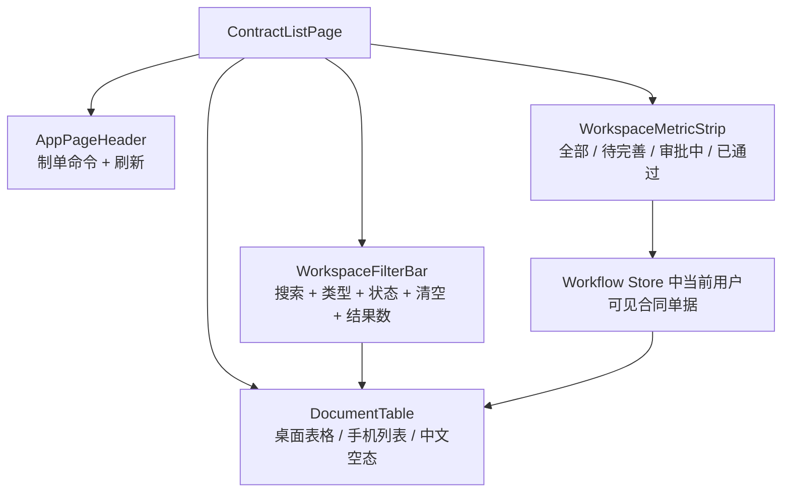
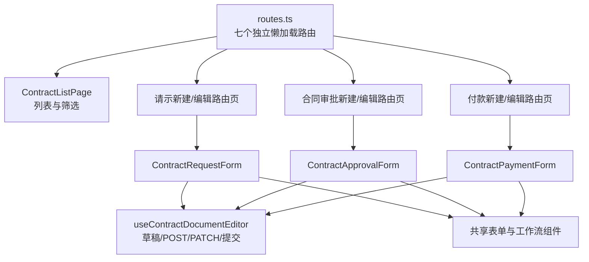
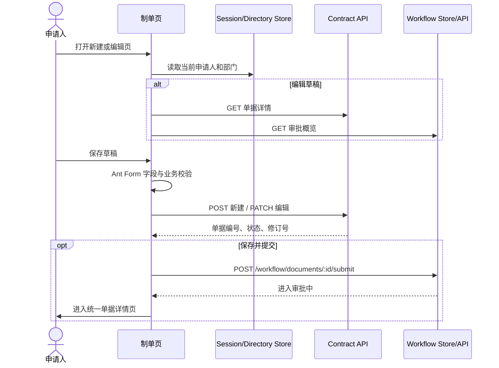

# 合同与支出模块企业级 UI

## 实现范围

本次仅升级原始需求的前三张表单，不扩展报销、银行支出、现金支出、借款及退款等后续表单。

1. 合同/支出请示：新建、编辑草稿、保存并提交、附件和审批概览。
2. 合同/协议审批：可关联本人已通过请示，维护签约部门、合同标的、乙方和用印信息。
3. 合同/协议支出申请：必须从已审批合同选择，生成合同快照，维护预算、进度、付款次序、付款方式和保修期。
4. 合同单据列表：基于共享工作流 store 的“我的单据”，提供关键词、单据类型和状态筛选，以及三类制单入口。

## 需求字段覆盖

| 表单 | 已覆盖字段 | 系统派生/只读字段 |
| --- | --- | --- |
| 合同/支出请示 | 请示题目、请示日期、可空请示金额、请示内容、附件 | 请示编号、当前部门、当前申请人、审批路径和意见 |
| 合同/协议审批 | 关联请示、签约部门、签约日期、名称、金额、对方单位全称、内容及理由、是否用印、附件 | 合同编号、经办人、审批路径和意见 |
| 合同/协议支出申请 | 合同项目、起止日期、预算金额、预算累计执行、会计科目、预计保养费用、付款次数与次序、累计已执行金额、进度、付款方式、付款原因、票据号、保修期、本次付款金额、附件 | 合同编号选择、签订日期、合同金额、乙方快照、合同余额、预算余额、进度差、金额大写、审批路径和意见 |

金额控件面向用户统一显示“元”，与 API 交互时使用整数“分”，避免浮点误差。

## 首页统一工作台

`/contract` 已接入共享的 `WorkspaceMetricStrip` 和 `WorkspaceFilterBar`，与印章、物资首页使用一致的信息层级和操作位置。

- 四项指标为“全部单据”、“待完善”、“审批中”和“已通过”；“待完善”同时统计 `DRAFT` 和 `RETURNED`。
- 筛选区支持按标题/类型关键词、单据类型和审批状态筛选，实时显示结果数量；存在有效条件时显示“清空筛选”。
- “刷新”位于页头命令区，并展示加载状态；没有符合条件的数据时显示“暂无符合条件的单据”，不暴露组件库英文空态。
- 桌面端指标按四列展示，筛选栏为搜索、选项、操作和结果数量的紧凑横向结构；宽度不足时搜索框先独占一行，手机端改为两列指标和单列全宽筛选，单据由 `DocumentTable` 切换为手机列表。
- 指标和刷新对具有合同查看权限的用户可见，不得以 `canCreate` 隐藏；三类新建入口仍仅在同时具有 `DOCUMENT_CREATE + CONTRACT_CREATE` 时显示。



## 页面与目录结构



```text
apps/web/src/modules/contract
├── components
│   ├── ContractRequestForm.vue
│   ├── ContractApprovalForm.vue
│   ├── ContractPaymentForm.vue
│   └── ContractDocumentActions.vue
├── pages
│   ├── ContractListPage.vue
│   ├── ContractRequestCreatePage.vue / ContractRequestEditPage.vue
│   ├── ContractApprovalCreatePage.vue / ContractApprovalEditPage.vue
│   └── ContractPaymentCreatePage.vue / ContractPaymentEditPage.vue
├── contract.config.ts
├── contract-payment.rules.ts
├── contract.types.ts
├── contract-form.css
├── useContractDocumentEditor.ts
└── routes.ts
```

## 路由

合同菜单和读取路由同时要求 `DOCUMENT_VIEW + CONTRACT_VIEW`，新建、编辑和提交同时要求 `DOCUMENT_CREATE + CONTRACT_CREATE`。非流程参与人的合同读取继续按 `CONTRACT_VIEW` 所属角色的数据范围判断，不能依赖通用单据权限跨模块访问。

| 路由 | 页面 |
| --- | --- |
| `/contract` | 合同单据列表 |
| `/contract/requests/new` | 新建合同/支出请示 |
| `/contract/requests/:id/edit` | 编辑合同/支出请示 |
| `/contract/approvals/new` | 新建合同/协议审批 |
| `/contract/approvals/:id/edit` | 编辑合同/协议审批 |
| `/contract/payments/new` | 新建合同/协议支出申请 |
| `/contract/payments/:id/edit` | 编辑合同/协议支出申请 |

## 数据流



付款申请额外调用 `GET /contracts/approved`，只允许选择已通过合同。选择后带出合同名称、签订日期、合同金额和乙方单位，与付款单一起保存为申请时快照。

## 复用与分层

- `AppPageHeader`：统一页面标题与操作区。
- `DocumentFormLayout`：统一主表单、审批侧栏和底部操作区。
- `FormSection`：按领域含义分组，不使用动态表单解析器。
- `MoneyInput`：集中处理元与分的转换。
- `AttachmentField`：统一多附件交互。
- `DocumentTable`：统一 PC 表格与移动端单据列表。
- `WorkflowSidebar`：统一审批路径和审批意见。
- `useContractDocumentEditor`：仅复用单据持久化、防重提交、状态判定和路由跳转；三张表的字段、校验和业务交互仍独立实现。
- `contract-payment.rules.ts`：集中付款次序、进度、合同/预算余额、日期区间和票据号校验，避免视图承担领域规则。
- `contract.config.ts`：集中管理路由名、API 路径、单据类型、状态和付款方式，避免业务常量分散。

## 校验与交互约束

- 所有必填项、文本长度、金额下限和次数下限均由 `a-form` rules 校验。
- 付款次序不得超过合同约定次数。
- 本次付款金额不得超过当前未执行合同金额。
- 合同日期和保修期均校验起止顺序，保修期必须成对填写。
- 合同约定进度和实际进度限定为 `0-100`，页面实时显示进度差。
- 支票和银行承兑汇票支付时，票据号码必填。
- 保存和提交按钮具有独立 loading 与防重入保护，API 异常通过统一 message 呈现。
- 已进入审批或已通过的单据在编辑页不提供保存和提交能力。
- 没有合同制单权限时隐藏三类新建入口；动态详情和打印路由仍会复核合同查看权限。

## 当前后端限制与遗漏

以下问题无法仅通过前端 UI 安全解决，需要后续扩展领域模型和 API。

| 优先级 | 限制 | 影响 |
| --- | --- | --- |
| P0 | `budgetExecutedCents` 与 `executedAmountCents` 由申请人手工输入，未从预算及历史付款台账汇总 | 合同余额、预算余额及超额校验不具备财务可信性 |
| P0 | 附件组件当前只保存文件名，没有文件存储、权限、哈希、版本和病毒扫描 API | 不能作为合同正文与财务凭证的正式归档 |
| P1 | 合同审批 DTO 缺少合同类型、履约开始日期和结束日期 | 付款选择合同后无法完整带出起止日期，必须依据合同正文补录 |
| P1 | 会计科目为自由文本，且当前 DTO 要求申请人制单时必填 | 无法与财务科目表对齐，与“财务节点填写”的原需求不一致 |
| P1 | 后端 DTO 对所有主要字段必填，不支持不完整草稿 | “保存草稿”仍需要先通过全表校验，后续应引入草稿命令或分阶段校验 |
| P2 | 请示时间在当前 UI/DTO 中使用日期粒度，未独立保存时分秒 | 与原始表“DateTime”粒度不完全一致，审计时间仍由单据索引创建时间记录 |
| P2 | 付款金额大写由服务端在保存后返回 | 首次保存前仅显示待生成状态，无实时预览 |

## 验证

- 所有合同模块 TypeScript/Vue 类型错误已清理。
- 付款进度、合同/预算余额、付款次序、票据号和保修期规则已配置前端单元测试。
- 单个 Vue/TypeScript 文件均少于 500 行，最大文件为付款表单。
- 新建表单不预置示例合同、示例单位、示例金额或固定日期。
- 服务端强制校验合同已审批，合同金额、签订日期和乙方快照以合同主数据为准。
- 关联请示必须属于当前申请人且已审批通过；已审批合同列表限制为当前部门或本人合同。
- Web 全量 `vue-tsc --noEmit` 已通过。

## 品牌图片资产

北京东方饭店的本地 WebP 图片、应用场景和原始来源统一记录在 `docs/assets/beijing-dongfang-hotel-images.md`。合同工作台不单独复制或热链品牌图片；正式对外发布前，项目所有方必须确认图片使用授权。
