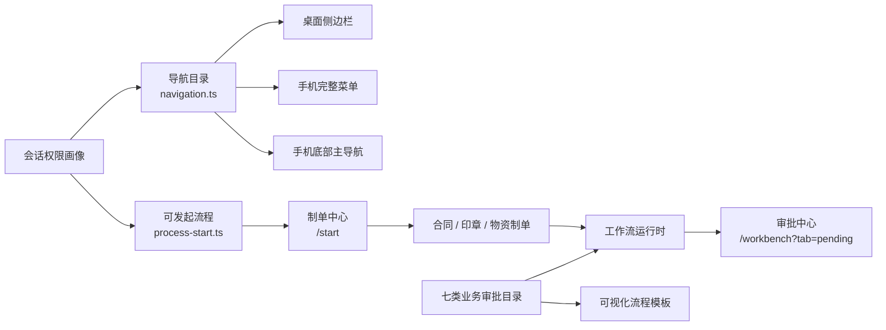
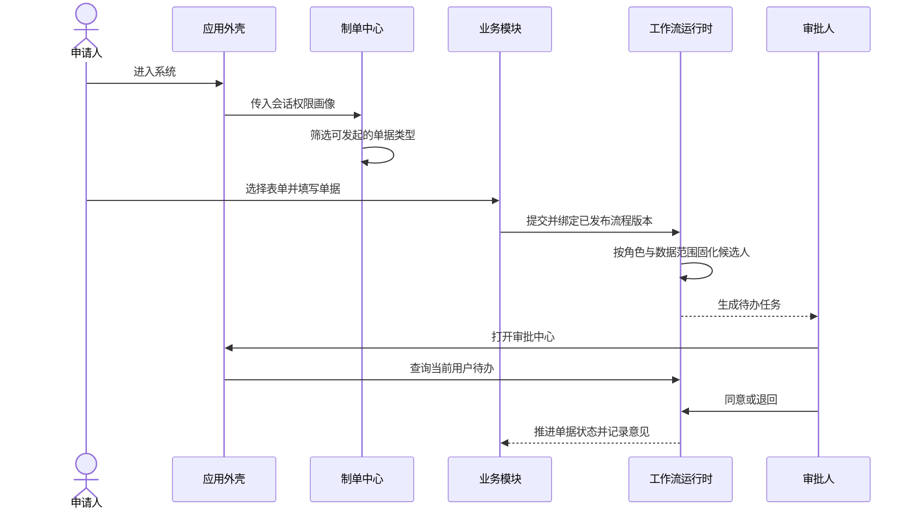

# 企业应用外壳、审批中心与制单入口

## 1. 模块目标

本模块将公司门户、个人工作台、审批办理、前三个业务包制单和平台管理统一到一个 Element Plus 企业应用外壳中。它解决的是入口可见性、信息分组、权限一致性和手机可用性，不重复实现业务表单或工作流内核。

当前“前 3 个功能”按需求文档的业务包口径计算：

1. 合同与支出。
2. 行政印章与证照。
3. 物资管理。

## 2. 已实现功能

### 2.1 企业应用外壳

- 登录后页面共用 `el-container` 应用框架，包含侧边导航、粘性页头、页面内容区和用户菜单。
- 桌面侧边栏支持 `236px` 完整状态与 `72px` 收起状态，收起后保留可识别的 Element Plus 图标。
- 导航按“办公台、业务中心、平台管理”分组，审批、制单和前三个业务包不再隐藏在单一工作台页面中。
- 导航目录是单一数据源，桌面侧边栏、手机完整菜单和底部导航共用同一份权限过滤结果。
- 页头“发起申请”按钮只在当前用户至少可发起一类单据时显示。
- 路由高亮支持业务子路由；`/workbench?tab=pending` 会高亮“审批中心”，不会与普通工作台入口混淆。

### 2.2 审批中心

- 导航入口为 `/workbench?tab=pending`，复用个人工作台已有的待办读模型和 workflow 命令。
- 进入审批入口后，应用页头和页面主标题会切换为“审批中心 / 待我审批”；离开待办页签后恢复个人工作台语义，避免同一页面复用造成入口像被删除的误解。
- 只有具备 `WORKFLOW_APPROVE` 的用户显示“审批中心”菜单。
- 待办详情继续展示业务字段、附件名称、审批路径和历史意见，审批命令由后端再次校验任务候选人与数据范围。
- 审批中心不创建第二套任务表、审批状态或接口，避免与个人工作台数据不一致。
- `767px` 以下使用“工作箱”选择器切换待办、已办、草稿、关注、抄送和阅办，不依赖不可发现的横向页签滚动。

### 2.3 制单中心

- 独立路由 `/start` 按合同支出、行政印章和物资管理分组展示当前用户可发起的流程。
- 支持按表单名称、业务包、功能说明和审批节点搜索。
- 每个入口展示用途和预计审批路径，点击后进入对应业务包的现有制单路由。
- 入口由 `DocumentType` 元数据、业务权限合同与审批目录驱动，桌面和手机不维护两份流程清单。

| 业务包 | 单据 | 制单路由 | 顺序审批角色 |
| --- | --- | --- | --- |
| 合同支出 | 合同/支出请示 | `/contract/requests/new` | 部门负责人 -> 财务审核 |
| 合同支出 | 合同审批 | `/contract/approvals/new` | 部门负责人 -> 财务审核 -> 办公室审核 |
| 合同支出 | 合同付款 | `/contract/payments/new` | 部门负责人 -> 财务审核 |
| 行政印章 | 印章证照外借 | `/seal/borrow/new` | 部门负责人 -> 办公室审核 -> 印章管理员 |
| 行政印章 | 印章证照使用 | `/seal/use/new` | 部门负责人 -> 办公室审核 -> 印章管理员 |
| 物资管理 | 物资申购 | `/supply/purchases/new` | 部门负责人 -> 采购负责人 -> 财务审核 |
| 物资管理 | 物资领用 | `/supply/requisitions/new` | 部门负责人 -> 仓库管理员 |

### 2.4 流程与 A4 设计器手机模式

- A4 设计器默认使用“适应宽度”，由 `ResizeObserver` 按当前画布宽度计算预览比例。
- 自动比例限制在 `20%` 至 `100%`，手动滑块可设置 `40%` 至 `125%`，并实时显示当前比例。
- `760px` 以下 A4 设计器使用“预览 / 表单库 / 字段 / 属性”分段切换，默认先显示预览；字段面板使用两列布局，同一时刻只保留一个工作面板。
- `760px` 以下流程设计器使用“流程图 / 流程库 / 节点属性”分段切换，默认先显示流程图；节点工具栏改为纵向和等宽操作，不再把画布推到长页面下方。
- A4 缩放工具栏的子项显式限制为容器宽度，`320px` 视口下页面级横向溢出为 `0`。
- 屏幕预览缩放不会改变纸张模型；打印媒体下固定恢复 `100%` 并按 `210mm x 297mm` 输出。

## 3. 架构与职责边界



企业外壳属于前端展示层，只组合路由、菜单和权限画像。业务数据仍由合同、印章、物资各自的领域模块拥有，审批任务仍由 workflow 模块拥有。

```text
apps/web/src/
├── app/
│   ├── App.vue                         企业应用外壳与响应式导航组合
│   ├── AppNavigationMenu.vue          桌面/抽屉共用菜单
│   ├── MobileBottomNavigation.vue     手机底部主导航
│   └── navigation.ts                  导航分组、权限过滤与选中规则
├── modules/workbench/
│   ├── pages/ProcessStartPage.vue     三业务包制单中心
│   ├── routes.ts                      `/start` 与个人工作台路由
│   └── styles/process-start.css       制单中心桌面/手机布局
├── modules/platform/
│   ├── pages/FormDesignerPage.vue     A4 适应宽度与手动缩放
│   └── styles/form.css                设计器响应式与打印缩放规则
├── shared/
│   ├── document.ts                    单据名称、业务包与制单路由元数据
│   └── process-start.ts               可发起列表与审批路径摘要
└── styles/
    ├── shell.css                       应用外壳视觉与稳定尺寸
    └── responsive.css                  全局响应式与打印规则

apps/api/src/common/
├── workflow/domain/business-workflow.catalog.ts       七类业务审批顺序单一来源
└── process-design/seed/business-process.templates.ts  由业务目录生成可视化流程
```

## 4. 权限规则

| 入口或操作 | 前端可见条件 | 后端边界 |
| --- | --- | --- |
| 公司门户 | `PORTAL_VIEW` + `CONTENT_VIEW` | 内容接口继续校验受众范围 |
| 个人工作台 | 登录用户可进入 | 各箱体在计数和列表前按单据权限过滤 |
| 审批中心 | `WORKFLOW_APPROVE` | 办理时校验 `WORKFLOW_APPROVE`、固化候选人、模块查看权限和数据范围 |
| 发起申请页 | `DOCUMENT_CREATE`，且至少一个业务包可制单 | 创建接口按单据类型再次校验通用和模块权限 |
| 单个制单卡片 | `DOCUMENT_CREATE` + `CONTRACT_CREATE` / `SEAL_CREATE` / `SUPPLY_CREATE` | 相同 all-of 规则，不信任隐藏菜单 |
| 业务包菜单 | `DOCUMENT_VIEW` + 对应模块 `*_VIEW` | 列表、详情、关联查询和打印继续校验数据范围 |
| 组织与权限 | `IAM_VIEW` | 写操作需 `IAM_MANAGE` |
| 审批流程设计 | `PROCESS_DESIGN_VIEW` | 保存、复制和发布需 `PROCESS_DESIGN_MANAGE` |
| A4 表单设计 | `FORM_DESIGN_VIEW` | 保存、复制和发布需 `FORM_DESIGN_MANAGE` |

前端菜单过滤和路由守卫只用于交互可见性，NestJS 权限守卫和领域服务才是最终安全边界。

## 5. 制单与审批流程



## 6. 响应式规则

| 视口 | 外壳与导航 | 制单/审批 | A4 设计器 |
| --- | --- | --- | --- |
| `>= 1200px` | 完整或可收起侧边栏，内容最大宽度 `1520px` | 高密度表格、多列表单和右侧辅助区 | 多面板编辑器，画布居中 |
| `992px - 1199px` | 保留桌面导航 | 指标和表单列数减少 | A4 按容器宽度缩放 |
| `768px - 991px` | 隐藏侧边栏，页头菜单按钮打开完整抽屉 | 表单主体与辅助区改为单列 | A4 按容器宽度缩放 |
| `<= 767px` | 紧凑页头 + 底部主导航 + “更多”完整抽屉，适配安全区 | 列表切换卡片，工作箱下拉切换，表单单列，制单与业务页操作使用等宽栅格 | `<= 760px` 通过分段控件切换工作面板，流程图/A4 预览优先展示 |

手机底部主导航按“公司门户、审批中心、发起申请、个人工作台”的优先级生成，其中无权项不占位；“更多”始终可打开全部有权菜单。

## 7. 扩展约定

1. 新增单据类型时，先扩展共享 `DocumentType` 与业务权限合同，再增加业务路由和领域实现。
2. 制单入口从共享元数据派生，不在侧边栏、门户、工作台和手机导航中分别硬编码。
3. 审批顺序优先扩展 `BUSINESS_WORKFLOW_CATALOG`，旧工作流与可视化流程种子必须复用同一目录。
4. 菜单可见不能代替后端授权；任何新建、审批、查看或打印接口都要独立校验。
5. 响应式组件优先共享语义和数据，仅在表格/卡片等显示形式上分流，不创建手机专用业务状态。

## 8. 已知边界

以下项目尚未完成，不得作为本次已交付能力宣称：

- 物资类“款待申请”尚未建立独立单据模型、表单和流程。
- 不需要合同的独立支出/报销单尚未实现；当前“合同/支出请示”不能替代完整报销闭环。
- 正式条件网关、动态会签、按金额升级、加签、转办和指定历史节点退回尚未实现。
- 附件当前主要保存文件名，缺少完整对象存储、下载鉴权、病毒扫描和不可变归档包。
- “审批中心”是个人待办的独立导航入口，不是流程管理员的全局运行监控台。
- 制单中心当前支持分类和搜索，最近使用、收藏、流程适用范围说明和管理员排序尚未实现。
- A4 表单设计结果已用于不可变打印版本，但尚未驱动合同、印章和物资的屏幕制单运行时。

完整差距和验收口径见 [前三模块企业化实现差距审计](../delivery/02-enterprise-gap-audit.md)。

## 9. 验证范围

- 导航单元测试覆盖菜单 all-of 权限、无制单能力时隐藏入口、审批中心高亮和手机主导航顺序。
- 制单目录测试覆盖七类单据按业务权限过滤。
- 人工响应式验收覆盖桌面、`390 x 844` 和 `320 x 740` 手机视口，检查导航、制单、待办审批、前三个业务首页、流程设计和 A4 适应宽度。
- 手机验收需确认页面级无横向溢出、底部导航不遮挡表单操作，且无权菜单在抽屉和底部导航中均不可见。
