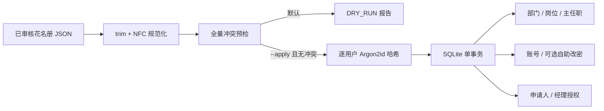

# 酒店花名册组织账号导入

## 1. 模块目标

本模块把已审核的酒店花名册 JSON 幂等导入现有 IAM，创建或复用部门、岗位和员工账号。导入默认使用 SQLite 只读连接预检，只有显式传入 `--apply` 并设置默认密码后才写入组织和账号数据；它直接连接 TypeORM `DataSource`，不会启动 NestJS，也不会触发开发演示账号初始化。预检遇到待执行迁移会明确拒绝，因此任何迁移或正式导入前都必须先备份。

首批账号规则：

- 登录账号和显示名均为员工姓名。
- 新账号使用操作时提供的默认密码，登录后可在“账号安全”中自行修改，不强制首次改密。
- 所有人获得 `APPLICANT + SELF`。
- 只有岗位严格等于 `总经理`、`经理` 或“部门名称 + `经理`”的人员才是部门负责人，并额外获得 `DEPARTMENT_MANAGER + DEPARTMENT`。
- 同一部门识别到多名经理时整批拒绝，不能任意选择一人。

## 2. 结构



后端目录：

```text
apps/api/src/common/roster-import/
  roster-input.ts                 JSON 校验、Unicode 规范化和稳定标识
  roster-import.plan-types.ts     导入计划模型
  roster-import.plan-utils.ts     预检辅助函数与统计
  roster-import.plan.ts           数据库冲突预检和变更计划
  roster-import.role-plan.ts      申请人和经理角色授权计划
  roster-import.persistence.ts    单事务持久化
  roster-import.service.ts        预览、独立密码哈希和应用编排
  roster-import.ts                独立 CLI 入口
  roster-import.service.spec.ts   内存 SQLite 集成测试
```

生产构建同时输出：

```text
apps/api/release/server.js
apps/api/release/roster-import.js
```

## 3. 输入和字段映射

输入支持人员数组，或包含 `people` 数组的对象：

```json
{
  "people": [
    {
      "sourceSheet": "在职人员",
      "sourceSequence": 2,
      "department": "客房部",
      "position": "服务员",
      "name": "张三"
    }
  ]
}
```

| 输入字段 | 必填 | 写入目标 | 规则 |
| --- | --- | --- | --- |
| `sourceSheet` | 是 | 仅冲突追踪 | 非空字符串 |
| `sourceSequence` | 是 | 仅冲突追踪 | 正安全整数，同工作表不得重复 |
| `department` | 是 | 部门名称、用户主任职 | `trim + NFC` |
| `position` | 是 | 岗位名称、经理判定 | `trim + NFC` |
| `name` | 是 | `username`、`displayName` | `trim + NFC`，全批次唯一 |

Excel 不由后端运行时解析。应先把工作簿转换为上述最小 JSON，并人工确认字段映射、空行、合并单元格和重名处理；原始身份证号、银行卡号等无关字段不得进入导入 JSON。

## 4. 幂等与所有权

1. 新部门按规范化名称匹配；不存在时使用名称哈希生成稳定 ID 和编码。
2. 新岗位按“所属部门 + 规范化岗位名”匹配；不同部门可以分别拥有“经理”等同名岗位。
3. 新用户 ID 只由规范化姓名生成。数据库存在同名但 ID 不是该稳定 ID 的用户时，视为人工账号冲突，禁止接管。
4. 重复导入只允许稳定 ID 用户更新姓名规范形式、主部门和导入器主任职，不重置密码或覆盖现有改密策略。
5. 导入器只创建或更新自己的稳定 ID 主任职和角色授权；管理员增加的副任职和其他角色保持不变。
6. 员工不再满足严格经理规则时，只删除导入器创建的经理授权；同类手工授权不删除。
7. 花名册未出现的既有用户不会被停用或删除。本命令不是离职同步工具。

经理账号同样保留 `APPLICANT`，但工作流会排除单据申请人本人，不能自审。正式启用前必须通过组织任职或流程设计为经理本人发起的单据配置代理/上级候选，否则提交会因没有有效办理人而失败。

### 上线后角色配置

导入器不会根据岗位名称自动授予 `OFFICE_REVIEWER`、`FINANCE_REVIEWER`、`SEAL_MANAGER`、`PROCUREMENT`、`WAREHOUSE_MANAGER` 或 `SYSTEM_ADMIN`。这些都是敏感审批/执行权限，必须由酒店确认实际责任人后，在 IAM 中人工配置对应数据范围。空生产库应先用 `OA_BOOTSTRAP_ADMIN_USERNAME` 为一个已导入账号建立首位系统管理员，完成角色、代理和审批候选配置后移除该环境变量；配置完成前不得开放正式流程提交。

## 5. 冲突策略

下列任一情况都会使 `conflicts` 非空并整批不写库：

- JSON 行缺字段、来源行重复或姓名重复。
- 数据库存在多个规范化后同名的部门或同部门岗位。
- 对应部门、岗位或稳定 ID 用户已停用。
- 稳定 ID、稳定编码已被其他记录占用。
- 姓名账号已由非花名册稳定 ID 用户占用。
- 同一部门识别出多名经理。
- 花名册用户已有另一条启用的手工主任职，或同部门岗位任职占用唯一约束。
- 导入器稳定角色授权与其他记录冲突。
- 密码哈希完成后、事务预检前数据发生并发变化。

冲突报告只包含错误码、业务说明和来源工作表/序号，不包含默认密码或密码哈希。应修正源数据或由管理员明确处理既有组织数据后，重新执行预检；禁止绕过预检直接修改 SQL。

## 6. 本地命令

先备份目标数据库，再从仓库根目录执行只读预检：

```bash
OA_DATABASE_PATH=data/oa-enterprise-demo.sqlite \
npm run import:roster -w @oa/api -- \
  --input /absolute/path/to/roster.json
```

确认输出为 `"mode": "DRY_RUN"`、`"applied": false` 且 `conflicts` 为空后执行：

```bash
export OA_ROSTER_DEFAULT_PASSWORD='000000'
OA_DATABASE_PATH=data/oa-enterprise-demo.sqlite \
npm run import:roster -w @oa/api -- \
  --input /absolute/path/to/roster.json \
  --apply
unset OA_ROSTER_DEFAULT_PASSWORD
```

npm 工作区命令在 `apps/api` 目录运行，因此相对数据库路径 `data/oa-enterprise-demo.sqlite` 实际指向 `apps/api/data/oa-enterprise-demo.sqlite`。必须为预检、正式导入和后续 API 启动显式使用同一个 `OA_DATABASE_PATH`。

预检以只读方式打开现有数据库，不执行迁移；发现待执行迁移时会失败，应先备份并单独运行 `migration:run`。`--apply` 会在事务导入前执行尚未应用的 TypeORM 迁移，缺少 `OA_ROSTER_DEFAULT_PASSWORD` 时会在连接数据库前失败。报告中 `applied: true` 才表示事务已经提交。

## 7. 生产单文件命令

生产包在 `api` 目录安装 Linux 原生依赖后，可以执行：

```bash
OA_DATABASE_PATH=/absolute/path/to/oa.sqlite \
npm run import:roster -- --input /secure/path/roster.json

export OA_ROSTER_DEFAULT_PASSWORD='000000'
OA_DATABASE_PATH=/absolute/path/to/oa.sqlite \
npm run import:roster -- --input /secure/path/roster.json --apply
unset OA_ROSTER_DEFAULT_PASSWORD
```

生产导入应安排维护窗口，并先停止 API 写流量。Docker 镜像和 Git 都不包含本地 SQLite 或花名册；需要把已导入的一致性数据库部署到持久化目录，或把 `roster-import.js` 和运行依赖放入受控的一次性运维环境执行。

## 8. 备份与回滚

运行中的 SQLite 可能仍有事务位于 WAL，禁止直接 `cp oa.sqlite`。导入前使用在线备份：

```bash
set -eu
umask 077
export SOURCE_DB=/absolute/path/to/oa.sqlite
export BACKUP_DB=/secure/backup/oa-before-roster.sqlite
install -d -m 700 "$(dirname "$BACKUP_DB")"
sqlite3 "$SOURCE_DB" ".timeout 10000" ".backup '$BACKUP_DB'"
test "$(sqlite3 -readonly "$BACKUP_DB" 'PRAGMA integrity_check;')" = ok

# 完整性检查可能生成 WAL/SHM；主文件和现存边车文件都必须只允许属主读写。
for file in "$BACKUP_DB" "$BACKUP_DB-wal" "$BACKUP_DB-shm"; do
  if [ -e "$file" ]; then
    chmod 600 "$file"
    test "$(find "$file" -prune -type f -perm 0600 -print)" = "$file"
  fi
done
```

导入后检查：

```bash
test "$(sqlite3 "$SOURCE_DB" 'PRAGMA integrity_check;')" = ok
sqlite3 -readonly "$SOURCE_DB" \
  "SELECT count(*) FROM users WHERE active = 1;"
```

需要回滚时先停止 API 和其他数据库写入者，把当前 `oa.sqlite`、`oa.sqlite-wal`、`oa.sqlite-shm` 整组移到故障留存目录，再将已验证备份恢复为 `oa.sqlite`，最后启动 API 并验收登录、组织树和权限。不要只覆盖主文件而遗留旧 WAL/SHM。

## 9. 安全要求

- 花名册包含人员信息，JSON 必须保存在仓库和 Web 根目录之外，并限制文件权限；处理完成后按内部制度销毁或归档。
- 新用户逐人调用 Argon2id，每个账号使用独立随机盐；不得复用同一条密码哈希。
- 登录未知姓名账号时同样执行 Argon2id 虚拟哈希校验，避免通过响应耗时枚举员工账号。
- 默认密码只通过进程环境传入，不写入源码、数据库字段、报告或应用日志。
- 新用户保存 `passwordChangeRequired=false`、`credentialVersion=0`、`passwordChangedAt=null`。
- 默认密码应通过安全渠道告知员工；员工可从用户菜单进入“修改密码”，系统不会阻断其他办公功能。
- 导入前后报告和数据库备份属于敏感运维资料，不得放入 Git、聊天群或公开下载目录。

## 10. 验证范围

- dry-run 使用只读数据库连接，不执行迁移，也不写入组织或账号数据。
- 字符串执行 `trim + NFC`，姓名账号保持唯一。
- 部门、岗位、主任职、申请人授权和严格经理授权一次事务创建。
- 新用户密码均可校验默认值，但不同用户哈希不相同。
- 重复执行不重置已修改密码，并保留手工副任职和角色。
- 任一人员冲突时，其他合法人员也不会部分写入。
- `副经理`、`值班经理` 等非严格名称不会获得部门经理权限。
