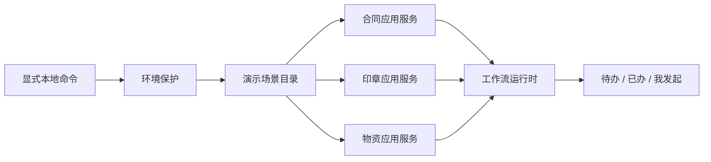

# 本地演示数据初始化

## 1. 模块目标

本模块为本地开发和验收环境生成可识别、可重复执行的业务数据，用于展示合同、印章、物资以及待办、已办、我发起的读模型。它不随 API 启动自动运行，也不允许在 `production` 环境执行。

## 2. 结构



后端目录：

```text
apps/api/src/common/demo-data/
  demo-data.catalog.ts       场景、表单内容和目标状态
  demo-data.seeder.ts        幂等查找、创建和流程推进
  seed-demo-data.ts          独立命令入口
  demo-data.seeder.spec.ts   环境保护与集成验证
```

## 3. 数据范围

初始化生成 10 张业务单据：

| 模块 | 草稿 | 审批中 | 已通过 | 用途 |
| --- | ---: | ---: | ---: | --- |
| 合同与支出 | 1 | 3 | 1 | 部门总监、财务待办、合同审批及合同付款轨迹 |
| 印章证照 | 0 | 1 | 1 | 办公室待办及印章审批已办 |
| 物资 | 0 | 2 | 1 | 采购、仓库待办及完整采购审批轨迹 |

所有单据由 `applicant` 发起，因此该账号的“我发起的”同时包含草稿、审批中和已通过状态。合同付款场景通过已审批合同场景的实际文档 ID 建立关联，不使用固定数据库 ID。`manager`、`finance`、`office`、`procurement`、`warehouse` 分别获得具有业务含义的待办或已办记录。

## 4. 幂等与安全

1. 场景通过固定的演示标题和申请人查找，重复执行只复用原单据。
2. 流程推进调用正式的 `DocumentWorkflowService`，候选人、任务和意见快照均按真实规则生成。
3. 已被人工继续办理的演示单据不会回退或重建。
4. 命令必须显式设置 `OA_DEMO_SEED=true`。
5. `NODE_ENV=production` 时无条件拒绝，即使设置了演示开关也不会连接并写入数据库。
6. 演示初始化不清理、不覆盖现有业务数据。

## 5. 使用

从仓库根目录执行：

```bash
OA_DEMO_SEED=true \
OA_DATABASE_PATH=data/oa.sqlite \
OA_DEMO_PASSWORD='Demo123!' \
OA_BOOTSTRAP_ADMIN_USERNAME=office \
npm run seed:demo -w @oa/api
```

工作区脚本在 `apps/api` 目录运行，因此上述相对数据库路径对应 `apps/api/data/oa.sqlite`。

`OA_BOOTSTRAP_ADMIN_USERNAME=office` 用于本地全功能验收，使 `office` 获得系统管理员权限，从而可以查看组织权限、七类审批流程和 A4 表单设计。该设置只应在本地演示环境使用；不设置时，`office` 仍保持办公室审核人和印章管理员角色，不能制单，也不能进入流程或表单设计器。

演示账号密码由 `OA_DEMO_PASSWORD` 决定。默认本地数据包含：

| 账号 | 主要演示视图 |
| --- | --- |
| `applicant` | 我发起的、草稿和业务详情 |
| `manager` | 部门审批待办与已办 |
| `finance` | 合同请示、合同付款的财务待办与已办 |
| `office` | 设置本地管理员变量后用于全功能验收；否则仅有印章待办与合同、印章已办 |
| `procurement` | 采购待办与已办 |
| `warehouse` | 领用发放待办 |
