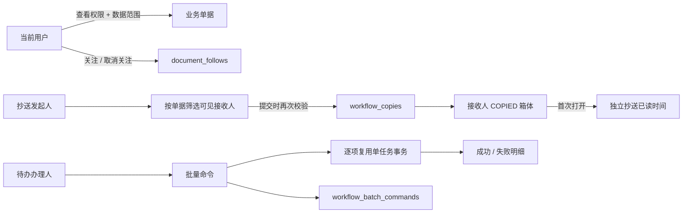

# 个人工作台高级协作

## 模块目标

本模块在基础待办、已办、我发起和草稿读模型上增加企业 OA 常用的关注、抄送和批量审批能力。协作事实与门户阅读回执、流程候选人保持独立，避免不同业务语义共用一张表或相互污染统计口径。

## 已实现功能

- `FOLLOWING` 箱体：关注或取消关注本人当前可见的业务单据，并记录关注时间。
- `COPIED` 箱体：接收独立工作流抄送，展示发送人、发送时间和已读状态；首次打开单据时写入已读时间。
- 可抄送人员：弹窗只展示当前单据范围内同时具有 `DOCUMENT_VIEW` 和业务模块 `VIEW` 权限的启用用户，提交时再次校验，防止越权或过期授权。
- 批量同意：从当前页待办中多选任务，填写统一意见后逐项审批；单项失败不回滚已成功任务。
- 批量幂等：相同账号和 `requestId` 重试返回首次结果；相同 `requestId` 携带不同任务或意见时返回冲突。
- 企业响应式界面：六项业务指标在桌面、平板和手机分别使用 6、3、2 列；八个工作台页签在窄屏可横向滚动，移动待办的选择和打开区域互不嵌套。
- 演示数据：初始化两条关注和两条抄送，其中办公室抄送为已读、财务抄送为未读，便于直接检查不同状态。

## 领域事实与流程



关键不变量：

1. 关注不会产生审批任务，抄送不会成为任务候选人，抄送已读不会写入门户阅读回执。
2. 箱体计数和分页都重新应用用户当前权限、参与关系及资源数据范围；授权被收回后，旧协作事实不会继续暴露单据。
3. 可抄送人员查询只用于改善交互，写命令始终以服务端二次校验为最终权限边界。
4. 批量审批不创建跨单据大事务，每项继续复用原单任务事务和候选人校验，保证部分失败结果可解释。

## 代码结构

```text
apps/api/src/common/
├── workbench/
│   ├── application/document-follow.service.ts
│   ├── infrastructure/document-follow.entity.ts
│   └── presentation/document-follow.controller.ts
└── workflow/
    ├── application/workflow-copy.service.ts
    ├── application/workflow-batch-approval.service.ts
    ├── infrastructure/workflow-copy.entity.ts
    ├── infrastructure/workflow-batch-command.entity.ts
    └── presentation/
        ├── workflow-copy.controller.ts
        └── workflow-batch-approval.controller.ts

apps/web/src/modules/workbench/
├── api/workbench-api.ts
├── components/
│   ├── DocumentFollowButton.vue
│   ├── WorkflowCopyDialog.vue
│   ├── WorkbenchBatchApprovalDialog.vue
│   ├── WorkbenchTaskTable.vue
│   └── WorkbenchDocumentTable.vue
├── domain/
├── pages/PersonalWorkbenchPage.vue
└── store/workbench.ts
```

## 接口

| 方法 | 路径 | 功能 |
| --- | --- | --- |
| `GET` | `/workbench/documents/:documentId/follow` | 查询当前用户关注状态 |
| `POST` | `/workbench/documents/:documentId/follow` | 关注当前可见单据 |
| `DELETE` | `/workbench/documents/:documentId/follow` | 取消关注 |
| `GET` | `/workflow/documents/:documentId/copy-recipients` | 返回当前单据可抄送人员 |
| `POST` | `/workflow/documents/:documentId/copies` | 创建或复用接收人的抄送事实 |
| `POST` | `/workflow/copies/:copyId/read` | 标记本人抄送为已读 |
| `POST` | `/workflow/tasks/batch-approve` | 执行幂等的逐项批量同意 |

单次抄送最多 20 人。批量审批请求包含 `requestId`、`taskIds` 和非空统一意见，响应返回总数、成功数、失败数及每项错误码和说明。

## 权限与数据范围

| 能力 | 功能权限 | 资源校验 |
| --- | --- | --- |
| 关注 | `DOCUMENT_FOLLOW` | `DOCUMENT_VIEW` + 模块 `VIEW` + 当前数据范围 |
| 发起抄送 | `WORKFLOW_COPY` | 发送人必须可查看单据 |
| 接收抄送 | `DOCUMENT_VIEW` + 模块 `VIEW` | 接收人的 `SELF / DEPARTMENT / DEPARTMENT_TREE / ALL` 必须覆盖目标单据 |
| 批量同意 | `WORKFLOW_APPROVE` + `WORKFLOW_BATCH_APPROVE` | 每项任务仍校验本人候选资格和任务当前状态 |

## 验证覆盖

- 工作台 HTTP 集成测试覆盖关注增删、独立抄送已读、可抄送人员过滤、越权接收人拒绝和箱体计数。
- 批量审批集成测试覆盖逐项结果、部分失败、相同请求重放和载荷冲突。
- Repository 与应用服务测试覆盖六个业务箱体、权限裁剪、筛选和稳定分页。
- DemoDataSeeder 测试覆盖演示关注/抄送事实及重复执行幂等。
- Web 领域与 Pinia 测试覆盖筛选请求、账号切换隔离、抄送已读更新和批量请求 ID 重试。

## 当前边界

- 批量操作仅支持“同意”，退回仍要求逐单确认，避免不同退回原因被统一意见掩盖。
- 抄送目前是单据级协作，不提供自由文本消息、撤回或再次催阅；后续应作为独立协作消息能力扩展。
