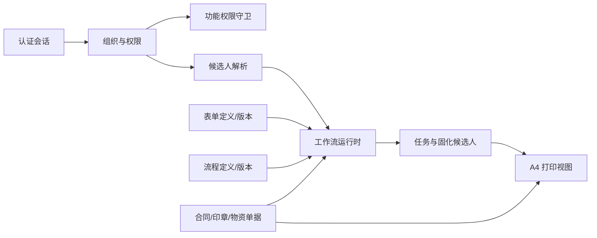
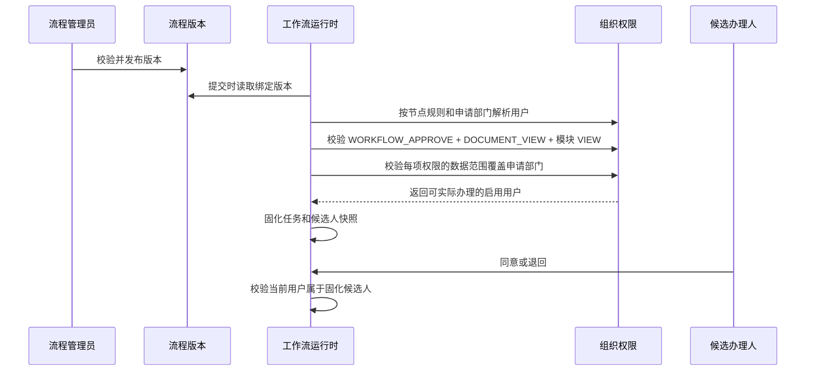

# 组织权限、流程与 A4 表单平台

## 1. 模块目标

本模块为前三个业务包提供企业 OA 的共享平台能力，不把组织、权限、审批链和打印结构硬编码到合同、印章或物资模块中。

已实现：

- 部门树、岗位、用户多部门/多岗位任职和唯一主任职。
- RBAC 业务角色可创建、编辑和启停；功能权限目录由代码定义，支持 `SELF`、`DEPARTMENT`、`DEPARTMENT_TREE`、`ALL` 数据范围。
- 会话权限画像、服务端权限守卫、前端菜单和路由权限。
- 表单定义、不可变版本、草稿复制、发布和 A4 打印结构。
- 流程定义、不可变版本、Vue Flow 设计、发布校验和线性审批节点解析。
- 流程实例绑定表单/流程版本，任务创建时固化具体候选用户。
- A4 业务打印视图，包含纸面字段、附件清单和审批意见。

## 2. 结构



后端目录：

```text
apps/api/src/common/
  iam/             组织、岗位、任职、角色、权限和数据范围
  form-design/     表单定义及不可变版本
  process-design/  流程定义、画布模型和发布规则
  workflow/        单据索引、任务、候选人、意见和运行时
```

前端目录：

```text
apps/web/src/modules/platform/
  api/             IAM 与设计器请求
  components/      组织权限面板、流程画布、A4 表单画布
  pages/           三个受权管理页面
  utils/           画布/表单模型转换与发布前校验
```

## 3. 核心规则

1. 一个用户可以有多个启用任职，但必须且只能有一个启用的主任职。
2. 岗位属于组织职责，角色属于功能授权，两者不互相替代。
3. 功能权限取用户所有角色的并集；数据范围始终保留在授予该权限的角色上。
4. 已发布的表单和流程版本不可修改，只能复制为新草稿。
5. 单据创建时绑定当时已发布的表单和流程版本；存量单据可继续使用旧流程定义。
6. 审批任务创建时解析并固化具体用户，后续角色变更不能让非候选人接管历史任务。
7. 业务入口要求通用单据权限与模块权限同时满足；单据发起人、历史办理人或当前候选人仍需具备对应模块查看权限，非参与人还必须由该模块 `*_VIEW` 的数据范围覆盖目标单据。
8. 屏幕填写布局与 A4 打印布局分离，打印必须包含附件清单和完整审批意见。
9. `SYSTEM_ADMIN` 不可停用或减权，只能授予 `ALL`，系统不得移除最后一个启用的系统管理员。

## 4. 权限矩阵

| 权限 | 用途 |
| --- | --- |
| `IAM_VIEW` | 查看部门、岗位、角色、权限和用户授权 |
| `IAM_MANAGE` | 修改组织、岗位、角色权限和用户任职 |
| `FORM_DESIGN_VIEW` | 查看表单及历史版本 |
| `FORM_DESIGN_MANAGE` | 创建、编辑、复制和发布表单版本 |
| `PROCESS_DESIGN_VIEW` | 查看流程及历史版本 |
| `PROCESS_DESIGN_MANAGE` | 创建、编辑、复制和发布流程版本 |
| `DOCUMENT_CREATE` | 通用制单能力，必须与一个模块 `*_CREATE` 同时授予 |
| `DOCUMENT_VIEW` | 通用查看能力，必须与一个模块 `*_VIEW` 同时授予 |
| `CONTRACT_CREATE` / `CONTRACT_VIEW` | 创建或查看合同与支出业务包 |
| `SEAL_CREATE` / `SEAL_VIEW` | 创建或查看行政印章业务包 |
| `SUPPLY_CREATE` / `SUPPLY_VIEW` | 创建或查看物资业务包 |
| `WORKFLOW_APPROVE` | 办理已固化给当前用户的审批任务 |
| `SEAL_EXECUTE` | 登记印章领用、归还和用印执行 |
| `SUPPLY_ISSUE` | 登记物资实发 |

前端权限只控制可见性和导航，所有写操作均由 NestJS 权限守卫再次校验。

合同关联查询、印章执行和物资发放会继续按对应模块权限或执行权限所附带的数据范围校验目标单据，不能用同一账号的其他角色扩大该权限范围。动态详情和 A4 打印路由会按 `documentType` 派生模块查看权限，不能绕过业务菜单直接访问。

## 5. 流程发布与运行



当前可发布运行时支持：

- `Start -> UserTask+ -> End` 无分支顺序流程。
- 办理人规则：申请人部门负责人、指定角色、指定用户。
- 同意、退回发起人、幂等请求和完整意见快照。

设计器可以表达其他节点，但网关、会签等未实现节点不能发布，系统不会伪装为可运行。

## 6. A4 表单与打印

表单版本保存两组结构：

- `schemaJson`：字段、类型、必填、明细和屏幕编辑语义。
- `printSchemaJson`：A4 方向、边距、网格、分页、附件和意见区域。

系统预置并发布七种 A4 模板：请示报告、合同/协议审批、合同付款、印章外借、印章使用、物资申购和物品领用。每张新单据绑定创建时的不可变表单版本，打印页按该版本的 `printSchemaJson` 重放标题、不同列数的网格、内容区、明细表、汇总、附件和审批意见，并解释页边距、表格线宽、单号和审批意见开关；明细表通过 `minRows` 保留纸面填写区。没有绑定版本的旧单据继续使用兼容版式。

手机端不把桌面三栏设计器简单纵向堆叠。`760px` 以下，流程设计器按“流程图 / 流程库 / 节点属性”切换，A4 设计器按“预览 / 表单库 / 字段 / 属性”切换，并分别默认展示流程图和 A4 预览。`320px` 边界下工具栏、业务页操作区和 A4 画布均不得产生页面级横向滚动；字段物料采用两列布局，A4 纸张继续按容器宽度缩放，打印尺寸不受屏幕缩放影响。

业务详情通过独立打印路由呈现，不直接打印响应式详情页面。当前不可变的是表单版式和审批意见中的组织/岗位快照；申请人、部门和印章资产的基础资料显示名仍由当前目录解析，完整历史归档仍需名称快照或不可变打印投影。

## 7. 兼容与初始化

- 旧版 `users.departmentId` 和 `users.roleCodes` 在启动时幂等迁移到 IAM 数据模型。
- 申请人初始为本人范围，部门负责人为本部门范围，财务、办公室、印章、采购和仓库等跨职能旧角色为全组织范围。
- 幂等模块权限迁移为申请人补齐三业务包制单/查看权限，并按旧审批链为各审批角色补齐所需模块查看权限。
- 设置 `OA_BOOTSTRAP_ADMIN_USERNAME` 可将指定启用账号幂等授予 `SYSTEM_ADMIN + ALL`。
- 没有发布新版流程的单据类型继续使用旧顺序定义；发布后新单据自动绑定新版，运行中单据不切换版本。

## 8. 错误与异常

| 错误码 | 含义 |
| --- | --- |
| `PERMISSION_DENIED` | 当前账号缺少功能权限 |
| `BUSINESS_MODULE_PERMISSION_DENIED` | 具有通用单据权限，但缺少目标业务包权限 |
| `WORKFLOW_ASSIGNEE_EMPTY` | 节点没有可用候选人，禁止生成静默卡死任务 |
| `WORKFLOW_ASSIGNEE_PERMISSION_MISSING` | 节点已解析到用户，但无人同时拥有审批和目标业务查看权限 |
| `PROCESS_DESIGN_INVALID` | 流程结构或办理人规则不可发布 |
| `PROCESS_NODE_NOT_SUPPORTED` | 当前运行时不支持该节点类型 |
| `FORM_VERSION_STATE_CHANGED` | 表单版本并发状态已变化 |
| `TASK_ALREADY_COMPLETED` | 审批命令重复或任务已处理 |

## 9. 验证范围

- IAM 多部门任职、权限并集和数据范围隔离测试。
- 跨部门候选人解析和非候选人越权测试。
- 角色、指定用户和申请部门负责人的审批/模块查看权限闭环、跨角色部门范围隔离与无权回滚测试。
- 表单/流程发布不可变和版本复制测试。
- 七类现有业务单据提交、退回、重提和完成测试。
- 工作流历史、已办、详情读取和无关用户拒绝测试。
- 模块 `*_VIEW` 的本人、部门、部门树和全部数据范围读取测试，以及仅有通用权限时的跨业务包拒绝测试。
- Web 路由、菜单、设计器模型转换和 A4 打印映射测试。

## 10. 仍未完成

以下能力仍属于后续企业化范围，不能作为本次已交付功能：

- 条件网关、串并行会签、转办、委托、加签、撤回、催办和超时升级。
- 字段级节点权限、流程模拟、运行监控和人工异常处理台。
- 真实附件存储、下载鉴权、病毒扫描、电子签名和不可变 PDF 归档包。
- 申请人、部门、印章等基础资料名称快照，以及 HTML/PDF/归档包共用的不可变打印投影。
- 用户账号全生命周期、单点登录、密码策略、审计日志和管理员双人复核。
- 表单设计结果驱动业务屏幕运行时；当前核心业务字段仍由明确领域模型拥有。
