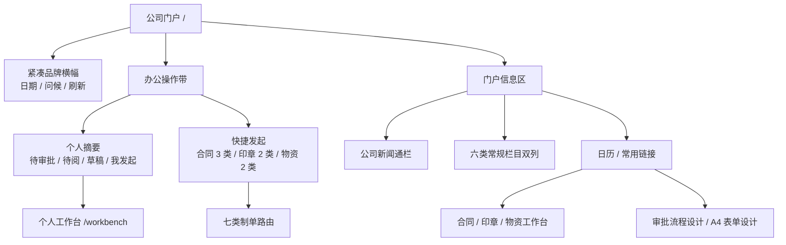
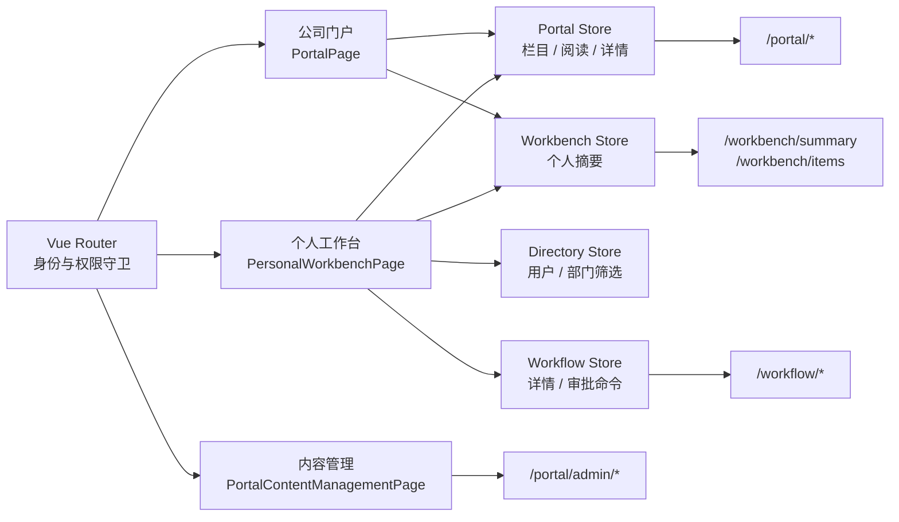

# 公司门户与个人工作台

## 已实现能力

### 公司门户

- 根路由 `/` 直接进入公司门户，展示酒店形象、当日信息和个人工作摘要。
- 支持公司新闻、通知公告、会议纪要、备忘录、规章制度、党群工作、宴会会议七类栏目。
- 按全员、部门、角色和指定人员隔离内容，详情接口重新校验可见性。
- 支持置顶、未读标识、阅读回执、待阅和已阅流转，正文在渲染前使用 DOMPurify 清洗。
- 首页栏目展示前 6 条，“更多”抽屉提供按栏目分页的全量可见内容。
- 展示日历事件和常用链接；七类内容栏目按服务端配置排序，日历和链接保持固定信息区。
- 日历按当前月视图实际 42 格的首尾日期加载，支持多日事件和快速切月防乱序。
- 常用链接在服务端按权限过滤。
- 快捷发起按 `DOCUMENT_CREATE + <MODULE>_CREATE` 双权限展示可用流程。
- 路由 `/portal/content-management` 提供 Element Plus 内容运营工作区，支持状态、栏目、关键词筛选和桌面表格/移动卡片视图。
- 内容支持草稿、定时发布、已发布、已撤回四态生命周期；发布和撤回均要求确认，酒店本地时间按 `Asia/Shanghai` 与 UTC 存储值双向转换。
- 创建、编辑、发布、撤回均写入不可变完整修订快照与审计事件；已发布内容可直接生成新修订，审计抽屉按时间倒序展示操作者和修订号。
- 发布受众直接复用 IAM 用户、部门和角色目录，内容管理员无需额外取得 IAM 管理权限。

### 个人工作台

- 路由 `/workbench` 提供待办、已办、我发起的、草稿、关注、抄送我、待阅和已阅八个视图。
- 待办、已办、我发起的、草稿、关注和抄送我六个业务箱体使用服务端分页，支持关键词、流程类型、发起人、部门、单据状态和日期范围组合查询。
- 待办和已办可在抽屉内查看业务字段、附件名称、审批路径和历史意见，并可进入完整单据；待办支持同意和退回。
- 待办支持本页多选和幂等批量同意，逐项返回成功或失败结果；关注与抄送使用独立领域事实，不复用任务候选人或门户阅读回执。
- 抄送弹窗按目标单据的模块权限和数据范围查询可接收人员，提交时服务端再次校验；接收人首次打开抄送单据时记录独立已读时间。
- 业务列表由工作台聚合读模型返回，审批命令继续通过 workflow 写模型执行，两者不共用重复单据表。
- 待阅和已阅继续使用门户阅读回执接口并独立分页，不伪造 workflow 任务。
- 非登录请求返回 401 时，统一清空会话、目录、门户、工作台和 workflow 缓存，然后携带原地址返回登录页。
- 关注、抄送和批量审批的结构、接口与不变量见[个人工作台高级协作](personal-workbench-advanced.md)。

## 门户布局与入口优先级

本次门户调整不删除栏目或业务入口，而是重新安排桌面首屏的信息优先级。宽屏从上到下依次为：

1. 紧凑品牌横幅：公司名称、业务日期、当前用户问候和刷新动作。
2. 办公操作带：待我审批、待阅信息、我的草稿、我发起的四项个人摘要，以及当前账号有权发起的业务单据。
3. 公司新闻：作为主信息区的首个通栏栏目，保证企业动态早于普通栏目出现；即使栏目暂时为空，也保留栏目位置和空状态。
4. 常规栏目：通知公告、会议纪要、备忘录、党群工作、规章制度、宴会会议按服务端 `displayOrder` 排列，桌面分为两列以提高扫描效率。
5. 辅助信息：日历和常用链接位于右侧窄栏，不与核心审批摘要争夺主栏宽度。

桌面首屏优先保证“今天要处理什么、可以发起什么、公司有什么重要信息”。其余栏目仍完整保留在同一页面中，允许继续向下浏览；“首屏未出现”不等于功能或数据被删除。



应用外壳继续保留独立的“审批中心”“发起申请”“合同与支出”“行政印章”“物资管理”“审批流程设计”和“A4 表单设计”入口。门户快捷区只是这些能力的补充入口，不是唯一入口；桌面侧栏、手机“更多”菜单和权限路由仍共享同一导航目录。

## 结构



```text
apps/web/src/modules/
├── portal/
│   ├── api/
│   ├── components/
│   │   └── admin/
│   ├── domain/
│   ├── pages/
│   └── store/
└── workbench/
    ├── api/
    ├── components/
    ├── domain/
    ├── pages/
    └── store/
```

## 权限

| 能力 | 权限口径 |
| --- | --- |
| 访问公司门户 | `PORTAL_VIEW` 与 `CONTENT_VIEW` 必须同时具备 |
| 查看门户内容 | 上述功能权限 + 全员/部门/角色/人员受众策略 |
| 管理门户内容 | `CONTENT_MANAGE`；默认仅 `SYSTEM_ADMIN` 与 `OFFICE_REVIEWER` |
| 显示常用链接 | 链接配置的 `requiredPermissionCodes` 必须全部满足 |
| 显示快捷发起 | `DOCUMENT_CREATE` + 业务模块 `CREATE` |
| 返回工作台业务项 | `DOCUMENT_VIEW` + 业务模块 `VIEW`，在计数和分页前都重新校验 |
| 返回待办 | 当前用户必须是节点创建时固化的候选人 |
| 返回已办 | `completedBy` 必须是当前用户 |
| 关注单据 | `DOCUMENT_FOLLOW` + 当前单据查看权限和数据范围 |
| 发起抄送 | `WORKFLOW_COPY`；接收人必须具有目标单据查看权限和数据范围 |
| 批量同意 | `WORKFLOW_APPROVE` + `WORKFLOW_BATCH_APPROVE`，每项重新校验候选资格 |

前端菜单和路由守卫执行 all-of 检查，后端接口仍是最终权限边界。

### “显示不出来”排查口径

| 现象 | 正常条件或原因 | 核对位置 |
| --- | --- | --- |
| 公司门户菜单或 `/` 无法进入 | 必须同时拥有 `PORTAL_VIEW` 和 `CONTENT_VIEW` | 会话权限画像、角色授权 |
| 某一栏目没有内容 | 只返回已发布、已到发布时间、未下线且命中全员/部门/角色/指定人员受众的内容 | 内容状态、发布时间、受众配置 |
| 整个内容栏目不出现 | 对应 `CONTENT:<CATEGORY>` 组件不存在、被用户覆盖为隐藏，或生产库未初始化默认组件 | `portal_widgets` |
| 快捷发起为空或数量较少 | 每个入口分别要求 `DOCUMENT_CREATE` 和对应模块 `*_CREATE` | 会话权限、`availableProcessStarts` |
| 常用链接数量较少 | 每条链接的 `requiredPermissionCodes` 必须全部满足；无权入口不会占位 | `portal_quick_links`、会话权限 |
| 待我审批为 0 | 当前用户不是活动任务的固化候选人，或缺少目标业务模块查看权限/数据范围 | workflow 候选人、模块权限 |
| 待阅为 0 | 只统计要求阅读回执且尚未产生本人回执的可见内容 | `requiresReceipt`、阅读回执 |
| 个人工作台业务箱体为空 | 计数和列表都按本人参与关系、模块查看权限和资源数据范围重新裁剪 | workbench 读模型 |

本地企业演示库在 2026-07-14 的验收基线为：16 条门户内容、10 个默认组件、6 个常用链接、4 个日历事件。`office` 和 `applicant` 的首页接口均返回七个栏目；`office` 可见六个常用链接，`applicant` 因无平台设计权限只可见个人工作台和前三业务工作台四个链接。因此当前演示环境的“栏目很多看不到”主要是首屏位置和权限差异，不是测试数据整体缺失。

## 数据口径

- 门户“待阅信息”只统计 `requiresReceipt=true` 且当前用户尚无阅读回执的内容，不把普通新闻的未读标识计入待阅。
- 栏目未读数是门户展示状态；工作台待阅数是阅读回执待办，两者不混用。
- 工作台顶部六项业务数字是未筛选的个人箱体总数；列表中的组合筛选只影响当前页和分页总数。
- 六个业务箱体默认每页 20 条，支持 10/20/50 切换，服务端最大允许 100 条。
- 待阅/已阅徽标与门户摘要使用服务端 `total`，不使用当前页 `items.length`。
- 待办/已办按任务 `updatedAt DESC, id DESC` 排序；我发起的、草稿、关注和抄送我均使用带 ID 次序的稳定分页。
- 发起人筛选对待办、已办、关注和抄送我可见；单据状态筛选对我发起的、关注和抄送我可见，隐藏条件不会随页签切换提交。
- 抄送已读是 `workflow_copies.readAt`，门户待阅/已阅是内容阅读回执，两者统计与状态互不混用。
- 所有时间和日期按 `VITE_OA_TIME_ZONE` 处理，默认 `Asia/Shanghai`，与后端 `OA_TIME_ZONE` 保持一致。
- 内容表以 `status` 作为唯一生命周期状态源；定时内容到期时由查询原子推进并记录系统发布审计，不保留可与状态冲突的启停字段。

## 响应式与打印

- `>= 1200px` 使用“主信息区 + 300px 辅助栏”；公司新闻在主区通栏，其余六个栏目按服务端顺序分配到两列。摘要采用 2 × 2，快捷发起采用四列紧凑入口，保证信息区能在常见桌面首屏开始出现。
- `< 1200px` 将门户操作区和信息区收为单列，个人摘要恢复四列，日历与链接组成双列辅助区。
- `< 768px` 使用单列内容流；品牌横幅压缩并隐藏次要刷新按钮，个人摘要为 2 × 2，快捷发起为两列，公司新闻图文改为上下排列。常规栏目通过顺序值恢复为“通知、会议、备忘、党群、制度、宴会”单列顺序，不能因桌面双列分组而错序或缺项。
- 手机底部保留公司门户、审批中心、发起申请和个人工作台；无权项不占位，“更多”菜单仍可进入前三业务工作台和平台设计页面。
- 1200px 以下工作台六项指标收为三列；768px 以下收为两列，并切换移动端导航、可横向滚动的八页签、筛选底部抽屉和卡片列表；分页可换行，审批路径改为纵向，详情抽屉占满可用宽度。
- 内容管理在 700px 以下隐藏桌面表格，切换为独立内容卡片；编辑、发布、撤回和审计保持完整操作，审计事件改为纵向信息块。
- A4 实际打印由独立 `/documents/:documentType/:id/print` 路由和发布后的 `printSchema` 负责，门户和工作台只提供入口，不复制打印布局。

## 原始需求与前三业务核对

| 范围 | 当前门户/工作台覆盖 | 仍未完成或不应误判为已完成 |
| --- | --- | --- |
| 公司门户 | 公司新闻、通知公告、会议纪要、备忘录、规章制度、党群工作、宴会会议、日历、常用链接和未读状态均有独立展示 | 全局组件拖拽、显隐和个人布局偏好尚无维护闭环 |
| 个人工作台 | 待办、已办、我发起的、草稿、关注、抄送我、待阅和已阅八个视图均保留 | 消息中心、超时催办和异常任务处理台尚未实现 |
| 合同与支出 | 门户保留请示、合同审批、合同付款三个制单入口和业务工作台入口 | 独立无合同支出/报销、预算台账和付款流水自动汇总尚未实现 |
| 行政印章 | 门户保留外借、使用两个制单入口和印章证照工作台入口 | 资产维护、双人交接、到期/逾期提醒和正式附件归档尚未闭环 |
| 物资管理 | 门户保留申购、领用两个制单入口和物资工作台入口 | 原始需求中的款待申请、采购入库、盘点和多次实发尚未实现 |
| 审批与制单平台 | 独立保留审批中心、审批流程设计、A4 表单设计和七类制单路由 | 会签、条件升级、指定历史节点退回、字段级节点权限及通用低代码运行时尚未完成 |

前三业务的完整字段、流程和平台差距以[前三模块企业化实现差距审计](../delivery/02-enterprise-gap-audit.md)为准。门户只负责聚合和导航，不应以门户入口存在替代业务闭环验收。

## 明确延期边界

- **全局布局与排序写接口**：本次按服务端已有配置排列七类内容栏目，尚未实现管理员对日历、链接等全局组件的可视化重排、显隐设置和保存接口。
- **生产默认门户配置**：默认组件、常用链接和日历目前由 `OA_DEMO_SEED=true` 的非生产种子初始化；空生产库没有等价的管理写接口或生产自举方案。正式部署前必须补齐默认组件初始化以及链接、日历维护能力，否则已发布内容也可能因缺少栏目组件而无法进入首页。
- **真实文件与通知**：门户内容附件当前只保存名称，尚无文件上传、下载鉴权、病毒扫描和归档；阅读回执已有事实记录，但没有站内信、提醒和催阅通道。
