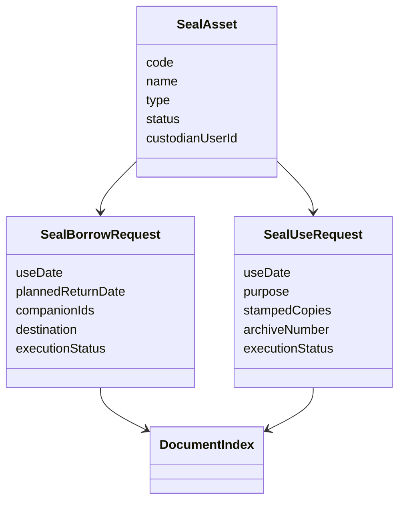
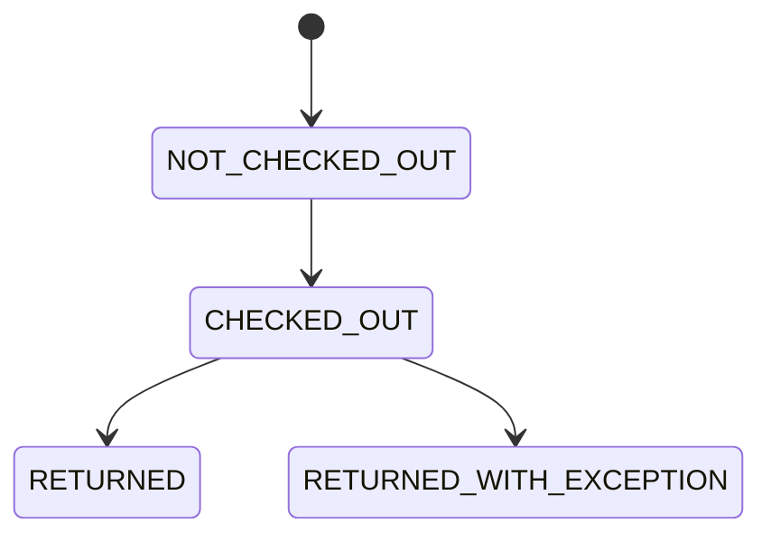

# 行政印章模块 MVP

## 功能说明

实现印章证照台账、外借申请、用印申请、领用归还和用印执行登记。审批完成前不能执行登记。

## 领域模型



## 结构图

```text
modules/seal
├── domain：日期、管理员和资产状态校验
├── application：外借/用印申请、执行闭环
├── infrastructure：印章资产、外借、用印实体
└── presentation：/api/v1/seals 接口
```

## 流程图


## 状态图



## 字段说明

- 外借：申请人、部门、日期、使用日期、归还日期、陪同人、地点、印章证照、内容、附件和审批意见。
- 外借执行：实际领用人、领用时间、归还时间、归还状态、异常说明。
- 用印：用途、印章证照、内容、附件、审批意见、盖章份数、实际用印时间、归档号。

## 权限矩阵

| 动作          | 申请人 | 部门总监 | 办公室           | 印章管理员 |
| ------------- | ------ | -------- | ---------------- | ---------- |
| 创建/提交     | 本人   | 否       | 否               | 否         |
| 审批          | 否     | 当前待办 | 当前待办         | 当前待办   |
| 领用/归还登记 | 否     | 否       | 需印章管理员角色 | 是         |
| 用印执行登记  | 否     | 否       | 需印章管理员角色 | 是         |

## API

- `GET /api/v1/seals/assets`
- `POST /api/v1/seals/borrow-requests`
- `PATCH /api/v1/seals/borrow-requests/:id`
- `POST /api/v1/seals/borrow-requests/:id/checkout`
- `POST /api/v1/seals/borrow-requests/:id/return`
- `POST /api/v1/seals/use-requests`
- `PATCH /api/v1/seals/use-requests/:id`
- `POST /api/v1/seals/use-requests/:id/execute`

## 数据迁移

`InitialSchema` 创建 `seal_assets`、`seal_borrow_requests`、`seal_use_requests`。开发环境种子数据包含公司公章和营业执照。

## 测试说明

- 单元：归还日期不能早于使用日期。
- 集成：审批完成后登记领用、归还；未审批执行被拒绝。
- E2E：PC/手机提交外借和用印申请。

## PC/手机 UI 验收

PC 显示资产台账与两类申请卡片；手机自动切换单列，外借与用印字段保持完整。

## 打印和归档

外借归还状态、异常说明、用印份数和归档号作为归档字段保存；后续可生成台账报表。

## 运维和异常

- `INVALID_RETURN_DATE`：归还日期早于使用日期。
- `DOCUMENT_NOT_APPROVED`：审批未完成时执行登记。
- `SEAL_ASSET_NOT_AVAILABLE`：印章证照被占用时禁止重复外借。
