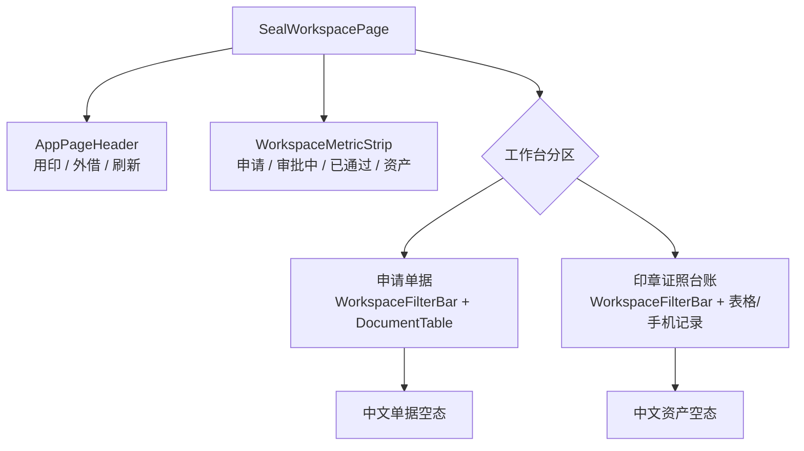
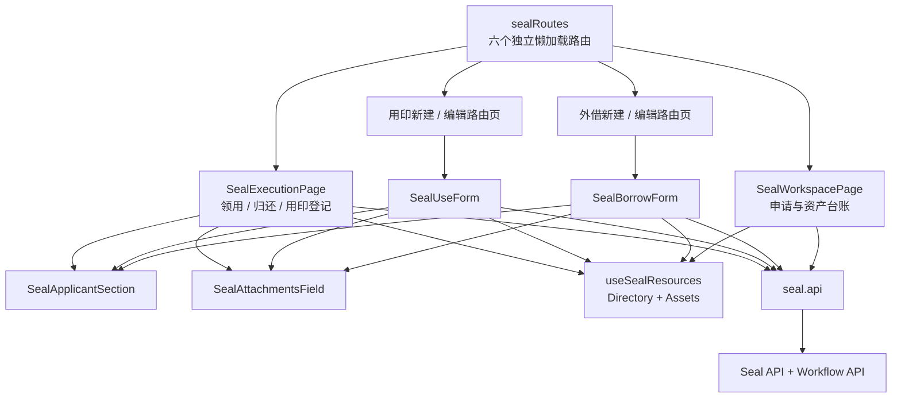
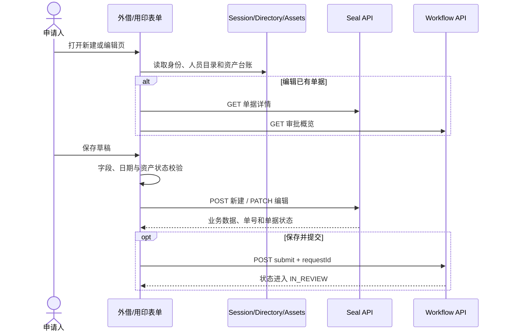
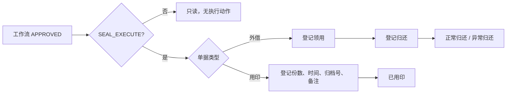

# 行政印章模块企业级 UI

## 1. 建设范围

本次将行政印章从演示单页升级为可维护的 OA 制单与执行流程，仅覆盖原始需求的前两张印章表单，不扩展物资和人力模块。

需求依据：

- 原始表单：`docs/assets/source-forms/image10.png`、`image11.png`。
- 结构化需求：`docs/requirements/forms/administration-supply-hr.md` 的前两张表。
- 既有后端：`docs/modules/seal-business-mvp.md` 与 `/api/v1/seals`。

原始表单中的申请人、部门、日期、使用日期、归还日期、陪同人、前往地点、用途、印章证照名称、申请内容、相关附件和审批意见均已覆盖。结构化需求新增的领用、归还和用印执行字段也已接入现有 API。

## 2. 已实现功能

### 2.1 行政印章工作台

- “申请单据”和“印章证照台账”分区展示，避免制单和资产状态混在同一表单页面。
- 工作台使用共享 `WorkspaceMetricStrip`，四项指标为“申请单据”、“审批中”、“已通过申请”和“在册资产”。
- 从共享工作流 store 的“我的单据”中过滤 `SEAL_BORROW`、`SEAL_USE`。
- 申请单据与台账分别使用 `WorkspaceFilterBar`：申请按标题、类型和审批状态筛选，台账按名称/编号/保管人、资产类型和状态筛选；两处都实时显示结果数量，仅在有有效条件时显示“清空筛选”。
- 页头提供用印、外借两个制单入口和独立“刷新”命令，刷新同时更新申请单据和资产台账。
- 印章证照台账调用 `GET /seals/assets`，展示名称、编号、类型、保管人、状态和有效期。
- 资产台账支持按名称、编号、保管人、类型和状态筛选，手机端改为纵向记录，避免压缩桌面表格。
- 草稿和退回单进入可编辑页；审批中及非管理员已通过单进入只读页；印章管理员可从已通过单进入执行登记。
- 指标、筛选、台账和刷新不受 `canCreate` 限制，具有查看权限的只读角色仍可查看统计；只有新建按钮需要 `DOCUMENT_CREATE + SEAL_CREATE`。
- 所有单据和台账空状态均使用中文，分别为“暂无符合条件的单据”和“暂无符合条件的印章证照”。

### 2.1.1 响应式结构

- 桌面端指标按四列展示，筛选栏横向组合搜索、选项、操作和结果数量。
- 中等宽度下搜索框独占一行；手机端指标为两列两行，筛选控件、清空按钮为单列全宽。
- 申请单据由 `DocumentTable` 切换为手机列表，资产台账切换为纵向记录，避免产生页面级横向滚动。



### 2.2 外借申请

- 申请人、部门来自当前会话，填单日期由系统生成，不允许前端修改身份字段。
- 维护使用日期、计划归还日期、陪同人、前往地点、多项印章证照、申请内容和多附件名称。
- 陪同人从组织用户目录选择，印章证照从实时资产台账选择，无固定人员或固定资产 ID。
- 校验计划归还日期不得早于使用日期、至少选择一个可用资产、文本必填及长度上限。
- 新单使用 `POST`，草稿或退回单使用 `PATCH`；支持保存草稿、保存并提交、请求 loading、错误反馈和审批侧栏。
- 审批中、已通过及已取消状态不提供保存或提交动作。

### 2.3 用印申请

- 申请人、部门和填单日期使用系统上下文。
- 维护使用日期、用途、多项印章证照、申请内容和相关附件名称。
- 印章证照来源于实时台账，并在提交前校验当前可用状态。
- 保存、编辑、提交、只读和审批概览行为与外借申请一致。

### 2.4 审批后执行

- 页面动作同时校验当前用户具有 `SEAL_EXECUTE`、工作流单据状态为 `APPROVED`、业务执行状态仍可处理。
- 外借状态按 `NOT_CHECKED_OUT -> CHECKED_OUT -> RETURNED/RETURNED_WITH_EXCEPTION` 推进。
- 领用登记的实际领用人和实际领用时间均由管理员填写，不使用申请人或当前时间作为固定值。
- 归还登记的实际归还时间、归还状态、是否异常和异常说明均由管理员填写；异常时强制填写说明。
- 用印登记的盖章份数、实际用印时间、文件归档号和执行备注均由管理员填写，不生成固定份数、归档号或备注。
- 已完成执行的单据只读展示执行结果，不重复开放登记动作。

## 3. 页面与目录结构



```text
apps/web/src/modules/seal
├── routes.ts
├── seal.api.ts
├── seal.constants.ts
├── seal.types.ts
├── useSealResources.ts
├── SealWorkspacePage.vue
├── SealBorrowCreatePage.vue / SealBorrowEditPage.vue
├── SealUseCreatePage.vue / SealUseEditPage.vue
├── SealBorrowForm.vue
├── SealUseForm.vue
├── SealExecutionPage.vue
├── SealApplicantSection.vue
└── SealAttachmentsField.vue
```

路由页只负责提供路由上下文，接口访问、目录资源、表单编排和执行状态分别放在独立文件中。所有模块代码文件均少于 500 行。

## 4. 路由

印章菜单和读取路由同时要求 `DOCUMENT_VIEW + SEAL_VIEW`，新建、编辑和提交同时要求 `DOCUMENT_CREATE + SEAL_CREATE`；执行路由还要求 `SEAL_EXECUTE`。无制单权限时隐藏新建入口，查看用户进入统一只读详情。

| 路由 | 页面 |
| --- | --- |
| `/seal` | 行政印章工作台 |
| `/seal/borrow/new` | 新建外借申请 |
| `/seal/borrow/:id/edit` | 编辑或查看外借申请 |
| `/seal/use/new` | 新建用印申请 |
| `/seal/use/:id/edit` | 编辑或查看用印申请 |
| `/seal/execution/:documentType/:id` | 外借或用印执行登记 |

## 5. 制单数据流



## 6. 执行状态与权限



前端权限判断只负责交互收口，真正的授权由后端模块权限守卫、`SEAL_EXECUTE` 数据范围、`DOCUMENT_NOT_APPROVED` 及执行状态规则共同负责。

## 7. 复用与分层

- `AppPageHeader`：统一工作台页头和制单入口。
- `DocumentFormLayout`：统一主表单、审批侧栏和底部命令区。
- `FormSection`：按申请信息、业务安排、印章证照、内容和附件分组。
- `DocumentTable`：复用桌面单据表格与手机单据列表。
- `WorkflowSidebar`：展示流程版本、审批路径和审批记录。
- `AttachmentField`：复用附件选择交互；模块包装组件负责只读清单。
- `session`、`directory`、`workflow` stores：复用登录身份、组织目录和工作流状态。
- `seal.api.ts`：集中管理模块 API 路径、请求方法和防重提交请求号。
- `seal.constants.ts`：集中管理资产、执行状态和显示映射，避免状态文字散落在页面。
- `useSealResources.ts`：集中加载人员、部门和资产，并提供 ID 到显示名称的映射。

## 8. 原始需求复核与后端缺口

前两张原始表单与结构化需求未发现遗漏字段。以下问题无法仅通过本次前端升级形成真正的企业级闭环，需要继续扩展后端领域模型、权限和平台服务。

| 优先级 | 当前限制 | 影响与后续方向 |
| --- | --- | --- |
| P0 | `AttachmentField` 目前只把文件名字符串写入单据，没有上传二进制文件 | 增加对象存储、附件元数据、哈希、版本、鉴权下载、病毒扫描、删除审计和归档关联 |
| P0 | 外借执行没有交接双方确认、确认时间和确认凭证 | 增加领用人与管理员双确认记录；电子签名、账号确认或纸质回执方案需落实 `Q-019` |
| P0 | 用印执行没有持久化实际执行管理员，外借执行也没有结构化管理员和领用人用户 ID | 增加执行人、交接双方用户快照、操作日志及不可抵赖审计字段 |
| P1 | 单据详情已接入模块权限和组织数据范围，但尚无访问审计日志与管理员双人复核 | 生产前补查询审计、敏感操作复核和异常访问告警 |
| P0 | 工作流定义仍是三节点 MVP，与需求文档中的办公室秘书/主任、可选会签、总经理、业主代表和通知发起人不一致 | 使用版本化流程定义补齐正式审批链，并配置条件分支和通知节点 |
| P1 | 印章管理员没有“待执行/逾期未还”业务队列；工作台申请列表仅来自“我的单据” | 增加按模块、执行状态、计划归还日期和权限分页查询的执行台账 API |
| P1 | 用印保存接口只校验资产存在，后端没有校验资产可用状态或时间冲突 | 将资产可用性、预约冲突和并发占用校验下沉到领域服务，不能只依赖前端筛选 |
| P1 | 后端 DTO 对主要字段全部必填 | 当前“保存草稿”仍需完整必填；应增加允许不完整草稿的独立命令，并在提交时执行完整校验 |
| P1 | 印章证照台账只有读取接口，没有新增、停用、保管人变更、有效期提醒和历史流水 | 增加资产管理命令、状态机、变更审计和到期预警；类别规则需落实 `Q-018` |
| P1 | 归还状态为自由文本，没有状态字典、照片或验收记录 | 增加结构化归还状态、异常类型、现场附件和异常处理闭环 |
| P1 | 执行接口没有业务幂等请求号 | 增加命令表或幂等键，使网络重试可返回同一执行结果而不是状态冲突 |
| P2 | 已有版本化 A4 原表打印和审批意见，尚无不可变 PDF 与正式归档包 | 增加 PDF 固化、附件原件、流程轨迹、校验码和保留策略 |

## 9. 验证与验收重点

- 六个路由均为独立页面文件并使用懒加载。
- 新单不预置地点、人员、印章、用途、份数、归档号、时间、归还状态或执行备注等示例数据。
- 申请人、部门和填单日期不进入客户端可编辑 DTO。
- 只有草稿或退回单可 `PATCH` 编辑，审批中及已通过单只读。
- 只有 `SEAL_EXECUTE + APPROVED + 待执行状态` 同时满足时才显示执行动作。
- 外借必须先领用再归还，用印只能登记一次；前后端均执行状态约束。
- 桌面端使用表格和双栏表单布局，手机端使用单列筛选、单据卡片和资产记录。
- 模块及 Web 全量 Vue/TypeScript 类型检查已通过。

## 10. 品牌图片资产

北京东方饭店的本地 WebP 图片、应用场景和原始来源统一记录在 `docs/assets/beijing-dongfang-hotel-images.md`。印章工作台不单独复制或热链品牌图片；正式对外发布前，项目所有方必须确认图片使用授权。
