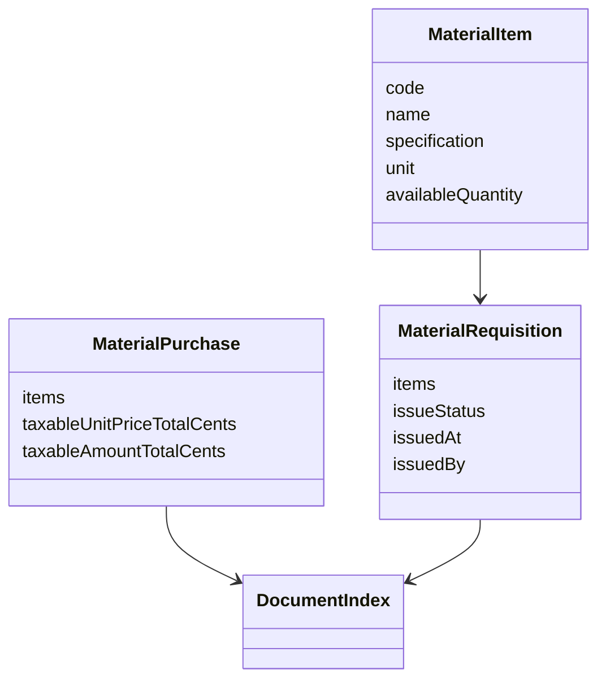
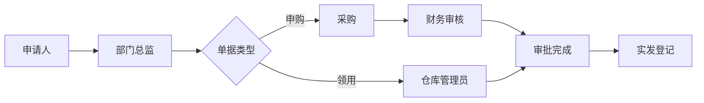
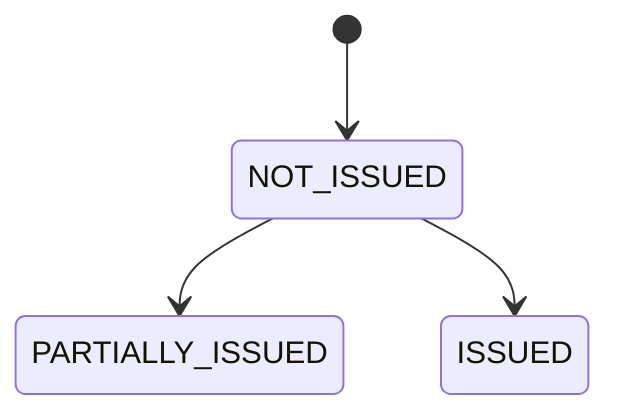

# 物资申购领用模块 MVP

## 功能说明

实现物资目录、物资申购、物品领用、库存校验和实发台账。审批通过不等于库存出库，必须由仓库管理员登记实发。

## 领域模型



## 结构图

```text
modules/supply
├── domain：数量、金额、申购汇总和库存校验
├── application：申购、领用、实发
├── infrastructure：物资、申购、领用实体
└── presentation：/api/v1/supplies 接口
```

## 流程图



## 状态图



## 字段说明

- 申购表头：申购人、申购部门、申购日期。
- 申购明细：品名、品牌、规格型号、单位、申购数量、月消耗数量、参考单价、备注。
- 领用：单号、填写日期、部门、联系人、货物编号、品名、规格、单位、请领数量、实发数量、用途、附件、审批意见。

## 权限矩阵

| 动作      | 申请人 | 部门总监 | 采购     | 财务     | 仓库     |
| --------- | ------ | -------- | -------- | -------- | -------- |
| 创建/提交 | 本人   | 否       | 否       | 否       | 否       |
| 申购审批  | 否     | 当前待办 | 当前待办 | 当前待办 | 否       |
| 领用审批  | 否     | 当前待办 | 否       | 否       | 当前待办 |
| 实发登记  | 否     | 否       | 否       | 否       | 是       |

## API

- `GET /api/v1/supplies/items`
- `POST /api/v1/supplies/purchase-requests`
- `PATCH /api/v1/supplies/purchase-requests/:id`
- `GET /api/v1/supplies/purchase-requests/:id`
- `POST /api/v1/supplies/requisitions`
- `PATCH /api/v1/supplies/requisitions/:id`
- `GET /api/v1/supplies/requisitions/:id`
- `POST /api/v1/supplies/requisitions/:id/issue`

## 数据迁移

`InitialSchema` 创建 `material_items`、`material_purchase_requests`、`material_requisitions`。开发种子包含 A4 纸和中性笔库存。

## 测试说明

- 单元：申购明细必填、数量精度、含税金额汇总。
- 集成：申购审批、领用审批、部分发放、库存扣减、超发拒绝。
- E2E：PC/手机提交申购和领用，并登记部分实发。

## PC/手机 UI 验收

PC 展示库存表和申购/领用双栏；手机单列显示，明细字段不隐藏。

## 打印和归档

领用单保存请领数量、实发数量、用途和审批意见；后续打印模板可从结构化数据生成。

## 运维和异常

- `PURCHASE_ITEMS_REQUIRED`：申购明细为空。
- `ISSUED_QUANTITY_EXCEEDED`：实发超过请领。
- `INSUFFICIENT_STOCK`：库存不足。
