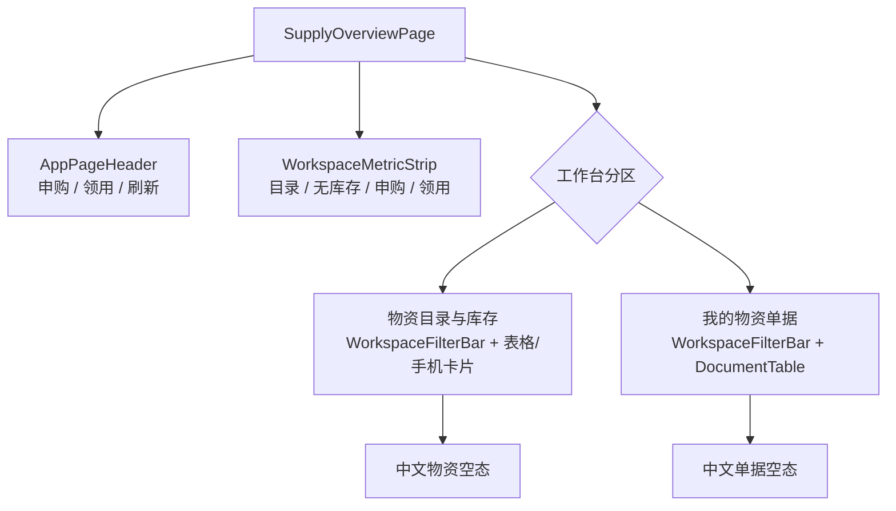
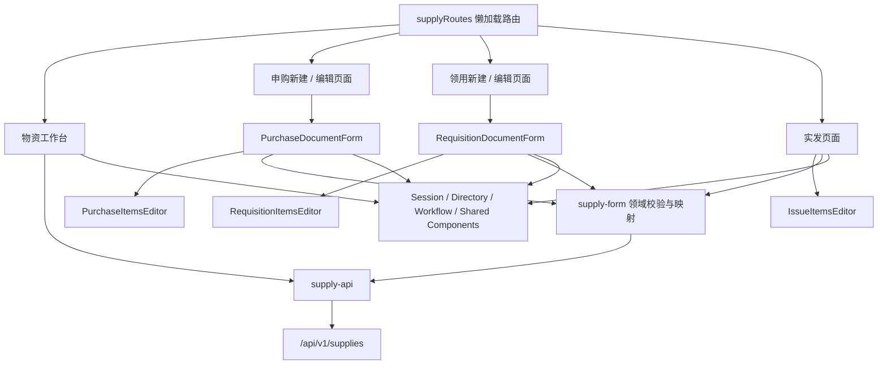
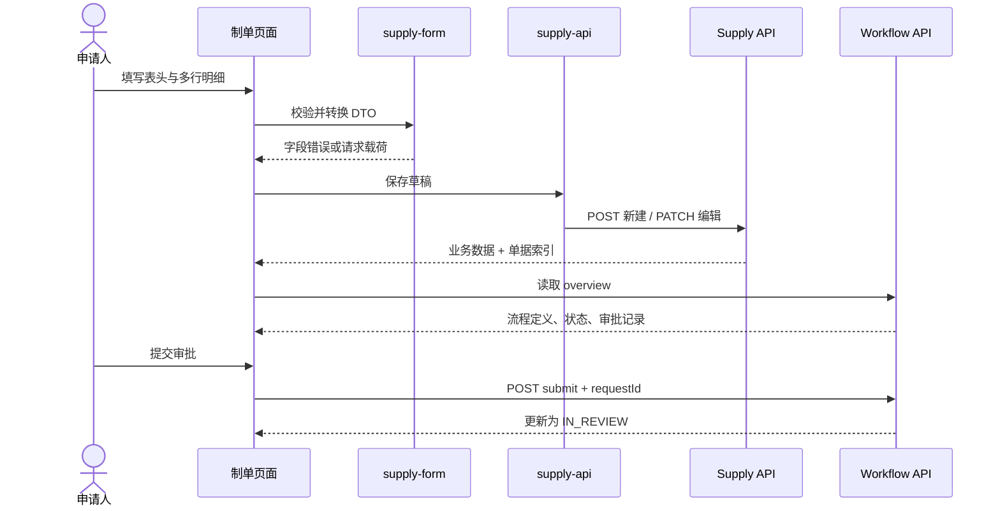
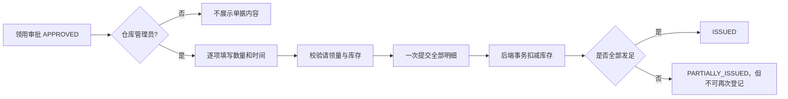

# 物资申购领用企业级前端模块

## 1. 建设范围

本次将物资申购领用从单页演示升级为可维护的 OA 制单流程，覆盖原始需求中的“物资申购单”和“领用申请单”，并保留审批通过后的仓库实发动作。

需求依据：

- 原始表单：`docs/assets/source-forms/image12.png`、`image13.png`
- 结构化需求：`docs/requirements/forms/administration-supply-hr.md`
- 既有后端能力：`docs/modules/supply-business-mvp.md`

本次升级保留供应、库存和工作流领域模型，并补齐模块级制单/查看权限闭环。

## 2. 已实现功能

### 2.1 物资工作台

- 工作台使用共享 `WorkspaceMetricStrip`，四项指标为“目录项目”、“无可用库存”、“本人申购单”和“本人领用单”。
- 展示物资目录及当前可用库存，支持按编号、品名、规格、单位搜索。
- 支持按“全部、有库存、无库存”筛选，并区分目录启停状态。
- 展示物资详情抽屉，手机端使用台账卡片，避免压缩桌面表格。
- 从 `/workflow/my-documents` 过滤本人发起的申购和领用单据。
- 物资目录和本人单据分别使用 `WorkspaceFilterBar`：目录按关键词和库存状态筛选，单据按标题、类型和审批状态筛选；两处都实时显示结果数量，仅在有有效条件时显示“清空筛选”。
- 页头提供新建申购、新建领用和手动“刷新”入口；刷新同时更新物资目录和本人单据。
- 物资台账和单据空状态均使用中文，分别为“暂无符合条件的物资”和“暂无符合条件的单据”。
- 指标、筛选、台账和刷新对具有物资查看权限的用户可见，不得以 `canCreate` 隐藏；新建申购和新建领用仍仅在同时具有 `DOCUMENT_CREATE + SUPPLY_CREATE` 时显示。

### 2.1.1 响应式结构

- 桌面端指标按四列展示，筛选栏横向组合搜索、选项、操作和结果数量。
- 中等宽度下搜索框独占一行；手机端指标为两列两行，筛选控件、清空按钮为单列全宽。
- 物资台账从桌面表格切换为可点击且支持键盘 Enter 的手机卡片，单据由 `DocumentTable` 切换为手机列表，避免页面级横向滚动。



### 2.2 物资申购制单

- 表头申请人、部门取自当前会话，申购日期默认当天。
- 明细支持增加和删除，字段包含品名、品牌、规格型号、单位、申购数量、月消耗数量、参考单价和备注。
- 数量、必填项和金额在提交前统一校验。
- 实时计算申购部门含税单价合计、含税金额合计和明细项数。
- 申购参考价保持为申请依据，不与未来采购执行价混用。
- 新单使用 `POST` 保存草稿，草稿或退回单使用 `PATCH` 编辑。
- 保存后加载单据概览、审批路径和审批记录；提交使用工作流幂等请求号。
- 审批中及审批完成的单据自动进入只读状态。

### 2.3 物品领用制单

- 表头申请人、部门取自当前会话，填写日期默认当天。
- 联系人从组织用户目录选择，不使用固定用户 ID。
- 明细支持增加和删除，库存物资通过目录搜索选择。
- 选择物资后自动带出货物编号、品名、规格、单位和可用库存。
- 校验重复物资、请领数量和用途，避免同一物资拆成重复行。
- 支持多附件名称随单据保存，并在只读状态展示附件清单。
- 保存、编辑、提交、只读和工作流概览行为与申购单一致。
- 明确区分审批状态与发放状态，审批通过不代表已经出库。

### 2.4 仓库实发

- 路由同时要求 `DOCUMENT_VIEW + SUPPLY_VIEW + SUPPLY_ISSUE`，页面继续执行状态二次校验。
- 仅当用户具有 `SUPPLY_ISSUE` 且单据状态为 `APPROVED` 时展示实发表单。
- 每条明细填写实际数量和实发时间，不再使用固定物资或固定数量。
- 校验实际数量不超过请领数量和当前可用库存，至少一项实际数量大于零。
- 按现有接口一次提交全部明细，提交成功后重新读取库存。
- 已实发单据只读展示，不允许再次提交。

## 3. 前端目录

```text
apps/web/src/modules/supply
├── routes.ts                         # 六个懒加载路由
├── route-names.ts                    # 模块路由名常量
├── supply-api.ts                     # 供应与工作流接口适配
├── types.ts                          # API、表单和领域视图类型
├── domain
│   └── supply-form.ts                # 表单构造、映射、汇总与业务校验
├── components
│   ├── PurchaseDocumentForm.vue      # 申购单生命周期编排
│   ├── PurchaseItemsEditor.vue       # 申购动态明细
│   ├── RequisitionDocumentForm.vue   # 领用单生命周期编排
│   ├── RequisitionItemsEditor.vue    # 库存选择与领用动态明细
│   └── IssueItemsEditor.vue          # 实发动态明细
└── pages
    ├── SupplyOverviewPage.vue        # 物资台账与本人单据
    ├── PurchaseCreatePage.vue        # 新建申购路由页
    ├── PurchaseEditPage.vue          # 编辑/查看申购路由页
    ├── RequisitionCreatePage.vue     # 新建领用路由页
    ├── RequisitionEditPage.vue       # 编辑/查看领用路由页
    └── RequisitionIssuePage.vue      # 仓库实发路由页
```

所有文件均低于 500 行。路由页只负责取得路由上下文，业务编排、明细编辑、领域校验和接口访问分层放置。

## 4. 结构导图



## 5. 制单数据流



## 6. 实发数据流和限制



现有 `POST /supplies/requisitions/:id/issue` 是一次性整单命令。后端在第一次登记后将状态改为 `ISSUED` 或 `PARTIALLY_ISSUED`，并拒绝状态不为 `NOT_ISSUED` 的后续请求。因此当前“部分发放”只是一次登记中少发的结果，不是真正的多批次出库。

若要支持企业级分批实发，后端至少需要新增：

- 独立的 `MaterialIssue` 出库单和 `MaterialIssueLine` 明细实体。
- 每批次出库时间、经办人、仓库、批次号、备注和幂等命令号。
- 累计实发量与剩余待发量计算，领用单状态由出库记录聚合得出。
- 出库撤销或红冲机制，以及库存流水而非只修改余额。
- 并发库存锁或乐观版本，防止多个出库命令超卖。

## 7. 对原始需求的复核

本次前端已补齐原 MVP 遗漏的动态多行、完整字段、移动端完整展示、联系人选择、库存物资选择、草稿编辑、实时金额汇总、错误状态、审批概览和角色保护。

仍需后端或跨模块建设的需求缺口：

| 缺口 | 当前表现 | 后续建议 |
| --- | --- | --- |
| 采购执行价 | 只有申请参考价 | 增加采购询价、供应商、核定价和采购订单模型 |
| 真正附件服务 | 仅保存附件名称字符串 | 增加对象存储、元数据、鉴权下载、病毒扫描和删除审计 |
| 多仓库和库存批次 | 目录只有单一可用数量 | 增加仓库、批次、占用量、库存流水和盘点模型 |
| 分批实发 | 首次部分发放后锁单 | 使用独立出库单累计实发并支持后续批次 |
| 物资目录维护 | 当前只有只读列表 | 增加分类、启停、单位字典和目录维护权限 |
| 打印归档 | 已有版本化 A4 套打，尚无不可变 PDF 归档包 | 根据结构化单据、附件原件和审批记录固化归档 PDF |
| 单据分页检索 | 本人单据由通用接口一次返回 | 后端提供按模块、类型、状态、时间分页查询 |

## 8. 路由和接口

物资菜单和读取路由同时要求 `DOCUMENT_VIEW + SUPPLY_VIEW`，新建、编辑和提交同时要求 `DOCUMENT_CREATE + SUPPLY_CREATE`。无制单权限时隐藏申购和领用入口；实发命令继续按 `SUPPLY_ISSUE` 的数据范围校验目标领用单。

前端路由：

- `/supply`
- `/supply/purchases/new`
- `/supply/purchases/:id/edit`
- `/supply/requisitions/new`
- `/supply/requisitions/:id/edit`
- `/supply/issues/:id`

使用的后端接口：

- `GET /api/v1/supplies/items`
- `POST /api/v1/supplies/purchase-requests`
- `PATCH /api/v1/supplies/purchase-requests/:id`
- `GET /api/v1/supplies/purchase-requests/:id`
- `POST /api/v1/supplies/requisitions`
- `PATCH /api/v1/supplies/requisitions/:id`
- `GET /api/v1/supplies/requisitions/:id`
- `POST /api/v1/supplies/requisitions/:id/issue`
- `GET /api/v1/workflow/my-documents`
- `GET /api/v1/workflow/documents/:id/overview`
- `POST /api/v1/workflow/documents/:id/submit`

## 9. 验收重点

- 桌面端明细表允许横向承载完整字段，手机端不压缩表格，改为逐项卡片。
- 新单保存后进入编辑路由，再次保存使用 `PATCH`。
- 审批中或已通过单据不可编辑。
- 领用物资不得使用固定 ID，必须从实时库存目录选择。
- 实发不得使用固定数量，必须逐项填写并通过角色、审批和库存校验。
- 前端不能将 `PARTIALLY_ISSUED` 描述为可继续分批发放。

## 10. 品牌图片资产

北京东方饭店的本地 WebP 图片、应用场景和原始来源统一记录在 `docs/assets/beijing-dongfang-hotel-images.md`。物资工作台不单独复制或热链品牌图片；正式对外发布前，项目所有方必须确认图片使用授权。
