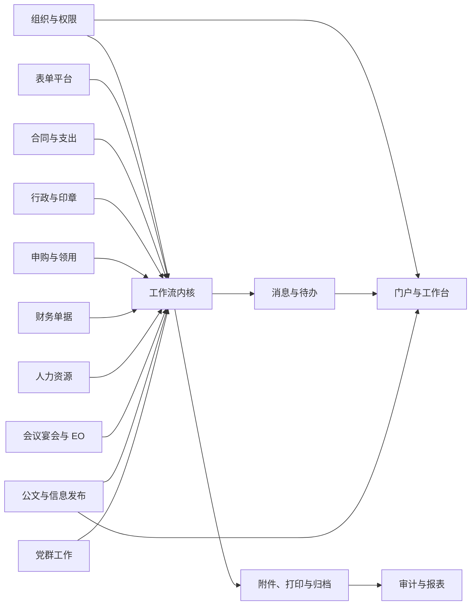
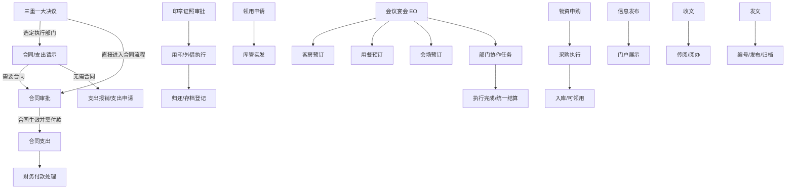

# 领域划分与模块关系

## 1. 限界上下文



### 1.1 核心域

- **工作流内核**：流程定义、节点、流转、任务、动作、会签、退回和版本。
- **动态表单**：表单定义、字段、布局、规则、数据快照和打印映射。

### 1.2 支撑域

- 组织与权限
- 消息与待办
- 附件与归档
- 编号与字典
- 审计与报表

### 1.3 业务子域

合同、财务、行政、采购、人事、会议宴会、公文和党群模块。每个模块拥有自己的聚合、校验和状态，不把业务规则写入流程内核。

## 2. 推荐模块化单体

首期采用模块化单体，而不是微服务：

- 约 200 用户不需要微服务带来的部署和一致性成本。
- NestJS 模块边界足以保持低耦合。
- 通过领域事件和仓储接口，为未来拆分保留边界。
- 单数据库事务更适合审批、任务和审计的一致提交。

```text
apps/
  api/                 NestJS API
  web/                 Vue 3 Web/PWA
packages/
  shared-kernel/       ID、Money、Result、DomainEvent 等稳定类型
  contracts/           前后端接口契约与生成类型
docs/
```

NestJS 内每个业务包保持相同结构：

```text
modules/<bounded-context>/
  domain/
    entities/
    value-objects/
    events/
    repositories/
    services/
  application/
    commands/
    queries/
    dto/
    handlers/
  infrastructure/
    persistence/
    messaging/
  presentation/
    controllers/       一个路由处理器文件只负责一个用例
  <context>.module.ts
```

依赖方向固定为 `presentation -> application -> domain`，`infrastructure -> domain`。领域层不依赖 NestJS、ORM、HTTP 或 Vue。

## 3. 业务模块关联



### 3.1 跨流程联动

跨流程不能复制业务数据，应建立显式关系：

- `parent_process_instance_id`：从哪一个流程启动。
- `business_relation`：请示、合同、付款之间的关系类型。
- `source_document_id`：新单据引用的来源单据。
- `field_mapping_snapshot`：启动时复制了哪些字段及原值。

来源单据后续变化不得自动污染已启动的目标单据。

## 4. 聚合边界

| 聚合 | 一致性边界 |
| --- | --- |
| ProcessDefinition | 流程版本、节点、边和发布状态 |
| ProcessInstance | 当前状态、当前节点集合、业务引用 |
| Task | 办理人、候选人、动作、期限和完成状态 |
| FormDefinition | 字段、布局、规则和版本 |
| BusinessDocument | 某类业务单据及其领域状态 |
| Attachment | 文件元数据、权限、哈希和版本 |
| ArchivePackage | 固化后的表单、轨迹、意见和文件清单 |

流程实例和业务单据通过 ID 关联，但不放入同一巨大聚合。一次审批动作由应用服务在事务中完成：

1. 校验用户和任务权限。
2. 调用业务模块验证当前动作。
3. 完成任务并推进流程状态机。
4. 写入审批意见和审计事件。
5. 通过 Outbox 记录待发送通知。

## 5. 模块间通信

- 同步查询：只通过公开应用接口，不直接读取其他模块仓储。
- 同步命令：只用于必须立即得知成功/失败的操作。
- 领域事件：用于通知、索引、统计和跨模块后续动作。
- Outbox：数据库事务提交后可靠投递，避免“审批成功但通知丢失”。

典型事件：

- `DocumentSubmitted`
- `TaskAssigned`
- `TaskCompleted`
- `ProcessReturned`
- `ProcessCompleted`
- `ContractApproved`
- `SealBorrowed`
- `SealReturned`
- `PurchaseApproved`
- `DocumentPublished`
- `ArchivePackageCreated`

## 6. 设计模式使用边界

| 场景 | 模式 | 目的 |
| --- | --- | --- |
| 流程运行 | 状态机 | 明确合法状态和迁移 |
| 办理人解析 | Strategy | 部门负责人、角色、指定人等规则可替换 |
| 分支条件 | Specification | 组合金额、部门、字段条件 |
| 节点动作 | Command | 审批、退回、转办等动作独立处理 |
| 业务事件 | Observer/Domain Event | 模块解耦 |
| 数据持久化 | Repository | 领域与 SQLite/ORM 隔离 |
| 外部系统 | Anti-Corruption Layer | 防止第三方模型污染领域 |

不为了使用模式而制造抽象。只有存在至少两个变化方向或明确扩展点时才引入策略/工厂。
