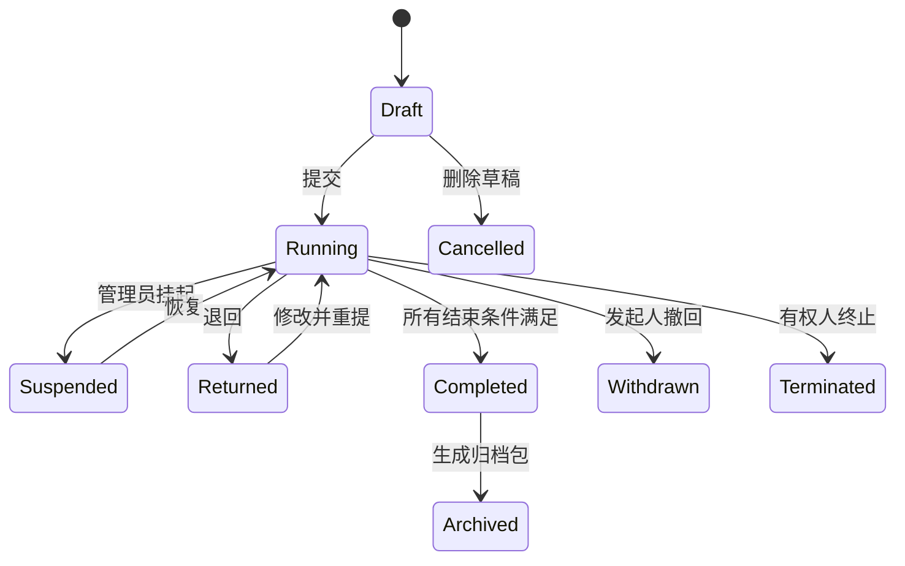

# 工作流需求

## 1. 工作流能力边界

工作流内核负责“谁在什么条件下处理什么任务”，业务模块负责“这张单据是否合法、审批完成后发生什么”。

## 2. 流程定义

流程定义至少包含：

- 唯一编码、名称、分类、说明和图标。
- 关联表单版本和业务模块。
- 可发起组织、角色、人员和数据范围。
- 节点、连线、条件、办理人规则和时限。
- 允许动作、退回范围、字段权限和通知规则。
- 发布版本、生效时间、停用时间和变更说明。

### 2.1 节点类型

| 节点 | 用途 |
| --- | --- |
| Start | 发起和初始化变量 |
| UserTask | 单人或候选人审批 |
| SerialCountersign | 按顺序会签 |
| ParallelCountersign | 多人并行会签 |
| ExclusiveGateway | 条件只选择一条路径 |
| InclusiveGateway | 条件可选择多条路径 |
| ManualChoice | 由当前办理人选择后续步骤或会签人 |
| CopyTask | 抄送、阅知，不阻塞主流程 |
| ServiceTask | 编号、归档、启动子流程等系统动作 |
| End | 正常完成、终止或作废 |

### 2.2 办理人规则

- 固定用户
- 固定角色
- 发起人
- 发起人部门负责人/上级
- 发起人部门指定岗位
- 表单字段选择的用户/部门
- 上一节点办理人指定
- 业务数据计算出的候选组

人员离职、岗位空缺或多人匹配时必须有明确兜底规则，不能让实例静默卡死。

## 3. 运行状态

撤回仅在下一办理人尚未完成任务且流程策略允许时执行。完成后的纠错使用“作废 + 重新发起”，不能篡改历史。

## 4. 审批动作

| 动作 | 规则 |
| --- | --- |
| 同意 | 完成本任务并计算后续节点 |
| 不同意/拒绝 | 按流程配置终止或退回 |
| 退回 | 选择允许的历史节点，填写必填原因 |
| 补件 | 退回发起人，保留流程上下文，补齐后重提 |
| 转办 | 任务所有权转给另一人，原办理人留痕 |
| 委托 | 在有效期内由代理人办理，记录委托关系 |
| 加签 | 当前节点前加签或后加签 |
| 会签 | 动态选择多个部门/人员并设置通过规则 |
| 撤回 | 发起人收回尚未被处理的流程 |
| 催办 | 发送提醒并记录催办次数 |
| 抄送 | 发送阅知任务，不影响流程完成 |

所有动作必须幂等。客户端提交 `requestId`，重复请求不能重复完成任务。

## 5. 会签规则

源需求多次要求“秘书根据领导意见选择会签”。应支持：

1. 当前办理人选择会签部门或人员。
2. 系统按部门解析该部门总监。
3. 并行生成会签任务。
4. 汇总所有会签意见。
5. 按配置决定通过条件：全部通过、达到比例、任一通过或指定角色通过。
6. 未达到条件时执行配置的退回或拒绝路径。

## 6. 退回与重提

总经理等节点要求退回某一步，因此退回不是简单的“退回发起人”。

- 流程定义配置可退回目标集合。
- 退回时取消尚未完成的同分支任务。
- 历史任务不删除，标记其所属运行轮次。
- 重提时创建新任务轮次。
- 已完成会签意见保留；是否需要重新会签由节点配置决定。
- 表单字段权限按退回目标重新计算。

## 7. 字段权限

每个节点可按字段配置：

- 隐藏
- 只读
- 可编辑
- 必填
- 脱敏显示

例如退款单分为“业务部门填写项目”和“财务部填写项目”。财务字段在发起节点只读或隐藏，到财务节点才可编辑。

## 8. 审批意见

意见记录包含：

- 节点名称和节点定义版本
- 办理人、代办人、所属部门和岗位快照
- 动作、意见正文、签名
- 接收、打开、提交时间和耗时
- 退回目标、转办对象、加签对象
- 附件
- 客户端与 IP 等安全审计信息

打印时按流程顺序展示，不只显示最终意见。

## 9. 时限、提醒和升级

- 节点可配置工作时限和日历。
- 到期前提醒、到期催办、超时升级。
- 升级可通知上级、转给候选组或仅告警。
- 暂停、节假日和退回期间的时钟规则必须可配置。

## 10. 源文档流程清单

### 10.1 合同与支出

1. 合同/支出请示：发起 → 部门总监 → 可选部门会签 → 财务秘书 → 财务主管 → 财务总监 → 业主负责人 → 办公室秘书 → 办公室主任 → 办公室秘书组织会签 → 总经理 → 业主负责人/代表 → 通知发起人。
2. 合同审批：部门秘书发起 → 部门总监 → 财务秘书 → 财务主管 → 财务总监 → 业主负责人 → 办公室秘书 → 办公室主任 → 会签 → 总经理 → 业主代表 → 通知发起人 → 可选用印 → 印章管理员 → 领取通知。
3. 合同支出：部门秘书发起 → 部门总监 → 财务链路 → 行政链路 → 总经理 → 业主代表 → 通知发起人。
4. 无合同支出：请示通过后直接进入支出报销/支出申请链路。

### 10.2 行政与物资

- 印章证照外借、使用：申请人 → 部门总监 → 办公室秘书 → 办公室主任 → 可选会签 → 总经理 → 业主代表 → 印章管理员 → 通知发起人。
- 物资申购、领用：申请人 → 部门总监 → 财务采购 → 财务秘书 → 财务主管 → 财务总监 → 财务秘书选择是否升级；无需升级则通知发起人，需要升级则办公室秘书 → 总经理 → 业主代表 → 通知发起人。
- 款待申请：申请人 → 部门总监 → 办公室秘书 → 办公室主任 → 总经理 → 业主代表 → 通知发起人。

### 10.3 财务、人力、公文

- 银行支出沿用合同/支出请示审批链，结束后通知财务处理。
- 现金支出、借款、三类退款的详细流程源文档未给出，需业务确认。
- 请假当前仅明确“员工发起 → 部门总监”，后续按请假天数、职级和类别配置。
- 非支出请示、发文、收文：部门秘书 → 部门总监 → 办公室秘书 → 办公室主任 → 会签 → 总经理 → 通知发起人。

### 10.4 党群

- 党群信息：直接发布，可选择查看范围。
- 党群印章：党委发起 → 主任 → 财务总监 → 业主财务负责人 → 党委委员会签 → 党委副书记 → 党委书记 → 业主代表 → 通知。
- 三重一大：党办发起 → 主任 → 党办秘书组织党委会签 → 办公室主任 → 办公室秘书组织店务会签 → 党办秘书选择执行部门 → 执行部门进入合同相关流程。
- 党委发文和党群收文在源文档中复用了党群印章审批链及对应表单，需确认是否真实业务规则。

### 10.5 会议宴会 EO

EO11.pdf 只提供表单和签署位置，没有明确完整流程。推荐：销售/会务制表 → 销售部负责人审批 → 根据协作明细并行分配财务、工程、保卫、餐饮等部门负责人确认 → 发布 EO → 部门执行 → 会后确认与结算。

已发布 EO 发生变化时必须创建修订版本，只让受影响部门重新确认，并保留旧版本和差异记录。该推荐流程需业务负责人确认后才能配置为生产版本。

## 11. 流程管理能力

- 流程草稿、校验、发布、停用和复制。
- 图形化设计器与节点属性面板。
- 发布前模拟：输入表单变量，预览路径和办理人。
- 运行实例监控、人工干预、任务改派和异常修复。
- 流程版本差异对比。
- 统计节点耗时、退回率、超时率和流程吞吐量。
