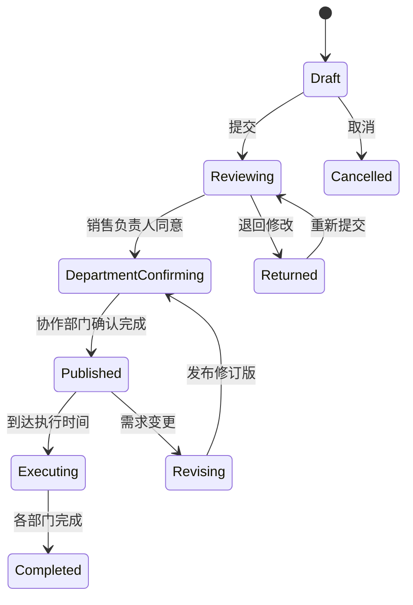

# 会议宴会 EO 单

来源：[EO11.pdf 渲染页](../../assets/source-forms/meeting-eo-form.png)

“EO”按酒店业务理解为 Event Order，用于将销售接待需求分解为客房、用餐、会场和协作部门执行事项。原表标题为“东方饭店 EO 单”。

## 1. 基础信息

| 字段 | 类型 | 规则 |
| --- | --- | --- |
| 会议名称/团 | String | 原表字段，必填 |
| 公付账号 | String/AccountReference | 公付结算账号，不按银行账号建模 |
| 接待单位 | Counterparty/String | 必填 |
| 自付账号 | String/AccountReference | 自付结算账号，不按银行账号建模 |
| 团籍 | DictSelect/String | 保留原表字段；业务含义和字典待确认 |
| 人数 | Integer | 大于 0 |
| 销售经理 | User | 必填 |
| 会务对接人 | User/String | 必填 |
| 联系电话 | Phone | 必填，格式校验 |

## 2. 客房预订信息

支持增加、删除和调整明细行。

| 字段 | 类型 | 规则 |
| --- | --- | --- |
| 序号 | Integer | 系统生成 |
| 抵离日期 | DateRange | 抵达时间不得晚于离店时间 |
| 房型 | RoomType | 来自房型字典 |
| 数量 | Integer | 大于 0 |
| 房间价格 | Money | 单间价格，金额精确计算 |
| 备注 | String | 其他客房要求 |

## 3. 用餐预订

| 字段 | 类型 | 规则 |
| --- | --- | --- |
| 序号 | Integer | 系统生成 |
| 用餐日期 | Date/DateTime | 必填 |
| 餐别及类型 | MealType | 例如早、午、晚餐及零点/自助 |
| 用餐地点 | Venue | 必填 |
| 用餐人数 | Integer | 大于 0 |
| 价格（单位：元） | Money | 支持按人、桌或场次计价，并另存计价单位 |
| 备注（其他需求） | String | 保底人数、签到、入会比例等 |

## 4. 会场预订

| 字段 | 类型 | 规则 |
| --- | --- | --- |
| 序号 | Integer | 系统生成 |
| 使用时间 | DateTimeRange | 必填 |
| 会议地点 | Venue | 必填 |
| 摆放形式 | LayoutType | 例如 U 型、课桌型、剧院型 |
| 会议人数 | Integer | 大于 0 |
| 价格（单位：元） | Money | 同时保存计价单位，例如元/天 |
| 备注 | String | 纸、笔、水、投影、麦克等需求 |

## 5. 相关协作部门具体事项

每一行在 EO 发布后生成一个部门协作任务。

| 字段 | 类型 | 规则 |
| --- | --- | --- |
| 部门 | Department | 必填 |
| 具体事项 | LongText | 必填 |
| 部门负责人签字 | ApprovalSignature | 由部门负责人确认任务后生成，不允许上传图片冒充系统签署 |

原表样例包含财务部统一结算、工程部投影/麦克、保卫部停车和餐饮部会务服务。

## 6. 制表与确认

| 字段 | 类型 | 规则 |
| --- | --- | --- |
| 制表人 | User/ApprovalSignature | 默认发起人，提交后记录签署快照 |
| 销售部负责人 | User/ApprovalSignature | 销售负责人审批时生成 |

建议由系统补充但不改变原表字段：

- EO 编号
- EO 状态和修订版本
- 计划发布日期、实际发布时间
- 关联客户、合同、会议项目
- 结算状态和执行完成时间

## 7. 状态

## 8. 推荐流程

PDF 只显示制表人、销售部负责人和协作部门负责人签字，没有给出完整 OA 流程。推荐流程需业务确认：

1. 销售经理或会务对接人制表。
2. 销售部负责人审批。
3. 按协作明细并行生成财务、工程、保卫、餐饮等部门确认任务。
4. 所有必需部门负责人确认后发布 EO。
5. 执行期间各部门记录完成情况和异常。
6. 会后由销售/会务人员确认完成，财务进入结算。

## 9. 业务规则

1. 客房、用餐、会场三类预订至少有一类包含明细。
2. 协作部门根据预订内容自动建议，但由制表人确认，禁止写死固定部门。
3. 场地、客房和资源冲突需要实时提示；是否允许超订由权限控制。
4. 已发布 EO 修改时生成新修订版，明确标出增、删、改内容。
5. 受影响部门必须重新确认修订，不受影响部门可沿用原确认。
6. 公付和自付账号只用于结算归集，不应在普通门户或无关部门展示。
7. 打印必须包含当前修订号、各部门确认、制表人和销售负责人签署。
