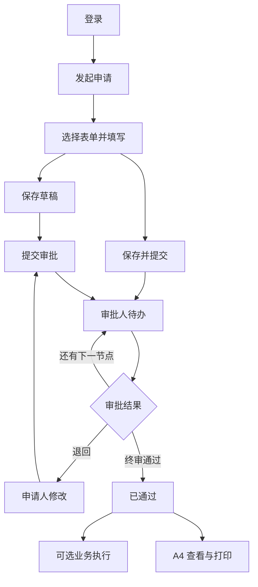
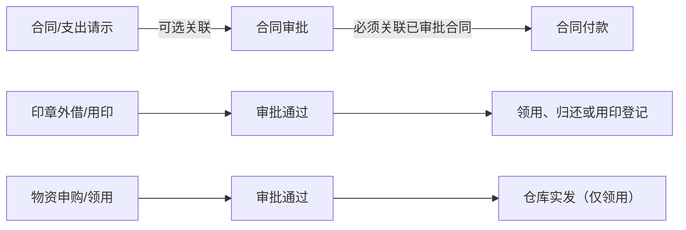

# 东方饭店 OA 系统操作手册

- 适用版本：OA Hotel V1（2026-07-21 当前实现）
- 适用人员：酒店员工、部门负责人、专业审核人、内容管理员和系统管理员
- Web 入口：`http://<服务器地址>/`
- 编写依据：当前页面、权限配置、已发布流程以及一次完整的合同/支出请示实测

## 1. 使用前准备

### 1.1 账号与密码

1. 打开系统地址，输入账号和密码后点击“登录”。
2. 花名册导入的酒店员工通常使用本人姓名作为账号，具体以管理员发放的账号为准。
3. 首次登录后不强制改密。用户可从右上角用户菜单进入“修改密码”自助更换。
4. 连续输入错误密码会触发账号限流，应等待锁定时间结束，不要反复尝试。

### 1.2 角色与职责

| 人员类型 | 主要操作 |
| --- | --- |
| 申请人 | 发起单据、保存草稿、提交审批、修改退回单、查看进度和打印 |
| 部门负责人 | 审批本部门申请 |
| 财务审核人 | 审核合同请示、合同审批、合同付款和物资申购 |
| 办公室审核人 | 审核合同审批和印章证照申请 |
| 印章管理员 | 印章流程审批，并在通过后登记领用、归还或用印 |
| 采购负责人 | 承担物资申购的“采购经办”节点 |
| 仓库管理员 | 审核物资领用，并在通过后登记实发 |
| 内容管理员 | 编辑和发布门户新闻、通知、制度等内容 |
| 流程管理员 | 复制、配置、校验和发布审批流程版本 |
| 表单管理员 | 复制、配置、预览和发布 A4 打印表单版本 |
| 系统管理员 | 具有全量功能权限，负责组织权限与平台配置验收 |

`SYSTEM_ADMIN` 具有全量功能权限，但该角色不会自动加入任何审批节点。审批人仍由单据提交时的部门、角色、数据范围和权限解析。

## 2. 主要入口

| 菜单 | 路径 | 用途 |
| --- | --- | --- |
| 公司门户 | `/` | 查看公司内容、工作摘要、快捷发起、日历和常用链接 |
| 个人工作台 | `/workbench` | 查看待办、已办、我发起的、草稿、关注、抄送、待阅和已阅 |
| 审批中心 | `/workbench?tab=pending` | 集中办理当前用户的审批任务 |
| 发起申请 | `/start` | 搜索并发起当前有权的七类流程 |
| 合同与支出 | `/contract` | 合同请示、合同审批和合同付款工作台 |
| 行政印章 | `/seal` | 印章外借、用印申请和印章证照台账 |
| 物资管理 | `/supply` | 物资申购、领用、目录和库存 |
| 内容管理 | `/portal/content-management` | 管理门户内容及发布受众 |
| 组织与权限 | `/system/iam` | 管理部门岗位、用户任职、角色和数据范围 |
| 审批流程设计 | `/system/processes` | 管理七类单据的已发布流程版本 |
| A4 表单设计 | `/system/forms` | 管理单据的 A4 打印版式 |

无权限的菜单不会显示，这是正常的权限隔离，不代表功能被删除。

## 3. 通用制单与审批流程

### 3.1 发起单据

前置条件：账号已启用，具有“创建单据”和对应业务模块的制单权限。正式上线前应确认对应流程和 A4 表单已发布；系统保留旧流程和兼容打印版式仅用于历史数据或过渡。

1. 从页头、左侧菜单或公司门户点击“发起申请”。
2. 在制单中心核对卡片上显示的“预计审批路径”。
3. 点击目标单据的“开始填写”。
4. 填写带 `*` 的必填字段，核对申请人、部门、日期、金额、明细和附件名称。
5. 暂不提交时点击“保存草稿”；完成时点击“保存并提交”或“提交审批”。

成功标志：

- 保存草稿成功：系统生成单号，状态保持“草稿”。
- 提交审批成功：状态变为“审批中”，页面显示已绑定的流程名称、版本和首个审批节点。

注意：当前版本的“保存草稿”也会校验完整必填字段，不能保存完全未填或严重缺项的草稿。

### 3.2 办理审批

前置条件：当前用户是该任务提交时固化的候选人，同时具有审批权限、目标业务模块查看权限和覆盖申请部门的数据范围。

1. 进入“审批中心”，或在“个人工作台 -> 待办”处理。
2. 可按标题、流程类型、发起人、部门和日期筛选，避免误办同名或历史测试单据。
3. 点击单据标题或“办理”，打开“审批单据”抽屉。
4. 核对关键业务信息、附件名称、审批路径和已有意见。需要完整表单时点击“查看完整单据”。
5. 点击“同意”或“退回”，填写必填的审批意见，然后点击“确认”。

成功标志：同意时页面提示“审批已提交”，退回时提示“单据已退回发起人”；两种操作都会使该单据从当前用户的待办中消失，并出现在“已办”中。

完整详情页可查看单据，并按状态和权限提供编辑、执行登记、关注、抄送和打印；“同意/退回”只在审批中心的待办抽屉中提供。

### 3.3 退回后修改

1. 审批人选择“退回”后，单据直接返回原发起人，状态为“已退回”。
2. 发起人在“个人工作台 -> 我发起的”或业务工作台打开单据。
3. 从个人工作台或合同详情进入时点击“编辑”；从印章或物资工作台打开本人退回单时会直接进入编辑页。按退回意见修改后重新提交。
4. 重新提交后从第一个审批节点重新开始，不是从原退回节点继续。

### 3.4 跟踪、关注、抄送和打印

1. 发起人从“个人工作台 -> 我发起的”查看状态和当前节点。
2. 在单据详情中查看已绑定的流程版本、每个节点和审批意见。
3. 需持续跟踪时点击“关注”；需协同人员查阅时点击“抄送”。抄送接收人仍必须有目标单据的查看权限和数据范围。
4. 点击详情页“打印”，进入独立 A4 预览页。
5. 核对单号、业务字段、附件清单和审批意见，再点击 A4 页的“打印”调用浏览器打印。

系统当前没有自动站内信、短信或催办通知。发起人需主动查看“我发起的”，审批人需主动查看“待我审批”。

## 4. 当前七类审批链

以“发起申请”页当时显示的已发布流程为准。当前实现如下：

| 业务包 | 单据 | 前置条件 | 顺序审批节点 | 审批后动作 |
| --- | --- | --- | --- | --- |
| 合同支出 | 合同/支出请示 | 无 | 部门负责人 -> 财务审核 | 可作为本人后续合同审批的关联请示 |
| 合同支出 | 合同审批 | 可关联本人已通过请示 | 部门负责人 -> 财务审核 -> 办公室审核 | 进入“已审批合同”选择范围 |
| 合同支出 | 合同付款 | 必须选择已审批合同，且制单数据范围覆盖该合同 | 部门负责人 -> 财务审核 | 当前无银行付款执行及付款台账回写 |
| 行政印章 | 印章证照外借 | 页面选择可用印章/证照 | 部门负责人 -> 办公室审核 -> 印章管理员 | 领用时再校验可用性，然后领用登记 -> 归还登记 |
| 行政印章 | 印章证照使用 | 选择可用印章/证照 | 部门负责人 -> 办公室审核 -> 印章管理员 | 登记用印份数、时间和归档号 |
| 物资管理 | 物资申购 | 填写申购明细 | 部门负责人 -> 采购经办 -> 财务审核 | 当前无采购订单、到货和入库闭环 |
| 物资管理 | 物资领用 | 从目录选择库存物资 | 部门负责人 -> 仓库管理员 | 仓库登记一次实发并扣减库存 |

以上是当前可运行的缩短版线性审批链，不等同于原始需求文档中的完整长链路。当前不支持条件分支、金额升级、会签、加签、转办、委托和指定历史节点退回。

## 5. 三个业务工作台

### 5.1 合同与支出

1. 请示：填写请示题目、日期、可选金额、请示内容和附件名称。
2. 合同审批：可选择本人已通过请示，填写签约部门、签约日期、合同名称、金额、对方单位、合同内容和是否需要用印。
3. 合同付款：必须选择已审批合同，且当前用户的 `CONTRACT_CREATE` 数据范围覆盖该合同；核对合同快照后填写预算、执行进度、付款次序、付款方式、付款原因、本次金额和附件名称。
4. “需要用印”当前只是合同字段，不会自动生成印章申请。

### 5.2 行政印章

1. 外借：填写使用日期、计划归还日期、陪同人、前往地点、印章证照、内容和附件名称。
2. 用印：填写使用日期、用途、印章证照、申请内容和附件名称。
3. 审批通过后，印章管理员从单据详情的“执行登记”进入执行页。
4. 外借先登记实际领用人和时间，用完后登记归还时间、状态及异常说明。
5. 用印登记盖章份数、实际时间、文件归档号和执行备注。

### 5.3 物资管理

1. 申购：逐项填写品名、品牌、规格、单位、数量、月消耗、参考单价和备注，系统计算含税金额合计。
2. 领用：从物资目录选择品项，填写数量、用途和附件名称。
3. 领用审批通过不等于已出库。仓库管理员必须进入“登记实发”页核对库存并填写实际发放数量。
4. 实发提交后立即扣减库存。当前只允许一次整单实发，部分发放后也不能二次补发或撤销。

## 6. 公司门户与个人工作台

### 6.1 公司门户

- “工作摘要”直接进入本人待审批、待阅、草稿和已发起列表。
- “快捷发起”只显示当前账号同时具有通用制单权限和业务模块制单权限的流程。
- 新闻、通知、制度等内容按全员、部门、角色或指定人员受众过滤。
- 要求阅读回执的内容在用户打开后记录为已阅，并从“待阅”移入“已阅”。

### 6.2 个人工作台

| 页签 | 内容 |
| --- | --- |
| 待办 | 当前用户可办理的活动审批任务 |
| 已办 | 当前用户已完成的审批记录 |
| 我发起的 | 本人发起单据的当前状态和进度 |
| 草稿 | 本人可继续编辑的草稿 |
| 关注 | 本人主动关注的单据 |
| 抄送我 | 其他人抄送给本人的单据 |
| 待阅 | 需要本人完成阅读回执的门户内容 |
| 已阅 | 已完成阅读回执的门户内容 |

同时具有 `WORKFLOW_APPROVE` 和 `WORKFLOW_BATCH_APPROVE` 的用户，可在待办中本页多选并点击“批量同意”。批量办理仍会逐项校验候选人、权限和任务状态，部分失败时会显示成功与失败数量。

## 7. 管理员操作

### 7.1 组织与权限

1. “部门与岗位”：维护部门树、部门负责人和各部门岗位。
2. “用户授权”：搜索用户，设置一个或多个部门任职、唯一主部门、岗位和部门负责人标记；再授予角色和数据范围。
3. “角色权限”：维护自定义业务角色和权限集。系统管理员角色不能被停用、减权或改为非全部数据范围。
4. 保存后让目标用户刷新页面或重新登录，使菜单和权限画像更新。

当前“组织与权限”只管理已有用户的任职和角色，不能在页面中创建账号、重置密码或完成离职销户。批量初始化员工账号见[酒店花名册导入](../modules/hotel-roster-import.md)。

### 7.2 审批流程设计

1. 选择流程定义和已发布版本。
2. 已发布版本不能直接修改，先复制为新草稿。
3. 配置审批节点和办理人规则，当前可发布结构只支持 `开始 -> 一个或多个审批节点 -> 结束`。
4. 保存草稿，系统在发布时校验线性结构和办理人规则语法，然后发布新版本。具体申请部门的候选人、权限和数据范围在单据提交时校验，上线前必须用真实部门做 UAT。
5. 单据首次保存生成草稿时，绑定当时已发布的流程和表单版本。已创建草稿、审批中和已办单据都不会切换到后发布版本。

### 7.3 A4 表单设计

1. 选择合同、印章或物资对应的表单定义和版本。
2. 已发布版本先复制为新草稿，再调整字段、页边距、网格线、单号、附件和审批意见区。当前纸张固定为 A4 纵向。
3. 使用“适应宽度”和打印预览检查 A4 排版，保存并发布。
4. 当前 A4 设计结果只驱动新单据绑定的打印版本，不会动态改变合同、印章和物资的屏幕制单页。

### 7.4 门户内容管理

1. 点击“新建内容”，选择栏目，填写标题、摘要、正文、时间和置顶等信息。
2. 设置受众为全员、部门、角色或指定人员，必要时开启阅读回执。
3. 可立即发布或定时发布，已发布内容需通过新修订继续编辑。
4. 发布和撤回都需确认，系统保留修订和审计事件。

## 8. 手机端使用

- 底部导航优先显示“公司门户、审批中心、发起申请、个人工作台”，“更多”中显示当前有权的完整菜单。
- 业务列表使用卡片，表单转为单列，审批路径使用纵向展示。
- 个人工作台通过“工作箱”下拉选择器切换待办、已办、草稿等视图，筛选条件从底部抽屉打开。
- 组织与权限在窄屏下使用单列，密集授权表格在自身区域内横向滑动，页面本身不横向溢出。
- 流程设计器使用“流程图 / 流程库 / 节点属性”切换，A4 设计器使用“预览 / 表单库 / 字段 / 属性”切换。
- 手机可查看 A4 缩放预览，正式纸质打印建议在电脑端完成。

## 9. 完整流程实测

2026-07-21 已通过真实页面完成一张合同/支出请示的发起、部门审批、财务终审、轨迹查看和 A4 预览。具体单号、时间、意见和数据库核对见 [2026-07-21 端到端操作验证](../delivery/03-operation-flow-verification-20260721.md)。

## 10. 常见问题与当前边界

| 现象 | 原因或处理方式 |
| --- | --- |
| 看不到某个菜单 | 缺少对应查看或管理权限；由管理员检查角色和数据范围后重新登录 |
| 有管理权限但没有审批待办 | 系统管理员不会自动成为任务候选人；检查节点规则、部门负责人、角色和数据范围 |
| 提交时提示无可用审批人 | 目标节点没有同时满足启用状态、审批权限、模块查看权限和数据范围的候选人 |
| 部门负责人发起本部门单据时无人审批 | 系统禁止发起人审批本人单据；将该部门负责人改为另一名有效用户，或在流程设计中将该节点改为其他角色/指定用户，并确保其具有审批、模块查看及相应数据范围权限 |
| 完整详情没有审批按钮 | 审批操作只在“审批中心 -> 待办 -> 办理”抽屉中提供 |
| 已审批但发起人没收到消息 | 当前无自动通知；请在“我发起的”中主动查看 |
| 附件只有名称无法下载 | 当前附件仅保存文件名，尚未实现对象存储、下载鉴权、病毒扫描和不可变归档 |
| A4 页可打印但没有 PDF 档案 | 当前调用浏览器打印，尚无服务端不可变 PDF、二维码验真和电子档案包 |
| 修改角色后历史待办未转移 | 候选人在提交时固化，后续修改角色不会自动改派历史任务 |

其他未完成能力：独立报销、无合同支出闭环、款待申请、流程运行监控台、撤回/作废/催办、真实通知、完整账号生命周期、银行付款执行和采购入库闭环。

## 11. 相关文档

- [企业应用外壳、审批中心与制单入口](../modules/enterprise-shell-and-process-start.md)
- [公司门户与个人工作台](../modules/portal-personal-workbench.md)
- [组织权限、流程与 A4 表单平台](../modules/platform-enterprise-foundation.md)
- [合同支出企业级 UI](../modules/contract-enterprise-ui.md)
- [行政印章企业级 UI](../modules/seal-enterprise-ui.md)
- [物资申购领用企业级 UI](../modules/supply-enterprise-ui.md)
- [认证与登录安全](../modules/authentication-security.md)
- [酒店花名册导入](../modules/hotel-roster-import.md)
- [前三模块企业化实现差距审计](../delivery/02-enterprise-gap-audit.md)
- [2026-07-21 端到端操作验证](../delivery/03-operation-flow-verification-20260721.md)
- [CentOS 宝塔 Docker 部署](../deployment/centos-baota-docker.md)
